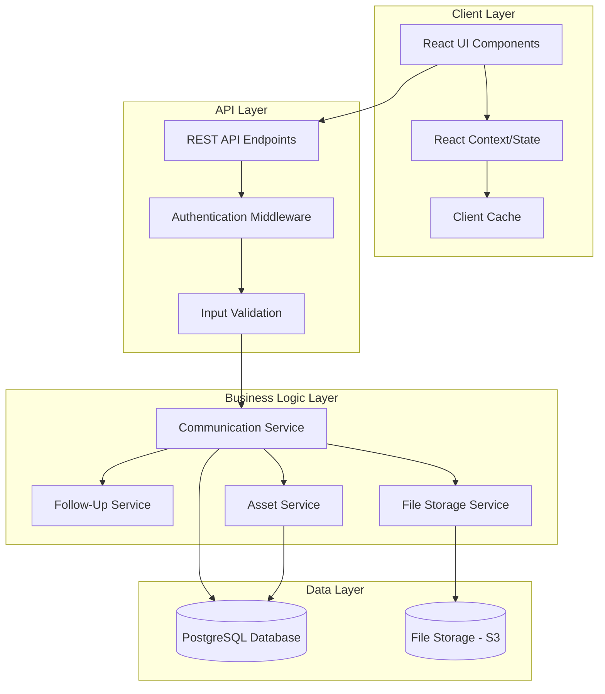

# Design Document: Communication Log

## Overview

The Communication Log feature provides a comprehensive system for tracking all communications between executors and financial institutions during the estate settlement process. The design emphasizes speed, mobile accessibility, and seamless integration with the existing asset management system.

The system consists of three primary layers:
1. **Data Layer**: Database schema and data models for storing communication records
2. **API Layer**: RESTful endpoints for CRUD operations and queries
3. **UI Layer**: React components providing forms, timelines, and dashboard widgets

Key design principles:
- **Speed First**: Target < 30 seconds to log a communication
- **Mobile-Friendly**: Full functionality on mobile devices with touch-optimized UI
- **Context-Aware**: Auto-populate fields from asset context
- **Real-Time Updates**: Immediate UI updates without page refresh
- **Progressive Enhancement**: Core functionality works without JavaScript, enhanced with rich interactions

**Technology Commitments:**
- **Database**: PostgreSQL (leveraging native features for FTS, transactions, constraints)
- **Search**: PostgreSQL Full-Text Search (FTS) with GIN indexes
- **Pagination**: Cursor-based pagination for consistency with concurrent inserts
- **File Storage**: S3-compatible object storage with normalized attachment table

## Out of Scope (Phase 2)

The following features are explicitly deferred to Phase 2 to maintain focus on core functionality:

### PII and Compliance Features
- **Encryption at Rest**: Field-level encryption for sensitive data (SSNs, account numbers)
- **Redaction/Masking**: UI helpers to mask sensitive data (show last-4 digits)
- **Audit Logging**: Detailed access logs for sensitive data viewing/downloading
- **Retention Policies**: Automated data retention and legal hold capabilities
- **GDPR/Privacy Compliance**: Right to erasure, data portability, consent management

### Rationale
Communication logs will contain sensitive information (account numbers, SSNs, beneficiary details). While important, these compliance features add significant complexity and should be implemented after core functionality is validated with users. Phase 1 will rely on:
- Database-level encryption (at-rest encryption provided by hosting platform)
- Standard authentication and authorization
- Basic audit trails (created_by, updated_at timestamps)

Phase 2 will add comprehensive compliance features once the core workflow is proven.

## Architecture

### System Architecture



### Data Flow

**Creating a Communication Log:**
1. User opens communication form (from asset page, dashboard, or floating button)
2. Form pre-populates with context (asset, institution, default type/direction)
3. User fills required fields (date, notes) and optional fields
4. User optionally uploads attachments
5. User submits form
6. Client validates input
7. API receives request, validates authentication and authorization
8. Communication Service creates log entry in database
9. Asset Service updates last contact date
10. Follow-Up Service creates reminder if follow-up date provided
11. File Service stores attachments
12. API returns created communication
13. Client updates UI in real-time (timeline, badges, dashboard)

**Viewing Communications:**
1. User navigates to asset detail page or communications page
2. Client requests communications from API with filters/pagination
3. API queries database with appropriate filters
4. Communication Service retrieves logs with associated data
5. API returns paginated results
6. Client renders timeline with communication cards

## Components and Interfaces

### Database Schema

#### Communications Table

```sql
CREATE TABLE communications (
  id UUID PRIMARY KEY DEFAULT gen_random_uuid(),
  estate_id UUID NOT NULL REFERENCES estates(id) ON DELETE CASCADE,
  asset_id UUID NOT NULL REFERENCES assets(id) ON DELETE CASCADE,
  type VARCHAR(20) NOT NULL CHECK (type IN ('call', 'email', 'letter', 'fax', 'in-person')),
  direction VARCHAR(10) NOT NULL CHECK (direction IN ('inbound', 'outbound')),
  occurred_at TIMESTAMPTZ NOT NULL,
  institution_name VARCHAR(255),
  contact_name VARCHAR(255),
  contact_channel VARCHAR(255),
  subject VARCHAR(500),
  notes TEXT NOT NULL,
  follow_up_due_at TIMESTAMPTZ,
  follow_up_completed_at TIMESTAMPTZ,
  follow_up_completed_by UUID REFERENCES users(id),
  status_change VARCHAR(50) CHECK (status_change IN ('initial_contact', 'documents_requested', 'documents_submitted', 'claim_submitted', 'under_review', 'approved', 'payment_received', 'completed')),
  status_change_effective_at TIMESTAMPTZ,
  created_at TIMESTAMPTZ NOT NULL DEFAULT NOW(),
  updated_at TIMESTAMPTZ NOT NULL DEFAULT NOW(),
  created_by UUID NOT NULL REFERENCES users(id),
  
  -- Constraints
  CONSTRAINT occurred_at_not_future CHECK (occurred_at <= NOW()),
  CONSTRAINT follow_up_after_occurred CHECK (follow_up_due_at IS NULL OR follow_up_due_at > occurred_at),
  CONSTRAINT estate_asset_match CHECK (
    -- Ensure asset belongs to the estate (enforced via trigger or application logic)
    TRUE
  )
);

-- TypeScript interface
interface Communication {
  id: string;                          // UUID primary key
  estateId: string;                    // Foreign key to estates table
  assetId: string;                     // Foreign key to assets table
  type: CommunicationType;             // Enum: call, email, letter, fax, in-person
  direction: CommunicationDirection;   // Enum: inbound, outbound
  occurredAt: Date;                    // When the communication occurred (timestamptz)
  institutionName?: string;            // Institution name (may differ from asset's institution)
  contactName?: string;                // Name of person contacted
  contactChannel?: string;             // Email address or phone number
  subject?: string;                    // Subject line (primarily for emails)
  notes: string;                       // Rich text notes (HTML)
  followUpDueAt?: Date;                // When to follow up (timestamptz)
  followUpCompletedAt?: Date;          // When follow-up was completed (timestamptz)
  followUpCompletedBy?: string;        // User ID who completed follow-up
  statusChange?: AssetStatus;          // Optional status change
  statusChangeEffectiveAt?: Date;      // When status change took effect
  createdAt: Date;                     // Record creation timestamp
  updatedAt: Date;                     // Last update timestamp
  createdBy: string;                   // User ID who created
}

#### Communication Attachments Table

```sql
CREATE TABLE communication_attachments (
  id UUID PRIMARY KEY DEFAULT gen_random_uuid(),
  communication_id UUID NOT NULL REFERENCES communications(id) ON DELETE CASCADE,
  storage_key VARCHAR(500) NOT NULL,
  file_name VARCHAR(255) NOT NULL,
  mime_type VARCHAR(100) NOT NULL,
  size_bytes INTEGER NOT NULL CHECK (size_bytes > 0 AND size_bytes <= 10485760),
  uploaded_by UUID NOT NULL REFERENCES users(id),
  created_at TIMESTAMPTZ NOT NULL DEFAULT NOW(),
  
  -- Constraints
  CONSTRAINT valid_mime_type CHECK (
    mime_type IN (
      'application/pdf',
      'image/jpeg', 'image/png', 'image/gif',
      'application/msword',
      'application/vnd.openxmlformats-officedocument.wordprocessingml.document',
      'text/plain'
    )
  )
);

-- TypeScript interface
interface CommunicationAttachment {
  id: string;                          // UUID
  communicationId: string;             // Foreign key to communications
  storageKey: string;                  // S3 key or storage path
  fileName: string;                    // Original file name
  mimeType: string;                    // MIME type
  sizeBytes: number;                   // Size in bytes (max 10MB)
  uploadedBy: string;                  // User ID who uploaded
  createdAt: Date;                     // Upload timestamp
}
```

#### Enums

```typescript
enum CommunicationType {
  CALL = 'call',
  EMAIL = 'email',
  LETTER = 'letter',
  FAX = 'fax',
  IN_PERSON = 'in-person'
}

enum CommunicationDirection {
  INBOUND = 'inbound',
  OUTBOUND = 'outbound'
}

enum AssetStatus {
  INITIAL_CONTACT = 'initial_contact',
  DOCUMENTS_REQUESTED = 'documents_requested',
  DOCUMENTS_SUBMITTED = 'documents_submitted',
  CLAIM_SUBMITTED = 'claim_submitted',
  UNDER_REVIEW = 'under_review',
  APPROVED = 'approved',
  PAYMENT_RECEIVED = 'payment_received',
  COMPLETED = 'completed'
}
```

#### Database Indexes

```sql
-- Primary key indexes (automatic)
CREATE INDEX idx_communications_id ON communications(id);
CREATE INDEX idx_communication_attachments_id ON communication_attachments(id);

-- Foreign key indexes for joins and authorization checks
CREATE INDEX idx_communications_estate_id ON communications(estate_id);
CREATE INDEX idx_communications_asset_id ON communications(asset_id);
CREATE INDEX idx_communication_attachments_communication_id ON communication_attachments(communication_id);

-- Query optimization indexes
CREATE INDEX idx_communications_occurred_at ON communications(occurred_at DESC);
CREATE INDEX idx_communications_follow_up ON communications(follow_up_due_at) 
  WHERE follow_up_completed_at IS NULL;

-- Full-text search index (PostgreSQL)
CREATE INDEX idx_communications_search ON communications 
  USING gin(to_tsvector('english', 
    coalesce(subject, '') || ' ' || 
    coalesce(notes, '') || ' ' || 
    coalesce(institution_name, '') || ' ' || 
    coalesce(contact_name, '')
  ));

-- Composite index for common queries
CREATE INDEX idx_communications_estate_occurred ON communications(estate_id, occurred_at DESC);
CREATE INDEX idx_communications_asset_occurred ON communications(asset_id, occurred_at DESC);
```

#### Full-Text Search Implementation

**Technology:** PostgreSQL Full-Text Search (FTS) with GIN indexes

**Search Fields:**
- `subject` - Email subject lines or communication titles
- `notes` - Full communication notes/body
- `institution_name` - Institution being contacted
- `contact_name` - Name of person contacted

**Implementation Details:**

```sql
-- Create GIN index for full-text search
CREATE INDEX idx_communications_search ON communications 
  USING gin(to_tsvector('english', 
    coalesce(subject, '') || ' ' || 
    coalesce(notes, '') || ' ' || 
    coalesce(institution_name, '') || ' ' || 
    coalesce(contact_name, '')
  ));

-- Example search query
SELECT * FROM communications
WHERE estate_id = $1
  AND to_tsvector('english', 
    coalesce(subject, '') || ' ' || 
    coalesce(notes, '') || ' ' || 
    coalesce(institution_name, '') || ' ' || 
    coalesce(contact_name, '')
  ) @@ plainto_tsquery('english', $2)
ORDER BY occurred_at DESC, id DESC
LIMIT 50;
```

**Search Behavior:**
- **Tokenization**: Uses PostgreSQL 'english' language configuration for stemming and stop words
- **Ranking**: Results ordered by `occurred_at DESC, id DESC` (chronological, not relevance)
- **Filter Combination**: Search combines with other filters using AND semantics
  - Example: `search="fidelity" AND type="call" AND startDate="2025-01-01"`
- **Case Insensitive**: All searches are case-insensitive by default
- **Partial Matching**: Uses `plainto_tsquery` for simple word matching (no complex operators)

**Search Over Attachments:**
- Phase 1 (MVP): Search does NOT include attachment filenames
- Phase 2: Can add `file_name` from `communication_attachments` table if needed

**Performance:**
- GIN index provides O(log n) search performance
- Target p95 latency < 1s for search queries
- Index size approximately 20-30% of text data size

#### Authorization and Tenant Isolation

**Authorization Rules:**

1. **Estate-Based Tenant Isolation**: Users can only access communications for estates where they are members/owners
   - Enforced at API layer: All queries filtered by `estate_id IN (user's estates)`
   - Prevents cross-tenant data leakage
   
2. **Asset-Estate Validation (IDOR Protection)**: When creating/updating a communication, verify the asset belongs to the specified estate
   - Prevents IDOR attacks where attacker manipulates `asset_id` to access other estates' assets
   - Enforced via database query: `SELECT estate_id FROM assets WHERE id = $assetId` must match `$estateId`
   
3. **Role-Based Deletion**: Only executors and co-executors can delete communications
   - Optional: Can be configured to allow all estate members to delete
   - Enforced at API layer via role check

**Implementation:**

```typescript
// Authorization middleware
async function authorizeEstateAccess(userId: string, estateId: string): Promise<boolean> {
  const membership = await db.query(
    'SELECT role FROM estate_members WHERE user_id = $1 AND estate_id = $2',
    [userId, estateId]
  );
  return membership.rows.length > 0;
}

// IDOR protection: verify asset belongs to estate
async function validateAssetEstate(assetId: string, estateId: string): Promise<boolean> {
  const asset = await db.query(
    'SELECT estate_id FROM assets WHERE id = $1',
    [assetId]
  );
  if (asset.rows.length === 0) {
    return false; // Asset doesn't exist
  }
  return asset.rows[0].estate_id === estateId;
}

// Role-based deletion check
async function canDeleteCommunication(userId: string, estateId: string): Promise<boolean> {
  const membership = await db.query(
    'SELECT role FROM estate_members WHERE user_id = $1 AND estate_id = $2',
    [userId, estateId]
  );
  if (membership.rows.length === 0) {
    return false;
  }
  const role = membership.rows[0].role;
  return role === 'executor' || role === 'co-executor';
}

// API endpoint authorization flow
async function createCommunication(req, res) {
  const { assetId, estateId, ...data } = req.body;
  const userId = req.user.id;
  
  // 1. Check estate access
  if (!await authorizeEstateAccess(userId, estateId)) {
    return res.status(403).json({ error: 'Forbidden: No access to this estate' });
  }
  
  // 2. Validate asset belongs to estate (IDOR protection)
  if (!await validateAssetEstate(assetId, estateId)) {
    return res.status(403).json({ error: 'Forbidden: Asset does not belong to this estate' });
  }
  
  // 3. Proceed with creation
  const communication = await communicationService.create({ assetId, estateId, ...data });
  return res.status(201).json({ communication });
}
```

**Authorization Tests (Required):**

```typescript
describe('Authorization', () => {
  it('should prevent reading communications from another estate', async () => {
    // User A creates communication in Estate 1
    const comm = await createCommunication(userA, estate1, asset1);
    
    // User B (not member of Estate 1) attempts to read
    const response = await request(app)
      .get(`/api/communications/${comm.id}`)
      .set('Authorization', `Bearer ${userB.token}`);
    
    // Should return 403 or 404 (decide which)
    expect(response.status).toBe(403);
  });
  
  it('should prevent IDOR via asset_id manipulation', async () => {
    // User A attempts to create communication with asset from Estate 2
    const response = await request(app)
      .post('/api/communications')
      .set('Authorization', `Bearer ${userA.token}`)
      .send({
        estateId: estate1.id,
        assetId: asset2.id, // Asset belongs to Estate 2
        type: 'call',
        direction: 'outbound',
        occurredAt: new Date(),
        notes: 'Test'
      });
    
    // Should return 403
    expect(response.status).toBe(403);
    expect(response.body.error).toContain('Asset does not belong to this estate');
  });
  
  it('should prevent unauthorized deletion', async () => {
    // User B (viewer role) attempts to delete communication
    const response = await request(app)
      .delete(`/api/communications/${comm.id}`)
      .set('Authorization', `Bearer ${userB.token}`);
    
    // Should return 403
    expect(response.status).toBe(403);
  });
});
```

**Decision: 403 vs 404 for Unauthorized Access**
- Use **403 Forbidden** when user is authenticated but lacks permission
- Use **404 Not Found** when resource doesn't exist OR user has no access (prevents information disclosure)
- Recommendation: Use **404** for GET requests (don't reveal existence), **403** for POST/PATCH/DELETE (clearer error)

#### Transaction Boundaries

**Critical Operations Requiring Transactions:**

All operations that modify communications AND derived data (asset.last_contact_at) must be wrapped in database transactions to ensure consistency.

**1. Create Communication**

Wrap communication insert + asset last_contact update in a single transaction:

```typescript
async function createCommunication(data: CreateCommunicationDTO): Promise<Communication> {
  return await db.transaction(async (trx) => {
    // 1. Insert communication
    const comm = await trx.query(
      `INSERT INTO communications 
       (estate_id, asset_id, type, direction, occurred_at, notes, created_by, ...) 
       VALUES ($1, $2, $3, $4, $5, $6, $7, ...) 
       RETURNING *`,
      [data.estateId, data.assetId, data.type, data.direction, data.occurredAt, data.notes, data.userId, ...]
    );
    
    // 2. Update asset last_contact_at (within same transaction)
    await trx.query(
      `UPDATE assets 
       SET last_contact_at = $1, updated_at = NOW() 
       WHERE id = $2`,
      [data.occurredAt, data.assetId]
    );
    
    return comm.rows[0];
  });
}
```

**Why Transaction?** If asset update fails, communication should not be created (orphaned data). If communication insert fails, asset should not be updated (incorrect derived data).

**2. Update Communication (Date Changed)**

Only wrap in transaction if `occurredAt` is being updated:

```typescript
async function updateCommunication(id: string, data: UpdateCommunicationDTO): Promise<Communication> {
  // Check if occurredAt is being updated
  const dateChanged = data.occurredAt !== undefined;
  
  if (!dateChanged) {
    // Simple update, no transaction needed
    return await db.query(
      `UPDATE communications SET ... WHERE id = $1 RETURNING *`,
      [id]
    );
  }
  
  // Date changed, wrap in transaction
  return await db.transaction(async (trx) => {
    // 1. Update communication
    const comm = await trx.query(
      `UPDATE communications 
       SET occurred_at = $1, updated_at = NOW(), ... 
       WHERE id = $2 
       RETURNING *`,
      [data.occurredAt, id]
    );
    
    // 2. Get asset_id from updated communication
    const assetId = comm.rows[0].asset_id;
    
    // 3. Recalculate asset last_contact_at from all communications
    const maxDate = await trx.query(
      `SELECT MAX(occurred_at) as max_date 
       FROM communications 
       WHERE asset_id = $1`,
      [assetId]
    );
    
    // 4. Update asset last_contact_at
    await trx.query(
      `UPDATE assets 
       SET last_contact_at = $1, updated_at = NOW() 
       WHERE id = $2`,
      [maxDate.rows[0].max_date, assetId]
    );
    
    return comm.rows[0];
  });
}
```

**Why Transaction?** If date update succeeds but asset recalculation fails, asset.last_contact_at becomes stale/incorrect.

**3. Delete Communication**

Wrap communication delete + attachment cleanup + asset last_contact recalculation:

```typescript
async function deleteCommunication(id: string): Promise<void> {
  return await db.transaction(async (trx) => {
    // 1. Get communication details before deletion
    const comm = await trx.query(
      'SELECT asset_id FROM communications WHERE id = $1',
      [id]
    );
    
    if (comm.rows.length === 0) {
      throw new Error('Communication not found');
    }
    
    const assetId = comm.rows[0].asset_id;
    
    // 2. Delete attachments from storage (outside transaction, idempotent)
    // Note: Attachment records deleted automatically via CASCADE
    const attachments = await trx.query(
      'SELECT storage_key FROM communication_attachments WHERE communication_id = $1',
      [id]
    );
    
    for (const att of attachments.rows) {
      await fileService.deleteFromStorage(att.storage_key); // Idempotent
    }
    
    // 3. Delete communication (CASCADE deletes attachment records)
    await trx.query('DELETE FROM communications WHERE id = $1', [id]);
    
    // 4. Recalculate asset last_contact_at from remaining communications
    const maxDate = await trx.query(
      `SELECT MAX(occurred_at) as max_date 
       FROM communications 
       WHERE asset_id = $1`,
      [assetId]
    );
    
    // 5. Update asset last_contact_at (null if no communications remain)
    await trx.query(
      `UPDATE assets 
       SET last_contact_at = $1, updated_at = NOW() 
       WHERE id = $2`,
      [maxDate.rows[0].max_date || null, assetId]
    );
  });
}
```

**Why Transaction?** If communication is deleted but asset recalculation fails, asset.last_contact_at points to deleted communication (dangling reference).

**Concurrency Handling:**

PostgreSQL transactions provide ACID guarantees. Concurrent operations are handled correctly:

**Scenario: Two Concurrent Creates for Same Asset**

```
Time  | Transaction A                    | Transaction B
------|----------------------------------|----------------------------------
T1    | BEGIN                            | BEGIN
T2    | INSERT comm (occurred_at: T2)    |
T3    |                                  | INSERT comm (occurred_at: T3)
T4    | UPDATE asset SET last_contact=T2 |
T5    |                                  | UPDATE asset SET last_contact=T3
T6    | COMMIT                           |
T7    |                                  | COMMIT
Result: last_contact_at = T3 (correct, most recent)
```

**Scenario: Edit to Older Date While Concurrent Create**

```
Time  | Transaction A (Edit to T1)       | Transaction B (Create at T5)
------|----------------------------------|----------------------------------
T1    | BEGIN                            | BEGIN
T2    | UPDATE comm SET occurred_at=T1   |
T3    |                                  | INSERT comm (occurred_at: T5)
T4    | SELECT MAX(occurred_at) = T1     |
T5    |                                  | UPDATE asset SET last_contact=T5
T6    | UPDATE asset SET last_contact=T1 |
T7    | COMMIT                           |
T8    |                                  | COMMIT
Result: last_contact_at = T1 (INCORRECT!)
```

**Mitigation:** Use `SELECT MAX(occurred_at) FOR UPDATE` to lock the asset row during recalculation, or accept eventual consistency and recalculate periodically.

**Recommended Approach:** Accept that last_contact_at is "eventually consistent" and recalculate on read if needed. The race condition is rare and non-critical (doesn't affect data integrity, only display).

**Transaction Tests (Required):**

```typescript
describe('Transaction Boundaries', () => {
  it('should rollback communication if asset update fails', async () => {
    // Mock asset update to fail
    // Attempt to create communication
    // Verify communication was NOT created
  });
  
  it('should handle concurrent creates correctly', async () => {
    // Create two communications concurrently for same asset
    // Verify asset.last_contact_at equals the most recent date
  });
  
  it('should recalculate last_contact_at correctly on delete', async () => {
    // Create 3 communications with dates T1, T2, T3
    // Delete communication with T3
    // Verify asset.last_contact_at = T2
  });
});
```

### API Endpoints

#### POST /api/communications

Create a new communication log.

**Request Body:**
```typescript
{
  assetId: string;
  type: CommunicationType;
  direction: CommunicationDirection;
  occurredAt: string;                  // ISO 8601 timestamp
  institutionName?: string;
  contactName?: string;
  contactChannel?: string;             // Email or phone
  subject?: string;
  notes: string;
  followUpDueAt?: string;              // ISO 8601 timestamp
  statusChange?: AssetStatus;
  statusChangeEffectiveAt?: string;    // ISO 8601 timestamp
}
```

**Response:** `201 Created`
```typescript
{
  communication: Communication;
}
```

**Validation Rules:**
- `assetId` must exist and belong to user's estate (IDOR protection)
- `type` must be valid enum value
- `direction` must be valid enum value
- `occurredAt` must be valid timestamp, not in future
- `notes` must not be empty
- `followUpDueAt` if provided must be valid timestamp and after `occurredAt`
- `contactChannel` if provided must be valid email or phone format

**Performance Target:** p95 latency < 500ms

#### GET /api/communications

Retrieve communications with filtering and pagination.

**Query Parameters:**
```typescript
{
  estateId?: string;                   // Filter by estate
  assetId?: string;                    // Filter by asset
  type?: CommunicationType;            // Filter by type
  direction?: CommunicationDirection;  // Filter by direction
  startDate?: string;                  // Filter by date range start (ISO 8601)
  endDate?: string;                    // Filter by date range end (ISO 8601)
  search?: string;                     // Full-text search
  cursor?: string;                     // Cursor for pagination (base64 encoded)
  limit?: number;                      // Items per page (default: 50, max: 100)
  includeCompleted?: boolean;          // Include completed follow-ups (default: true)
}
```

**Response:** `200 OK`
```typescript
{
  communications: Communication[];
  pagination: {
    nextCursor: string | null;         // Cursor for next page
    hasMore: boolean;                  // Whether more results exist
    total: number;                     // Total count (optional, expensive)
  };
}
```

**Sorting:** Default sort is `occurred_at DESC, id DESC` (stable sort for cursor pagination)

**Performance Target:** p95 latency < 800ms for 50 items

#### GET /api/communications/:id

Retrieve a single communication by ID.

**Response:** `200 OK`
```typescript
{
  communication: Communication;
  attachments: CommunicationAttachment[];
}
```

**Authorization:** User must have access to the communication's estate

#### GET /api/communications/recent

Retrieve recent communications across all assets in an estate.

**Query Parameters:**
```typescript
{
  estateId: string;                    // Required
  limit?: number;                      // Default: 5, max: 20
}
```

**Response:** `200 OK`
```typescript
{
  communications: Array<Communication & {
    asset: {
      id: string;
      name: string;
      institution: string;
    };
  }>;
}
```

**Performance Target:** p95 latency < 300ms

#### GET /api/assets/:id/communications/count

Get communication count for a specific asset.

**Response:** `200 OK`
```typescript
{
  count: number;
}
```

**Performance Target:** p95 latency < 200ms (uses indexed count query)

#### PATCH /api/communications/:id

Update an existing communication.

**Request Body:** (all fields optional)
```typescript
{
  type?: CommunicationType;
  direction?: CommunicationDirection;
  occurredAt?: string;                 // ISO 8601 timestamp
  institutionName?: string;
  contactName?: string;
  contactChannel?: string;
  subject?: string;
  notes?: string;
  followUpDueAt?: string;              // ISO 8601 timestamp
  followUpCompletedAt?: string;        // ISO 8601 timestamp (set to NOW() to mark complete)
  statusChange?: AssetStatus;
  statusChangeEffectiveAt?: string;
}
```

**Response:** `200 OK`
```typescript
{
  communication: Communication;
}
```

**Concurrency Control:** Uses optimistic locking with `updated_at` timestamp

**Performance Target:** p95 latency < 500ms

#### DELETE /api/communications/:id

Delete a communication log.

**Response:** `204 No Content`

**Side Effects:**
- Deletes all associated attachments from storage
- Recalculates asset's `last_contact_at` from remaining communications
- Removes associated follow-up reminders

**Performance Target:** p95 latency < 800ms (includes attachment cleanup)

#### POST /api/communications/:id/attachments

Upload an attachment to a communication.

**Request:** `multipart/form-data`
```typescript
{
  file: File;                          // File upload
}
```

**Response:** `201 Created`
```typescript
{
  attachment: CommunicationAttachment;
}
```

**Validation Rules:**
- File size must not exceed 10MB (10,485,760 bytes)
- Supported MIME types: PDF, images (JPEG, PNG, GIF), documents (DOC, DOCX), text files
- User must have access to the communication's estate

**Performance Target:** p95 latency < 3s for 5MB file

#### DELETE /api/communications/:id/attachments/:attachmentId

Delete an attachment from a communication.

**Response:** `204 No Content`

**Side Effects:** Removes file from storage (S3 or equivalent)

#### GET /api/communications/follow-ups

Retrieve pending and overdue follow-ups.

**Query Parameters:**
```typescript
{
  estateId: string;                    // Required
  status?: 'pending' | 'overdue' | 'all'; // Default: 'all'
}
```

**Response:** `200 OK`
```typescript
{
  followUps: Array<{
    communication: Communication;
    asset: {
      id: string;
      name: string;
      institution: string;
    };
    daysUntilDue: number;              // Negative if overdue
    status: 'pending' | 'overdue';
  }>;
}
```

**Sorting:** Overdue first (by `follow_up_due_at` ASC), then pending (by `follow_up_due_at` ASC)

**Performance Target:** p95 latency < 500ms

### Service Layer Interfaces

#### CommunicationService

```typescript
interface CommunicationService {
  // Create a new communication log (within transaction)
  create(data: CreateCommunicationDTO): Promise<Communication>;
  
  // Retrieve communications with filters and cursor pagination
  findMany(filters: CommunicationFilters): Promise<CursorPaginatedResult<Communication>>;
  
  // Retrieve a single communication with attachments
  findById(id: string): Promise<CommunicationWithAttachments | null>;
  
  // Update a communication (within transaction if date changed)
  update(id: string, data: UpdateCommunicationDTO): Promise<Communication>;
  
  // Delete a communication (within transaction)
  delete(id: string): Promise<void>;
  
  // Search communications by text using PostgreSQL FTS
  search(estateId: string, query: string, limit?: number): Promise<Communication[]>;
  
  // Get communication count for an asset (indexed query)
  getCountByAsset(assetId: string): Promise<number>;
  
  // Get recent communications for an estate
  getRecent(estateId: string, limit?: number): Promise<CommunicationWithAsset[]>;
}

interface CursorPaginatedResult<T> {
  items: T[];
  nextCursor: string | null;
  hasMore: boolean;
  total?: number;  // Optional, expensive to compute
}

interface CommunicationWithAttachments extends Communication {
  attachments: CommunicationAttachment[];
}

interface CommunicationWithAsset extends Communication {
  asset: {
    id: string;
    name: string;
    institution: string;
  };
}
```

#### FollowUpService

```typescript
interface FollowUpService {
  // Get pending follow-ups for an estate
  getPendingFollowUps(estateId: string): Promise<FollowUpWithAsset[]>;
  
  // Get overdue follow-ups for an estate
  getOverdueFollowUps(estateId: string): Promise<FollowUpWithAsset[]>;
  
  // Mark a follow-up as complete (sets completed_at timestamp)
  completeFollowUp(communicationId: string, userId: string): Promise<void>;
  
  // Calculate follow-up status based on due date and completion
  getFollowUpStatus(followUpDueAt: Date, completedAt: Date | null): FollowUpStatus;
}

enum FollowUpStatus {
  PENDING = 'pending',
  OVERDUE = 'overdue',
  COMPLETED = 'completed'
}

interface FollowUpWithAsset {
  communication: Communication;
  asset: {
    id: string;
    name: string;
    institution: string;
  };
  daysUntilDue: number;
  status: FollowUpStatus;
}
```

#### AssetService

```typescript
interface AssetService {
  // Update last contact date for an asset (called within transaction)
  updateLastContactDate(assetId: string, date: Date): Promise<void>;
  
  // Recalculate last contact date from communications (called within transaction)
  recalculateLastContactDate(assetId: string): Promise<void>;
  
  // Get asset with communication count
  getAssetWithCommunicationCount(assetId: string): Promise<AssetWithCount>;
}

interface AssetWithCount {
  id: string;
  name: string;
  institution: string;
  communicationCount: number;
  lastContactAt: Date | null;
}
```

#### FileService

```typescript
interface FileService {
  // Upload a file and return metadata
  uploadFile(file: File, communicationId: string, userId: string): Promise<CommunicationAttachment>;
  
  // Delete a file from storage
  deleteFile(attachmentId: string): Promise<void>;
  
  // Delete all files for a communication
  deleteAllFiles(communicationId: string): Promise<void>;
  
  // Generate a signed URL for file download
  getDownloadUrl(attachmentId: string, expiresIn?: number): Promise<string>;
  
  // Validate file before upload
  validateFile(file: File): ValidationResult;
}

interface ValidationResult {
  valid: boolean;
  errors: string[];
}
```

#### AuthorizationService

```typescript
interface AuthorizationService {
  // Check if user has access to an estate
  canAccessEstate(userId: string, estateId: string): Promise<boolean>;
  
  // Check if user can delete communications (role-based)
  canDeleteCommunication(userId: string, estateId: string): Promise<boolean>;
  
  // Validate asset belongs to estate (IDOR protection)
  validateAssetEstate(assetId: string, estateId: string): Promise<boolean>;
  
  // Get user's estate memberships
  getUserEstates(userId: string): Promise<string[]>;
}
```

## Data Models

### Communication Model

The Communication model represents a single interaction with a financial institution.

**Invariants:**
- `occurredAt` must not be in the future
- `followUpDueAt` if present must be after `occurredAt`
- `notes` must not be empty
- `assetId` must reference a valid asset
- `estateId` must match the estate of the referenced asset
- If `followUpCompletedAt` is set, `followUpDueAt` must be present
- `followUpCompletedAt` must be after `occurredAt`

**Business Rules:**
- When a communication is created, the associated asset's `lastContactAt` is updated (within transaction)
- When a communication is deleted, the asset's `lastContactAt` is recalculated (within transaction)
- When a communication date is updated to be more recent, the asset's `lastContactAt` is updated (within transaction)
- Follow-ups with `followUpDueAt` <= today and `followUpCompletedAt` IS NULL are considered overdue
- Follow-ups with `followUpDueAt` > today and `followUpCompletedAt` IS NULL are considered pending
- Follow-ups with `followUpCompletedAt` IS NOT NULL are considered completed

### Communication Attachment Model

The Communication Attachment model represents a file associated with a communication.

**Invariants:**
- `sizeBytes` must be positive and not exceed 10MB (10,485,760 bytes)
- `mimeType` must be in the allowed list
- `storageKey` must be a valid storage path
- `fileName` must not be empty
- `communicationId` must reference a valid communication

**Allowed MIME Types:**
- `application/pdf`
- `image/jpeg`, `image/png`, `image/gif`
- `application/msword`, `application/vnd.openxmlformats-officedocument.wordprocessingml.document`
- `text/plain`

**Business Rules:**
- When a communication is deleted, all associated attachments are deleted from storage
- Attachment deletion is idempotent (safe to retry)

### Concurrency Handling

**Optimistic Locking:**
- Communications include `updatedAt` timestamp
- Updates include `updatedAt` in WHERE clause to detect concurrent modifications
- If `updatedAt` doesn't match, update fails with HTTP 409 (Conflict)
- Client must refresh and retry

**Derived Data Consistency:**
- Asset `lastContactAt` is derived from `MAX(communications.occurred_at)`
- Updates to `lastContactAt` happen within the same transaction as communication create/update/delete
- This ensures consistency even with concurrent operations

**Concurrent Create Scenario:**
```
Time  | Transaction A                    | Transaction B
------|----------------------------------|----------------------------------
T1    | BEGIN                            | BEGIN
T2    | INSERT comm (occurred_at: T2)    |
T3    |                                  | INSERT comm (occurred_at: T3)
T4    | UPDATE asset SET last_contact=T2 |
T5    |                                  | UPDATE asset SET last_contact=T3
T6    | COMMIT                           |
T7    |                                  | COMMIT
Result: last_contact_at = T3 (correct, most recent)
```

### UI Component Models

#### CommunicationFormData

```typescript
interface CommunicationFormData {
  assetId: string;
  type: CommunicationType;
  direction: CommunicationDirection;
  occurredAt: Date;
  institutionName: string;
  contactName: string;
  contactChannel: string;
  subject: string;
  notes: string;
  followUpDueAt: Date | null;
  statusChange: AssetStatus | null;
  statusChangeEffectiveAt: Date | null;
  attachments: File[];
}
```

#### CommunicationFilters

```typescript
interface CommunicationFilters {
  estateId?: string;
  assetId?: string;
  type?: CommunicationType;
  direction?: CommunicationDirection;
  startDate?: Date;
  endDate?: Date;
  search?: string;
  hasFollowUp?: boolean;
  cursor?: string;
  limit?: number;
}
```

## Correctness Properties

*A property is a characteristic or behavior that should hold true across all valid executions of a system—essentially, a formal statement about what the system should do. Properties serve as the bridge between human-readable specifications and machine-verifiable correctness guarantees.*


### Property 1: Communication Creation with Required Fields

*For any* communication submission with all required fields (communication date, type, direction, notes) and a valid asset ID, the system should successfully create the communication and return the created record.

**Validates: Requirements 1.2, 1.5**

### Property 2: Required Field Validation

*For any* communication submission missing one or more required fields (communication date, type, direction, or notes), the system should reject the submission and return a validation error.

**Validates: Requirements 1.5**

### Property 3: Optional Field Acceptance

*For any* communication submission with all required fields and any combination of optional fields (contact name, contact title, contact phone, contact email, subject, follow-up date, attachments, status change), the system should successfully create the communication.

**Validates: Requirements 1.6**

### Property 4: Asset Last Contact Date Update on Creation

*For any* communication created for an asset, the asset's last contact date should equal the communication date immediately after creation.

**Validates: Requirements 1.7, 11.1**

### Property 5: Institution Name Auto-Population

*For any* asset with an institution name, when creating a communication for that asset, the form should pre-populate the institution field with the asset's institution name.

**Validates: Requirements 1.4**

### Property 6: Communication Direction Storage

*For any* communication created with a direction value (inbound or outbound), retrieving that communication should return the same direction value.

**Validates: Requirements 2.2, 2.3**

### Property 7: Valid Communication Type Acceptance

*For any* communication submission with a type from the valid set (call, email, letter, fax, in-person), the system should accept the submission.

**Validates: Requirements 2.4**

### Property 8: Invalid Communication Type Rejection

*For any* communication submission with a type not in the valid set, the system should reject the submission and return a validation error.

**Validates: Requirements 2.4**

### Property 9: File Attachment Storage and Retrieval

*For any* valid file uploaded to a communication, retrieving that communication should return the file with correct metadata (file name, size, mime type, upload date).

**Validates: Requirements 3.1, 3.5**

### Property 10: Multiple File Attachments

*For any* communication with multiple files attached, retrieving that communication should return all attached files in the order they were uploaded.

**Validates: Requirements 3.3**

### Property 11: Communication Timeline Sorting

*For any* asset or estate with multiple communications, querying communications should return them sorted in reverse chronological order (newest first).

**Validates: Requirements 4.1, 5.1**

### Property 12: Timeline Rendering Completeness

*For any* communication rendered in a timeline view, the output should contain all required display fields: date, type, direction, contact name (if present), subject (if present), and notes preview.

**Validates: Requirements 4.2, 5.2**

### Property 13: Cross-Asset Timeline Context

*For any* communication displayed in an estate-wide timeline, the rendered output should include the associated asset name and institution.

**Validates: Requirements 5.2**

### Property 14: Pagination Trigger

*For any* query returning more than 50 communications, the system should paginate the results and return pagination metadata (page, limit, total, totalPages).

**Validates: Requirements 5.3**

### Property 15: Search Result Matching

*For any* search query and set of communications, all returned results should contain the query string (case-insensitive) in at least one of these fields: institution name, contact name, subject, or notes.

**Validates: Requirements 6.1, 6.2**

### Property 16: Case-Insensitive Search

*For any* search query, searching with different case variations (uppercase, lowercase, mixed case) should return the same set of communications.

**Validates: Requirements 6.2**

### Property 17: Search Clear Restoration

*For any* estate, applying a search filter and then clearing it should return the same set of communications as the initial unfiltered query.

**Validates: Requirements 6.5**

### Property 18: Combined Filter Application

*For any* combination of filters (type, direction, date range, asset), all returned communications should satisfy all applied filter criteria simultaneously.

**Validates: Requirements 7.1, 7.2, 7.3**

### Property 19: Filter Result Count Accuracy

*For any* applied filter or combination of filters, the returned count should equal the actual number of communications matching the filter criteria.

**Validates: Requirements 7.4**

### Property 20: Filter Clear Restoration

*For any* estate, applying filters and then clearing all filters should return the same set of communications as the initial unfiltered query.

**Validates: Requirements 7.5**

### Property 21: Follow-Up Date Storage

*For any* communication created or updated with a follow-up date, retrieving that communication should return the same follow-up date.

**Validates: Requirements 8.1**

### Property 22: Follow-Up Status Calculation

*For any* communication with a follow-up date and completion status, the calculated follow-up status should be:
- "overdue" if the date is <= today and not completed
- "pending" if the date is > today and not completed  
- "completed" if marked as completed regardless of date

**Validates: Requirements 8.3, 8.4, 8.5**

### Property 23: Pending Follow-Up Query Filtering

*For any* estate, querying pending follow-ups should return only communications that have a follow-up date set and follow-up completed is false.

**Validates: Requirements 9.1**

### Property 24: Follow-Up Rendering Completeness

*For any* follow-up rendered in the dashboard widget, the output should contain: asset name, institution, original communication date, follow-up date, and follow-up status.

**Validates: Requirements 9.2**

### Property 25: Follow-Up Sorting Order

*For any* list of follow-ups, the ordering should place overdue items first (sorted by follow-up date ascending), followed by pending items (sorted by follow-up date ascending).

**Validates: Requirements 9.3**

### Property 26: Follow-Up Count Accuracy

*For any* estate, the displayed count of pending follow-ups should equal the actual number of communications with follow-up dates and not completed.

**Validates: Requirements 9.5**

### Property 27: Follow-Up Completion and Removal

*For any* communication, marking the follow-up as complete should set the completion flag to true AND remove it from pending follow-up queries.

**Validates: Requirements 10.1, 10.2**

### Property 28: Completed Follow-Up Display

*For any* communication with a completed follow-up, the rendered output should display the follow-up date with a completion indicator.

**Validates: Requirements 10.3**

### Property 29: Asset Last Contact Date Update on Edit

*For any* communication updated with a more recent date than the asset's current last contact date, the asset's last contact date should be updated to the new communication date.

**Validates: Requirements 11.2**

### Property 30: Asset Last Contact Date Recalculation on Delete

*For any* communication deleted from an asset, the asset's last contact date should be recalculated to equal the most recent remaining communication date, or null if no communications remain.

**Validates: Requirements 11.3**

### Property 31: Communication Count Accuracy

*For any* asset, the displayed communication count should equal the actual number of communications associated with that asset.

**Validates: Requirements 12.1, 12.3**

### Property 32: Partial Update Preservation

*For any* communication updated with partial data, only the specified fields should change while all other fields should remain unchanged.

**Validates: Requirements 14.1**

### Property 33: Communication and Attachment Deletion

*For any* communication deleted, both the communication record and all associated attachments should be removed and no longer retrievable.

**Validates: Requirements 14.2**

### Property 34: Follow-Up Deletion with Communication

*For any* communication with a follow-up that is deleted, the follow-up should no longer appear in pending follow-up queries.

**Validates: Requirements 14.4**

### Property 35: Status Change Display

*For any* communication with a status change value, the rendered timeline output should prominently display the status change.

**Validates: Requirements 15.2**

### Property 36: Status History Communication Inclusion

*For any* asset status history query, all communications with status change values should be included in the results.

**Validates: Requirements 15.3**

## Error Handling

### Backend SLA Targets

**API Performance Targets (p95 latency):**
- `POST /api/communications`: < 500ms
- `GET /api/communications` (50 items): < 800ms
- `GET /api/communications/:id`: < 300ms
- `GET /api/communications/recent`: < 300ms
- `GET /api/assets/:id/communications/count`: < 200ms
- `PATCH /api/communications/:id`: < 500ms
- `DELETE /api/communications/:id`: < 800ms (includes attachment cleanup)
- `POST /api/communications/:id/attachments` (5MB file): < 3s
- `GET /api/communications/follow-ups`: < 500ms
- Full-text search: < 1s

**Pagination Strategy:**
- Use cursor-based pagination for infinite scroll consistency
- Cursor encodes `(occurred_at, id)` for stable sorting
- Avoids offset pagination issues with concurrent inserts
- Default limit: 50, max limit: 100

**Database Query Optimization:**
- All foreign key columns indexed
- Composite indexes for common query patterns
- Full-text search using PostgreSQL GIN index
- Query timeout: 5 seconds (fail fast)

**Monitoring:**
- Log all queries > 1 second
- Track p50, p95, p99 latencies per endpoint
- Alert on p95 > 2x target
- Monitor database connection pool utilization

### Validation Errors

**Input Validation:**
- All API endpoints must validate input before processing
- Validation errors return HTTP 400 with detailed error messages
- Error response format:
```typescript
{
  error: "Validation Error",
  details: [
    {
      field: "communicationDate",
      message: "Communication date cannot be in the future"
    }
  ]
}
```

**Common Validation Rules:**
- `communicationDate` must be valid ISO 8601 date, not in future
- `followUpDate` must be valid ISO 8601 date, must be after `communicationDate`
- `contactEmail` must be valid email format
- `contactPhone` must be valid phone format
- `notes` must not be empty or only whitespace
- `type` must be one of: call, email, letter, fax, in-person
- `direction` must be one of: inbound, outbound
- `statusChange` if provided must be valid enum value

### Authorization Errors

**Access Control:**
- Users can only access communications for estates they have access to
- Attempting to access unauthorized communications returns HTTP 403
- Attempting to create communication for unauthorized asset returns HTTP 403

### Not Found Errors

**Resource Not Found:**
- Requesting non-existent communication returns HTTP 404
- Requesting communication for non-existent asset returns HTTP 404
- Deleting non-existent communication returns HTTP 404

### File Upload Errors

**File Validation:**
- File size exceeding 10MB returns HTTP 413 (Payload Too Large)
- Unsupported MIME type returns HTTP 415 (Unsupported Media Type)
- File upload failure returns HTTP 500 with retry guidance

**Error Response:**
```typescript
{
  error: "File Upload Error",
  message: "File size exceeds maximum allowed size of 10MB",
  maxSize: 10485760,
  actualSize: 15728640
}
```

### Database Errors

**Transactional Integrity:**
- Communication creation is transactional with asset update
- If asset update fails, communication creation is rolled back
- Database errors return HTTP 500 with generic error message (no internal details exposed)

**Retry Strategy:**
- Transient database errors (connection timeout, deadlock) trigger automatic retry (max 3 attempts)
- Permanent errors (constraint violation) return immediately without retry

### Concurrent Modification

**Optimistic Locking:**
- Communications include `updatedAt` timestamp
- Updates include `updatedAt` in WHERE clause
- If `updatedAt` doesn't match, update fails with HTTP 409 (Conflict)
- Client must refresh and retry

## Testing Strategy

### Dual Testing Approach

The Communication Log feature requires both unit testing, property-based testing, and integration testing for comprehensive coverage:

**Unit Tests** focus on:
- Specific examples demonstrating correct behavior
- Edge cases (empty states, boundary conditions)
- Error conditions and validation
- Integration points between components
- UI component rendering with specific props

**Property-Based Tests** focus on:
- Universal properties that hold for all inputs
- Comprehensive input coverage through randomization
- Invariants that must always be maintained
- Round-trip properties (create → retrieve, update → retrieve)

**Integration Tests** focus on:
- End-to-end workflows across multiple layers
- Authorization and tenant isolation
- Transaction boundaries and consistency
- File upload with real multipart parsing
- Database constraints and foreign key relationships

All three testing approaches are complementary and necessary. Unit tests catch concrete bugs with specific inputs, property tests verify general correctness across a wide range of inputs, and integration tests verify system behavior across layers.

### Property-Based Testing Configuration

**Testing Library:** Use `fast-check` for TypeScript/JavaScript property-based testing

**Test Configuration:**
- Minimum 100 iterations per property test (due to randomization)
- Each property test must reference its design document property
- Tag format: `// Feature: communication-log, Property {number}: {property_text}`

**Example Property Test Structure:**
```typescript
import fc from 'fast-check';

describe('Communication Log Properties', () => {
  // Feature: communication-log, Property 1: Communication Creation with Required Fields
  it('should create communication with all required fields', () => {
    fc.assert(
      fc.property(
        fc.record({
          assetId: fc.uuid(),
          type: fc.constantFrom('call', 'email', 'letter', 'fax', 'in-person'),
          direction: fc.constantFrom('inbound', 'outbound'),
          communicationDate: fc.date({ max: new Date() }),
          notes: fc.string({ minLength: 1 })
        }),
        async (data) => {
          const result = await communicationService.create(data);
          expect(result).toBeDefined();
          expect(result.assetId).toBe(data.assetId);
          expect(result.type).toBe(data.type);
        }
      ),
      { numRuns: 100 }
    );
  });
});
```

### Unit Testing Strategy

**Test Coverage Areas:**

1. **API Endpoint Tests:**
   - Test each endpoint with valid inputs
   - Test validation error responses
   - Test authorization checks (estate access, IDOR protection)
   - Test pagination behavior (cursor-based)
   - Test search and filter combinations

2. **Service Layer Tests:**
   - Test business logic in isolation
   - Mock database calls
   - Test error handling and retries
   - Test transactional behavior

3. **Component Tests:**
   - Test form rendering and validation
   - Test timeline rendering with various data
   - Test filter UI interactions
   - Test file upload UI
   - Test responsive behavior

4. **Integration Tests (Critical):**
   - **Authorization Wiring**: Create comm → attach file → delete comm → verify attachment removed + asset last_contact recalculated
   - **IDOR Protection**: User A cannot access/modify communications from User B's estate (returns 403 or 404)
   - **Asset-Estate Validation**: Cannot create communication with asset_id from different estate
   - **Transaction Boundaries**: Concurrent creates preserve correct max date for asset.last_contact_at
   - **File Upload**: Real multipart parsing with size/type validation
   - **Follow-Up Completion**: Mark complete → verify removed from pending queries
   - **Search Accuracy**: Full-text search returns correct results across all indexed fields

**Edge Cases to Test:**
- Empty states (no communications, no follow-ups)
- Boundary conditions (exactly 50 communications for pagination)
- Zero communication count (no badge display)
- Asset with no communications (null last contact date)
- Search with no results
- Filter with no matches
- File upload at size limit (10MB)
- Communication date at boundary (today, yesterday)
- Follow-up date at boundary (today, tomorrow)
- Concurrent communication creation for same asset
- Edit communication to older date (should not regress last_contact_at)

**Error Conditions to Test:**
- Missing required fields
- Invalid field formats (email, phone, date)
- Future communication date
- Follow-up date before communication date
- Unauthorized access attempts (different estate)
- IDOR attempts (manipulate asset_id to access other estate's assets)
- Non-existent resource access
- File size exceeding limit
- Unsupported file type
- Concurrent modification conflicts (optimistic locking)

### Test Data Generation

**Generators for Property Tests:**
```typescript
// Generate valid communication data
const validCommunication = fc.record({
  assetId: fc.uuid(),
  type: fc.constantFrom('call', 'email', 'letter', 'fax', 'in-person'),
  direction: fc.constantFrom('inbound', 'outbound'),
  communicationDate: fc.date({ max: new Date() }),
  notes: fc.string({ minLength: 1, maxLength: 5000 }),
  contactName: fc.option(fc.string({ minLength: 1 })),
  contactEmail: fc.option(fc.emailAddress()),
  followUpDate: fc.option(fc.date({ min: new Date() }))
});

// Generate search queries
const searchQuery = fc.string({ minLength: 1, maxLength: 100 });

// Generate filter combinations
const filters = fc.record({
  type: fc.option(fc.constantFrom('call', 'email', 'letter', 'fax', 'in-person')),
  direction: fc.option(fc.constantFrom('inbound', 'outbound')),
  startDate: fc.option(fc.date()),
  endDate: fc.option(fc.date())
});
```

### Performance Testing

While not part of automated test suites, performance requirements should be validated:

**Manual Performance Validation:**
- Form display time < 500ms
- Communication creation < 2 seconds
- Timeline load (50 items) < 1 second
- Search operation < 1 second

**Performance Monitoring:**
- Add timing instrumentation to API endpoints
- Log slow queries (> 1 second)
- Monitor database query performance
- Track file upload times

### Testing Checklist

Before considering the feature complete:

- [ ] All 36 correctness properties have corresponding property-based tests
- [ ] All property tests run minimum 100 iterations
- [ ] All property tests are tagged with feature name and property number
- [ ] Unit tests cover all edge cases identified
- [ ] Unit tests cover all error conditions
- [ ] Integration tests cover authorization wiring and IDOR protection
- [ ] Integration tests verify transaction boundaries
- [ ] Integration tests cover file upload with real multipart parsing
- [ ] API endpoint tests verify all validation rules
- [ ] Component tests verify responsive behavior
- [ ] File upload tests verify size and type limits
- [ ] Performance requirements manually validated (p95 latencies)
- [ ] All tests pass consistently
- [ ] Database migrations tested (up and down)
- [ ] Cursor pagination tested with concurrent inserts
