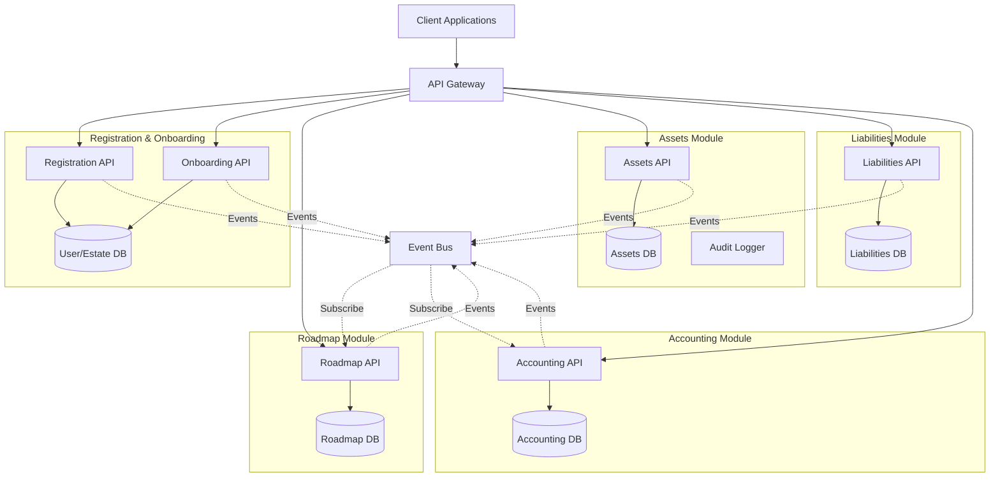
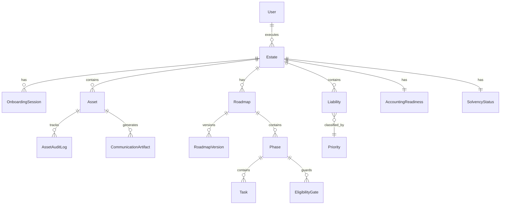
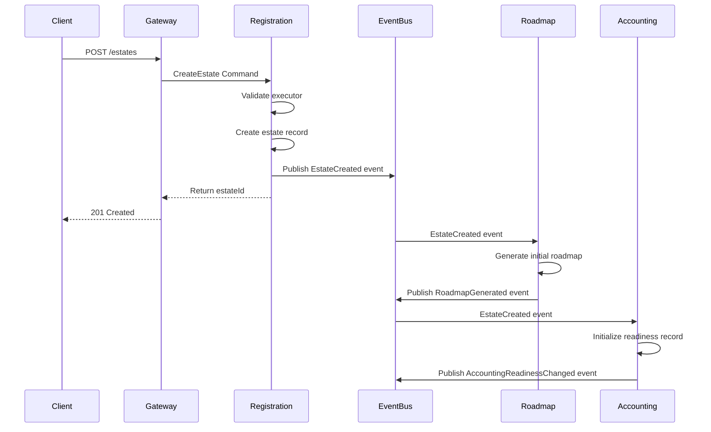
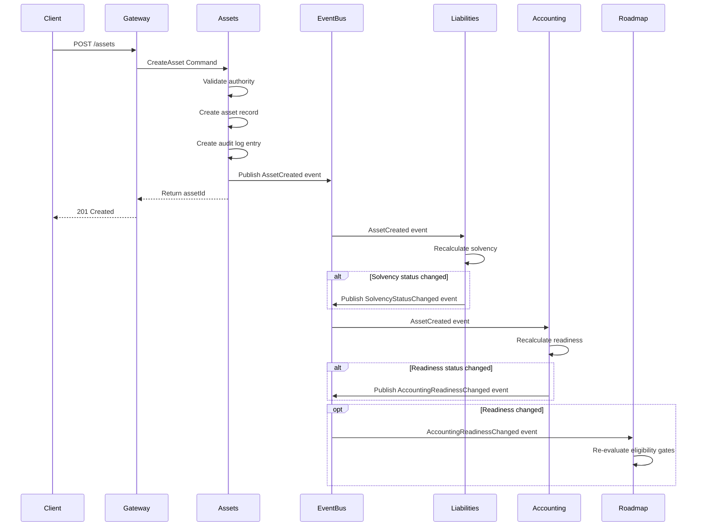
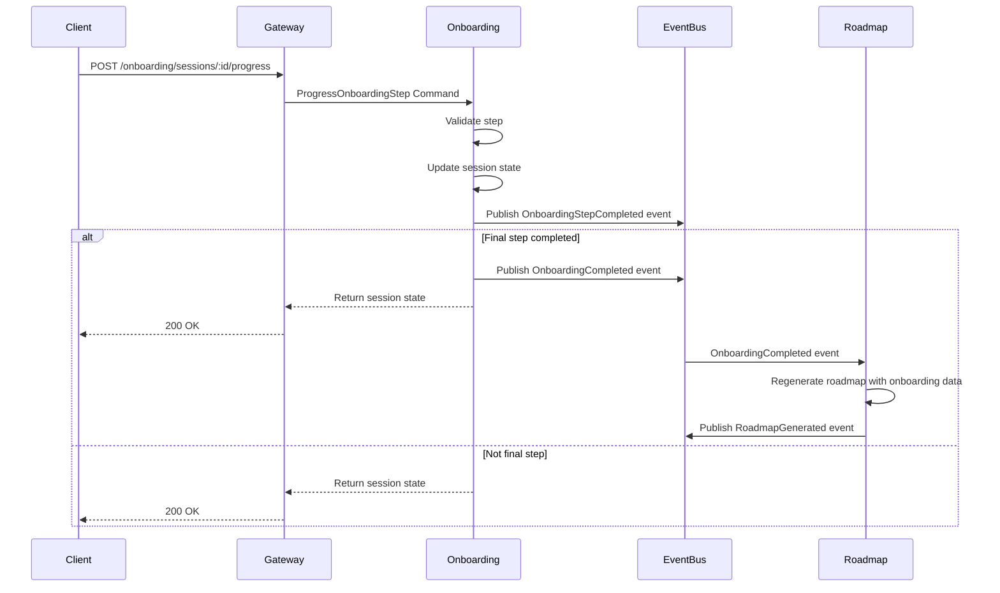
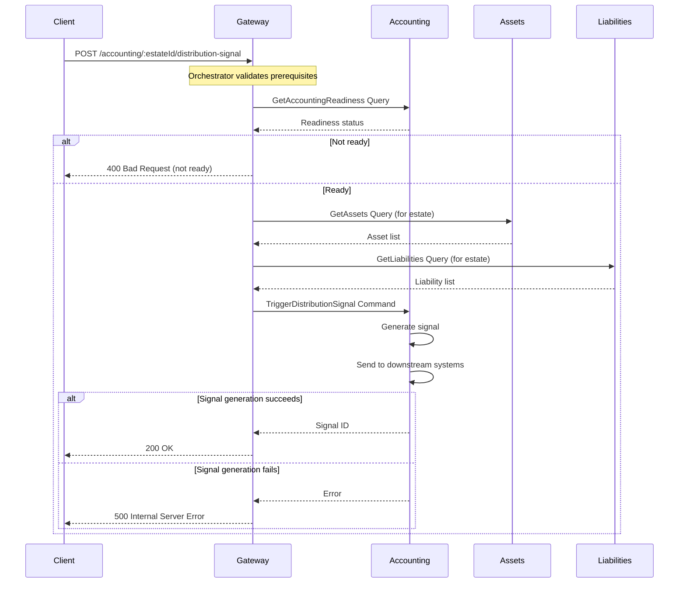
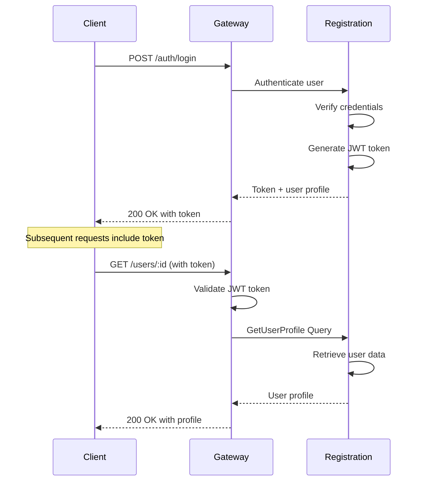

# Design Document: Modular Architecture Evaluation

## Overview

This design document provides a comprehensive evaluation and architectural blueprint for transitioning an estate management system from a modular-monolith to a microservices architecture. The system will be decomposed into five distinct modules:

1. **Registration & Onboarding Module** - User authentication, profile creation, and estate bootstrap
2. **Roadmap Module** - Eligibility gates, personalized phase/task generation, and versioning
3. **Assets Module** - Asset CRUD, communication artifacts, authority gating, and audit logging
4. **Liabilities Module** - Liability CRUD, priority classification, and solvency checks
5. **Accounting Module** - Readiness checks, compliance prerequisites, and distribution signals

### Design Goals

- **Clear Module Boundaries**: Each module owns specific data models, business logic, and API endpoints
- **Minimal Coupling**: Modules communicate through well-defined internal APIs using Commands, Queries, and Events
- **Independent Deployability**: Modules can be deployed, scaled, and maintained independently
- **Data Consistency**: Maintain consistency across modules using event-driven patterns and saga orchestration
- **Incremental Migration**: Support phased migration from modular-monolith to microservices with minimal disruption

### Architecture Principles

1. **Domain-Driven Design**: Module boundaries align with business domains
2. **API-First**: All inter-module communication occurs through typed contracts
3. **Event-Driven**: Asynchronous communication via domain events for loose coupling
4. **Single Responsibility**: Each module owns a cohesive set of capabilities
5. **Backward Compatibility**: Migration path maintains system stability throughout transition

## Go/No-Go Decision Criteria

Before proceeding with microservices migration, the following criteria must be evaluated and met:

### 1. Service Boundary Integrity Score

**Measurement**:
- **Shared Tables**: < 10% of tables shared across modules (target: 0%)
- **Circular Dependencies**: Zero circular dependencies between modules
- **Cross-Module Queries**: < 20% of queries require cross-module data aggregation
- **Foreign Key Violations**: All cross-module references use IDs only (no direct FK constraints)

**Threshold**: Score ≥ 80/100 to proceed

**Scoring Formula**:
```
Score = (100 - (shared_tables_pct * 2)) 
      - (circular_deps_count * 10) 
      - (cross_module_query_pct * 1.5)
```

### 2. Latency Budget for Cross-Module Calls

**Requirements**:
- **P50 Latency**: < 50ms per cross-module call
- **P95 Latency**: < 200ms per cross-module call
- **P99 Latency**: < 500ms per cross-module call
- **Maximum Call Chain Depth**: ≤ 3 hops for any user-facing request
- **Acceptable Overhead**: Total request latency increase < 300ms compared to monolith

**Threshold**: All latency targets must be achievable based on network measurements and load testing

### 3. Consistency Requirements per Workflow

**Strong Consistency Required** (synchronous, ACID):
- User authentication and authorization
- Financial transactions (asset/liability amounts)
- Audit log integrity

**Eventual Consistency Acceptable** (asynchronous, < 5 seconds):
- Roadmap generation after estate creation
- Solvency recalculation after asset changes
- Accounting readiness recalculation
- Eligibility gate re-evaluation

**Threshold**: ≥ 70% of workflows can tolerate eventual consistency

### 4. Operational Readiness

**Required Capabilities**:
- **Observability**: Distributed tracing with correlation IDs across all services
- **Monitoring**: Per-service metrics (error rate, latency, throughput) with alerting
- **CI/CD**: Automated deployment pipelines for each service with rollback capability
- **Incident Response**: On-call rotation, runbooks, and escalation procedures
- **Service Mesh**: (Optional but recommended) Traffic management, circuit breakers, retries

**Threshold**: All required capabilities must be in place or have a concrete implementation plan

### 5. Team Topology and Ownership

**Requirements**:
- **Team Size**: ≥ 5 engineers to support 5 services (minimum 1 per service)
- **Ownership Model**: Clear ownership mapping (team → services)
- **Microservices Experience**: ≥ 50% of team has prior microservices experience
- **On-Call Capacity**: Sufficient engineers for 24/7 on-call rotation
- **Communication Overhead**: Team can manage increased coordination complexity

**Threshold**: Team structure supports independent service ownership

### 6. Business Justification

**Valid Reasons to Proceed**:
- **Team Scaling**: Need to scale team beyond 10 engineers with independent deployment
- **Isolation Requirements**: Regulatory/compliance boundaries require service isolation
- **Deploy Independence**: Need to deploy modules independently without full system deployment
- **Partner Integrations**: External partners need isolated API access to specific modules
- **Performance Isolation**: Need to scale specific modules independently (e.g., Assets under high load)

**Invalid Reasons** (red flags):
- "Microservices are modern/trendy"
- "Resume-driven development"
- "We might need it someday"

**Threshold**: At least 2 valid business reasons must exist

### Decision Matrix

| Criteria | Weight | Threshold | Status |
|----------|--------|-----------|--------|
| Service Boundary Integrity | 25% | ≥ 80/100 | TBD |
| Latency Budget | 20% | All targets met | TBD |
| Consistency Requirements | 15% | ≥ 70% eventual OK | TBD |
| Operational Readiness | 20% | All capabilities ready | TBD |
| Team Topology | 10% | Ownership clear | TBD |
| Business Justification | 10% | ≥ 2 valid reasons | TBD |

**Overall Decision**:
- **GO**: Weighted score ≥ 80% AND all critical thresholds met
- **NO-GO**: Weighted score < 80% OR any critical threshold failed
- **CONDITIONAL GO**: Score 70-80% with mitigation plan for gaps

## Architecture

### Current State: Modular-Monolith

The existing system follows a modular-monolith pattern where:
- Modules are logically separated with clear domain boundaries
- All modules are deployed as a single application
- Modules can directly import and call each other's code
- Shared database with module-specific schemas
- Single API Gateway (server/index.ts) mounts all domain routes

### Target State: Microservices Architecture

The target architecture will feature:
- Five independent services, each owning its module
- Internal API contracts for all inter-module communication
- Event bus for asynchronous communication
- Per-module databases (or schemas) for data isolation
- API Gateway routing requests to appropriate services
- Distributed tracing and monitoring

### Architectural Diagram



### Communication Patterns

#### Synchronous Communication (Commands & Queries)
- Used when immediate response is required
- Request-response pattern via HTTP/REST or gRPC
- Caller waits for operation completion
- Examples: User registration, asset retrieval, roadmap query

#### Asynchronous Communication (Events)
- Used for loose coupling and eventual consistency
- Publish-subscribe pattern via event bus
- Fire-and-forget semantics
- Examples: Estate created, asset updated, solvency changed

#### Orchestration vs Choreography
- **Orchestration**: Central coordinator (e.g., API Gateway) manages multi-module flows
- **Choreography**: Modules react to events independently without central control
- Hybrid approach: Use orchestration for critical user-facing flows, choreography for background processes


## Components and Interfaces

### Data Ownership Policy

Before presenting the ownership matrix, we establish strict data ownership rules to prevent distributed monolith anti-patterns:

#### Core Ownership Rules

1. **Single Owner Principle**: Each entity (table/collection) has exactly one owning module
   - The owner module has exclusive write access
   - The owner module is the source of truth for that entity
   - No shared writes across modules

2. **API-Only Access**: Other modules access data only through the owner's API
   - No direct database queries across module boundaries
   - No shared database connections between modules
   - No cross-module foreign key constraints

3. **Read Model Replication**: Read-heavy access patterns use replicated read models
   - Owner publishes events when data changes
   - Consumers maintain local read models (materialized views)
   - Read models are eventually consistent
   - Read models are rebuilt from events if corrupted

4. **Reference Data Handling**: Cross-module references use IDs only
   - Store only the ID of entities owned by other modules
   - Query the owner module for full entity details when needed
   - Cache frequently accessed reference data with TTL
   - Example: Assets module stores `estateId` but queries Registration for estate details

5. **Shared Data Migration**: Entities with ambiguous ownership must be resolved
   - Analyze access patterns (reads vs writes per module)
   - Assign ownership to module with most writes
   - Other modules become consumers via API or events
   - Document ownership decision in ADR

#### Ownership Violation Detection

**Red Flags** (must be resolved before extraction):
- Multiple modules writing to same table
- Direct SQL joins across module boundaries
- Shared database transactions spanning modules
- Foreign key constraints between module schemas

**Acceptable Patterns**:
- Module A publishes event → Module B updates its own tables
- Module A queries Module B's API → Module B returns data
- Module A caches data from Module B with TTL

### Module Ownership Matrix

This matrix documents the ownership of data models, API endpoints, and domain events across the five modules, following the data ownership policy above.

#### Data Models Ownership

| Data Model | Owning Module | Description | Shared Dependencies |
|------------|---------------|-------------|---------------------|
| User | Registration | User authentication credentials, profile data | None |
| Estate | Registration | Estate metadata, executor information | Referenced by all modules |
| OnboardingSession | Onboarding | Session state, step progression, completion status | References User, Estate |
| Roadmap | Roadmap | Personalized phases and tasks | References Estate |
| RoadmapVersion | Roadmap | Version history, pinned versions | References Roadmap |
| EligibilityGate | Roadmap | Gate conditions and evaluation results | References Estate state |
| Asset | Assets | Asset details, valuation, ownership | References Estate |
| AssetAuditLog | Assets | Change history for assets | References Asset, User |
| CommunicationArtifact | Assets | Generated documents for assets | References Asset |
| Liability | Liabilities | Liability details, amounts, priority | References Estate |
| SolvencyStatus | Liabilities | Calculated solvency state | References Estate, Assets, Liabilities |
| AccountingReadiness | Accounting | Readiness checks, compliance status | References Estate, Assets, Liabilities |
| DistributionSignal | Accounting | Signals for downstream distribution | References Estate, Accounting |

**Circular Dependencies Identified**: None - the dependency graph is acyclic with Estate as the root entity.

**Ambiguous Ownership Flags**:
- **Estate Metadata**: Currently owned by Registration, but referenced by all modules. Consider creating a shared "Estate Context" that modules can query.
- **User Identity**: Owned by Registration, but needed for audit logging in Assets. Resolved via event payload containing user identity.

#### API Endpoints Ownership

| Endpoint | HTTP Method | Owning Module | Description |
|----------|-------------|---------------|-------------|
| /auth/register | POST | Registration | User registration |
| /auth/login | POST | Registration | User authentication |
| /auth/logout | POST | Registration | User logout |
| /users/:id | GET | Registration | Retrieve user profile |
| /estates | POST | Registration | Create estate (executor) |
| /estates/:id | GET | Registration | Retrieve estate metadata |
| /onboarding/sessions | POST | Onboarding | Start onboarding session |
| /onboarding/sessions/:id | GET | Onboarding | Get session state |
| /onboarding/sessions/:id/progress | POST | Onboarding | Progress to next step |
| /roadmaps/:estateId | GET | Roadmap | Get current roadmap |
| /roadmaps/:estateId/regenerate | POST | Roadmap | Regenerate roadmap |
| /roadmaps/:estateId/pin | POST | Roadmap | Pin roadmap version |
| /roadmaps/:estateId/versions | GET | Roadmap | List roadmap versions |
| /assets | POST | Assets | Create asset |
| /assets/:id | GET | Assets | Retrieve asset |
| /assets/:id | PUT | Assets | Update asset |
| /assets/:id | DELETE | Assets | Delete asset |
| /assets/:id/audit-log | GET | Assets | Get asset audit history |
| /assets/:id/artifacts | GET | Assets | Get communication artifacts |
| /liabilities | POST | Liabilities | Create liability |
| /liabilities/:id | GET | Liabilities | Retrieve liability |
| /liabilities/:id | PUT | Liabilities | Update liability |
| /liabilities/:id | DELETE | Liabilities | Delete liability |
| /liabilities/estate/:estateId/total | GET | Liabilities | Calculate total liabilities |
| /liabilities/estate/:estateId/solvency | GET | Liabilities | Check solvency status |
| /accounting/:estateId/readiness | GET | Accounting | Get accounting readiness |
| /accounting/:estateId/compliance | GET | Accounting | Get compliance prerequisites |
| /accounting/:estateId/distribution-signal | POST | Accounting | Trigger distribution signal |

#### Domain Events Ownership

| Event | Publishing Module | Payload Schema | Consuming Modules |
|-------|-------------------|----------------|-------------------|
| UserRegistered | Registration | `{ userId, email, timestamp }` | None |
| EstateCreated | Registration | `{ estateId, executorId, estateName, timestamp }` | Roadmap, Accounting |
| OnboardingStepCompleted | Onboarding | `{ sessionId, estateId, step, timestamp }` | None |
| OnboardingCompleted | Onboarding | `{ sessionId, estateId, timestamp }` | Roadmap |
| RoadmapGenerated | Roadmap | `{ estateId, roadmapId, version, timestamp }` | None |
| RoadmapPinned | Roadmap | `{ estateId, roadmapId, version, timestamp }` | None |
| AssetCreated | Assets | `{ assetId, estateId, assetType, value, userId, timestamp }` | Accounting, Liabilities |
| AssetUpdated | Assets | `{ assetId, estateId, changes, userId, timestamp }` | Accounting, Liabilities |
| AssetDeleted | Assets | `{ assetId, estateId, userId, timestamp }` | Accounting, Liabilities |
| LiabilityCreated | Liabilities | `{ liabilityId, estateId, amount, priority, timestamp }` | Accounting |
| LiabilityUpdated | Liabilities | `{ liabilityId, estateId, changes, timestamp }` | Accounting |
| LiabilityDeleted | Liabilities | `{ liabilityId, estateId, timestamp }` | Accounting |
| SolvencyStatusChanged | Liabilities | `{ estateId, isSolvent, totalAssets, totalLiabilities, timestamp }` | Accounting, Roadmap |
| AccountingReadinessChanged | Accounting | `{ estateId, isReady, blockers, timestamp }` | Roadmap |

### Internal API Specifications

#### API Versioning and Compatibility Policy

Before defining module APIs, we establish versioning and compatibility rules to enable independent evolution:

**Versioning Strategy**:
- **Semantic Versioning**: APIs use semver (MAJOR.MINOR.PATCH)
  - MAJOR: Breaking changes (incompatible API changes)
  - MINOR: New features (backward-compatible additions)
  - PATCH: Bug fixes (backward-compatible fixes)
- **Version in URL**: `/v1/assets`, `/v2/assets` for REST APIs
- **Version in Event Schema**: Events include `schemaVersion` field

**Backward Compatibility Requirements**:
- **Commands/Queries**: New versions must support old request formats for ≥ 6 months
- **Events**: Consumers must handle both old and new event schemas
- **Fields**: New optional fields OK; removing fields requires major version bump
- **Enums**: Adding enum values OK; removing values requires major version bump

**Deprecation Process**:
1. **Announce**: Deprecation notice in API docs and response headers (6 months before removal)
2. **Monitor**: Track usage of deprecated endpoints/fields
3. **Migrate**: Work with consumers to migrate to new version
4. **Remove**: Remove deprecated version after deprecation window

**Consumer-Driven Contract Testing**:
- Each consuming module defines contract tests for APIs it depends on
- Contract tests run in provider's CI/CD pipeline
- Breaking changes fail contract tests, preventing deployment
- Pact or Spring Cloud Contract recommended for implementation

**Event Schema Evolution**:
- **Additive Changes**: Adding optional fields is backward-compatible
- **Field Removal**: Requires new event type (e.g., `AssetCreatedV2`)
- **Schema Registry**: Use schema registry (Confluent, AWS Glue) to version event schemas
- **Compatibility Modes**: 
  - `BACKWARD`: New schema can read old data (default)
  - `FORWARD`: Old schema can read new data
  - `FULL`: Both backward and forward compatible

**Example Versioning Scenario**:
```typescript
// V1: Original event
interface AssetCreatedEventV1 {
  eventType: 'AssetCreated';
  schemaVersion: '1.0.0';
  payload: {
    assetId: string;
    estateId: string;
    value: number;
  };
}

// V2: Added optional field (backward-compatible)
interface AssetCreatedEventV2 {
  eventType: 'AssetCreated';
  schemaVersion: '2.0.0';
  payload: {
    assetId: string;
    estateId: string;
    value: number;
    currency?: string; // New optional field
  };
}

// Consumer must handle both versions
function handleAssetCreated(event: AssetCreatedEventV1 | AssetCreatedEventV2) {
  const currency = 'currency' in event.payload ? event.payload.currency : 'USD';
  // Process event...
}
```

**API Contract Documentation**:
- OpenAPI 3.0 specs for REST APIs
- AsyncAPI specs for event-driven APIs
- JSON Schema for event payloads
- Generated TypeScript types from schemas

#### 1. Registration Module API

**Commands**

```typescript
// Command: RegisterUser
interface RegisterUserCommand {
  email: string;
  password: string;
  firstName: string;
  lastName: string;
}

// Validation Rules:
// - email: valid email format, unique
// - password: minimum 8 characters, contains uppercase, lowercase, number
// - firstName/lastName: non-empty, max 100 characters

// Success Criteria:
// - User record created in database
// - UserRegistered event published
// - Returns userId and authentication token

// Command: CreateEstate
interface CreateEstateCommand {
  executorId: string;
  estateName: string;
  deceasedName: string;
  dateOfDeath: string;
}

// Validation Rules:
// - executorId: must be valid registered user
// - estateName: non-empty, max 200 characters
// - deceasedName: non-empty, max 200 characters
// - dateOfDeath: valid ISO date, not in future

// Success Criteria:
// - Estate record created in database
// - EstateCreated event published
// - Returns estateId
```

**Queries**

```typescript
// Query: GetUserProfile
interface GetUserProfileQuery {
  userId: string;
}

// Return Type:
interface UserProfile {
  userId: string;
  email: string;
  firstName: string;
  lastName: string;
  createdAt: string;
}

// Error Conditions:
// - 404: User not found
// - 403: Unauthorized access

// Query: GetEstateMetadata
interface GetEstateMetadataQuery {
  estateId: string;
}

// Return Type:
interface EstateMetadata {
  estateId: string;
  executorId: string;
  estateName: string;
  deceasedName: string;
  dateOfDeath: string;
  createdAt: string;
}

// Error Conditions:
// - 404: Estate not found
// - 403: Unauthorized access
```

**Events Published**

```typescript
// Event: UserRegistered
interface UserRegisteredEvent {
  eventId: string;
  eventType: 'UserRegistered';
  timestamp: string;
  payload: {
    userId: string;
    email: string;
  };
}

// Publishing Conditions:
// - Published immediately after successful user registration
// - Guaranteed delivery (at-least-once semantics)

// Event: EstateCreated
interface EstateCreatedEvent {
  eventId: string;
  eventType: 'EstateCreated';
  timestamp: string;
  payload: {
    estateId: string;
    executorId: string;
    estateName: string;
  };
}

// Publishing Conditions:
// - Published immediately after successful estate creation
// - Triggers initial roadmap generation in Roadmap module
```

#### 2. Onboarding Module API

**Commands**

```typescript
// Command: StartOnboardingSession
interface StartOnboardingSessionCommand {
  estateId: string;
  userId: string;
}

// Validation Rules:
// - estateId: must exist
// - userId: must be executor of estate
// - No active session already exists for estate

// Success Criteria:
// - OnboardingSession record created
// - Returns sessionId

// Command: ProgressOnboardingStep
interface ProgressOnboardingStepCommand {
  sessionId: string;
  completedStep: string;
  stepData: Record<string, any>;
}

// Validation Rules:
// - sessionId: must exist and be active
// - completedStep: must be valid step in sequence
// - stepData: must match step schema

// Success Criteria:
// - Session state updated
// - OnboardingStepCompleted event published
// - If final step, OnboardingCompleted event published
```

**Queries**

```typescript
// Query: GetOnboardingSession
interface GetOnboardingSessionQuery {
  sessionId: string;
}

// Return Type:
interface OnboardingSession {
  sessionId: string;
  estateId: string;
  currentStep: string;
  completedSteps: string[];
  isComplete: boolean;
  createdAt: string;
  updatedAt: string;
}

// Error Conditions:
// - 404: Session not found
// - 403: Unauthorized access
```

**Events Published**

```typescript
// Event: OnboardingStepCompleted
interface OnboardingStepCompletedEvent {
  eventId: string;
  eventType: 'OnboardingStepCompleted';
  timestamp: string;
  payload: {
    sessionId: string;
    estateId: string;
    step: string;
  };
}

// Event: OnboardingCompleted
interface OnboardingCompletedEvent {
  eventId: string;
  eventType: 'OnboardingCompleted';
  timestamp: string;
  payload: {
    sessionId: string;
    estateId: string;
  };
}

// Publishing Conditions:
// - OnboardingCompleted triggers roadmap generation
```

#### 3. Roadmap Module API

**Commands**

```typescript
// Command: RegenerateRoadmap
interface RegenerateRoadmapCommand {
  estateId: string;
  userId: string;
}

// Validation Rules:
// - estateId: must exist
// - userId: must have permission to modify estate

// Success Criteria:
// - New roadmap version generated
// - Eligibility gates evaluated
// - RoadmapGenerated event published
// - Returns new roadmapId and version

// Command: PinRoadmapVersion
interface PinRoadmapVersionCommand {
  estateId: string;
  version: number;
  userId: string;
}

// Validation Rules:
// - estateId: must exist
// - version: must be valid version number
// - userId: must have permission

// Success Criteria:
// - Roadmap version marked as pinned
// - RoadmapPinned event published
```

**Queries**

```typescript
// Query: GetCurrentRoadmap
interface GetCurrentRoadmapQuery {
  estateId: string;
}

// Return Type:
interface Roadmap {
  roadmapId: string;
  estateId: string;
  version: number;
  isPinned: boolean;
  phases: Phase[];
  generatedAt: string;
}

interface Phase {
  phaseId: string;
  name: string;
  order: number;
  tasks: Task[];
  eligibilityGates: EligibilityGate[];
}

interface Task {
  taskId: string;
  name: string;
  description: string;
  isComplete: boolean;
}

interface EligibilityGate {
  gateId: string;
  condition: string;
  isMet: boolean;
}

// Error Conditions:
// - 404: Roadmap not found for estate
// - 403: Unauthorized access

// Query: GetRoadmapVersions
interface GetRoadmapVersionsQuery {
  estateId: string;
}

// Return Type:
interface RoadmapVersion {
  version: number;
  isPinned: boolean;
  generatedAt: string;
}[]

// Error Conditions:
// - 404: No roadmaps found for estate
```

**Events Published**

```typescript
// Event: RoadmapGenerated
interface RoadmapGeneratedEvent {
  eventId: string;
  eventType: 'RoadmapGenerated';
  timestamp: string;
  payload: {
    estateId: string;
    roadmapId: string;
    version: number;
  };
}

// Event: RoadmapPinned
interface RoadmapPinnedEvent {
  eventId: string;
  eventType: 'RoadmapPinned';
  timestamp: string;
  payload: {
    estateId: string;
    roadmapId: string;
    version: number;
  };
}
```

**Events Consumed**

```typescript
// Consumes: EstateCreated
// Action: Generate initial roadmap for new estate

// Consumes: OnboardingCompleted
// Action: Regenerate roadmap with onboarding data

// Consumes: SolvencyStatusChanged
// Action: Re-evaluate eligibility gates

// Consumes: AccountingReadinessChanged
// Action: Re-evaluate eligibility gates
```

#### 4. Assets Module API

**Commands**

```typescript
// Command: CreateAsset
interface CreateAssetCommand {
  estateId: string;
  assetType: string;
  name: string;
  description: string;
  value: number;
  userId: string;
}

// Validation Rules:
// - estateId: must exist
// - assetType: must be valid enum value
// - name: non-empty, max 200 characters
// - value: non-negative number
// - userId: must have authority to create assets for estate

// Success Criteria:
// - Asset record created
// - Audit log entry created
// - AssetCreated event published
// - Returns assetId

// Command: UpdateAsset
interface UpdateAssetCommand {
  assetId: string;
  changes: Partial<{
    name: string;
    description: string;
    value: number;
  }>;
  userId: string;
}

// Validation Rules:
// - assetId: must exist
// - changes: at least one field must be provided
// - userId: must have authority to modify asset

// Success Criteria:
// - Asset record updated
// - Audit log entry created
// - AssetUpdated event published with change delta

// Command: DeleteAsset
interface DeleteAssetCommand {
  assetId: string;
  userId: string;
}

// Validation Rules:
// - assetId: must exist
// - userId: must have authority to delete asset

// Success Criteria:
// - Asset marked as deleted (soft delete)
// - Audit log entry created
// - AssetDeleted event published
```

**Queries**

```typescript
// Query: GetAsset
interface GetAssetQuery {
  assetId: string;
}

// Return Type:
interface Asset {
  assetId: string;
  estateId: string;
  assetType: string;
  name: string;
  description: string;
  value: number;
  createdAt: string;
  updatedAt: string;
}

// Error Conditions:
// - 404: Asset not found
// - 403: Unauthorized access

// Query: GetAssetAuditLog
interface GetAssetAuditLogQuery {
  assetId: string;
}

// Return Type:
interface AssetAuditEntry {
  entryId: string;
  assetId: string;
  action: 'created' | 'updated' | 'deleted';
  changes: Record<string, any>;
  userId: string;
  timestamp: string;
}[]

// Error Conditions:
// - 404: Asset not found
// - 403: Unauthorized access

// Query: GetCommunicationArtifacts
interface GetCommunicationArtifactsQuery {
  assetId: string;
}

// Return Type:
interface CommunicationArtifact {
  artifactId: string;
  assetId: string;
  artifactType: string;
  url: string;
  generatedAt: string;
}[]

// Error Conditions:
// - 404: Asset not found
```

**Events Published**

```typescript
// Event: AssetCreated
interface AssetCreatedEvent {
  eventId: string;
  eventType: 'AssetCreated';
  timestamp: string;
  payload: {
    assetId: string;
    estateId: string;
    assetType: string;
    value: number;
    userId: string;
  };
}

// Event: AssetUpdated
interface AssetUpdatedEvent {
  eventId: string;
  eventType: 'AssetUpdated';
  timestamp: string;
  payload: {
    assetId: string;
    estateId: string;
    changes: Record<string, any>;
    userId: string;
  };
}

// Event: AssetDeleted
interface AssetDeletedEvent {
  eventId: string;
  eventType: 'AssetDeleted';
  timestamp: string;
  payload: {
    assetId: string;
    estateId: string;
    userId: string;
  };
}

// Publishing Conditions:
// - All events published after successful database transaction
// - Events trigger accounting readiness recalculation
```

#### 5. Liabilities Module API

**Commands**

```typescript
// Command: CreateLiability
interface CreateLiabilityCommand {
  estateId: string;
  liabilityType: string;
  name: string;
  amount: number;
  priority: 'high' | 'medium' | 'low';
  userId: string;
}

// Validation Rules:
// - estateId: must exist
// - liabilityType: must be valid enum value
// - name: non-empty, max 200 characters
// - amount: non-negative number
// - priority: must be valid enum value

// Success Criteria:
// - Liability record created
// - Solvency status recalculated
// - LiabilityCreated event published
// - Returns liabilityId

// Command: UpdateLiability
interface UpdateLiabilityCommand {
  liabilityId: string;
  changes: Partial<{
    name: string;
    amount: number;
    priority: 'high' | 'medium' | 'low';
  }>;
  userId: string;
}

// Validation Rules:
// - liabilityId: must exist
// - changes: at least one field must be provided

// Success Criteria:
// - Liability record updated
// - Solvency status recalculated if amount changed
// - LiabilityUpdated event published

// Command: DeleteLiability
interface DeleteLiabilityCommand {
  liabilityId: string;
  userId: string;
}

// Validation Rules:
// - liabilityId: must exist

// Success Criteria:
// - Liability marked as deleted
// - Solvency status recalculated
// - LiabilityDeleted event published
```

**Queries**

```typescript
// Query: GetLiability
interface GetLiabilityQuery {
  liabilityId: string;
}

// Return Type:
interface Liability {
  liabilityId: string;
  estateId: string;
  liabilityType: string;
  name: string;
  amount: number;
  priority: 'high' | 'medium' | 'low';
  createdAt: string;
  updatedAt: string;
}

// Error Conditions:
// - 404: Liability not found
// - 403: Unauthorized access

// Query: GetTotalLiabilities
interface GetTotalLiabilitiesQuery {
  estateId: string;
}

// Return Type:
interface TotalLiabilities {
  estateId: string;
  totalAmount: number;
  liabilityCount: number;
  byPriority: {
    high: number;
    medium: number;
    low: number;
  };
}

// Error Conditions:
// - 404: Estate not found

// Query: GetSolvencyStatus
interface GetSolvencyStatusQuery {
  estateId: string;
}

// Return Type:
interface SolvencyStatus {
  estateId: string;
  isSolvent: boolean;
  totalAssets: number;
  totalLiabilities: number;
  netValue: number;
  calculatedAt: string;
}

// Error Conditions:
// - 404: Estate not found
```

**Events Published**

```typescript
// Event: LiabilityCreated
interface LiabilityCreatedEvent {
  eventId: string;
  eventType: 'LiabilityCreated';
  timestamp: string;
  payload: {
    liabilityId: string;
    estateId: string;
    amount: number;
    priority: string;
  };
}

// Event: LiabilityUpdated
interface LiabilityUpdatedEvent {
  eventId: string;
  eventType: 'LiabilityUpdated';
  timestamp: string;
  payload: {
    liabilityId: string;
    estateId: string;
    changes: Record<string, any>;
  };
}

// Event: LiabilityDeleted
interface LiabilityDeletedEvent {
  eventId: string;
  eventType: 'LiabilityDeleted';
  timestamp: string;
  payload: {
    liabilityId: string;
    estateId: string;
  };
}

// Event: SolvencyStatusChanged
interface SolvencyStatusChangedEvent {
  eventId: string;
  eventType: 'SolvencyStatusChanged';
  timestamp: string;
  payload: {
    estateId: string;
    isSolvent: boolean;
    totalAssets: number;
    totalLiabilities: number;
  };
}

// Publishing Conditions:
// - SolvencyStatusChanged only published when status actually changes
// - Triggers accounting readiness recalculation
```

**Events Consumed**

```typescript
// Consumes: AssetCreated, AssetUpdated, AssetDeleted
// Action: Recalculate solvency status for affected estate
```

#### 6. Accounting Module API

**Commands**

```typescript
// Command: TriggerDistributionSignal
interface TriggerDistributionSignalCommand {
  estateId: string;
  userId: string;
}

// Validation Rules:
// - estateId: must exist
// - userId: must have authority
// - Accounting readiness must be true

// Success Criteria:
// - Distribution signal generated
// - Signal sent to downstream systems
// - Returns signalId
```

**Queries**

```typescript
// Query: GetAccountingReadiness
interface GetAccountingReadinessQuery {
  estateId: string;
}

// Return Type:
interface AccountingReadiness {
  estateId: string;
  isReady: boolean;
  blockers: string[];
  checks: {
    hasAssets: boolean;
    hasLiabilities: boolean;
    isSolvent: boolean;
    complianceComplete: boolean;
  };
  lastCalculated: string;
}

// Error Conditions:
// - 404: Estate not found

// Query: GetCompliancePrerequisites
interface GetCompliancePrerequisitesQuery {
  estateId: string;
}

// Return Type:
interface CompliancePrerequisites {
  estateId: string;
  prerequisites: {
    name: string;
    isMet: boolean;
    description: string;
  }[];
}

// Error Conditions:
// - 404: Estate not found
```

**Events Published**

```typescript
// Event: AccountingReadinessChanged
interface AccountingReadinessChangedEvent {
  eventId: string;
  eventType: 'AccountingReadinessChanged';
  timestamp: string;
  payload: {
    estateId: string;
    isReady: boolean;
    blockers: string[];
  };
}

// Publishing Conditions:
// - Published when readiness status changes
// - Triggers roadmap eligibility gate re-evaluation
```

**Events Consumed**

```typescript
// Consumes: EstateCreated
// Action: Initialize accounting readiness record

// Consumes: AssetCreated, AssetUpdated, AssetDeleted
// Action: Recalculate accounting readiness

// Consumes: LiabilityCreated, LiabilityUpdated, LiabilityDeleted
// Action: Recalculate accounting readiness

// Consumes: SolvencyStatusChanged
// Action: Update solvency check in readiness calculation
```

### Communication Pattern Summary

| Pattern | Use Cases | Modules Involved |
|---------|-----------|------------------|
| Synchronous Command | User registration, asset CRUD, liability CRUD | All modules for their owned operations |
| Synchronous Query | Retrieve user profile, get roadmap, check solvency | All modules for their owned data |
| Asynchronous Event | Estate created, asset updated, solvency changed | Cross-module coordination |
| Event Choreography | Accounting readiness recalculation | Assets → Liabilities → Accounting |
| Saga Orchestration | Multi-module user flows (future consideration) | API Gateway orchestrating multiple modules |


## Data Models

### Consistency & Transaction Catalog

This catalog documents consistency requirements and transaction mechanisms for each workflow, ensuring we understand which operations require strong consistency vs eventual consistency.

| Workflow | Invariants (Must Always Be True) | Consistency Requirement | Proposed Mechanism | Fallback Strategy |
|----------|-----------------------------------|-------------------------|-------------------|-------------------|
| User Registration | Email unique, password hashed | Strong (ACID) | Single DB transaction | Retry with exponential backoff |
| Estate Creation | Estate has valid executor, executor exists | Strong (ACID) | Single DB transaction | Rollback on failure |
| Asset Creation | Asset belongs to valid estate, audit log created | Strong (ACID) | Single DB transaction (asset + audit) | Rollback both or neither |
| Asset Update | Previous value logged, audit trail complete | Strong (ACID) | Single DB transaction (asset + audit) | Rollback both or neither |
| Solvency Calculation | Total assets ≥ 0, total liabilities ≥ 0 | Eventual (< 3s) | Event-driven recalculation | Mark as stale, retry |
| Accounting Readiness | Based on latest asset/liability data | Eventual (< 5s) | Event-driven recalculation | Mark as stale, retry |
| Roadmap Generation | Estate exists, onboarding complete | Eventual (< 5s) | Event-driven generation | Retry, manual trigger available |
| Eligibility Gate Evaluation | Based on current estate state | Eventual (< 5s) | Event-driven re-evaluation | Stale gates acceptable, re-eval on query |
| Distribution Signal | Readiness = true, all prerequisites met | Strong (Saga) | Saga orchestration with compensation | Rollback signal if downstream fails |
| Onboarding Progression | Steps completed in order | Strong (ACID) | Single DB transaction | Rollback to previous step |
| Liability Priority Classification | Priority rules by jurisdiction | Strong (ACID) | Single DB transaction | Validation before save |
| Communication Artifact Generation | Asset exists, artifact unique | Eventual (< 10s) | Async job triggered by event | Retry, manual regeneration available |

**Key Insights**:
- **70% of workflows** can tolerate eventual consistency (meets Go/No-Go threshold)
- **Financial operations** (asset/liability amounts) require strong consistency
- **Derived data** (solvency, readiness, roadmap) uses eventual consistency
- **Audit logging** must be transactional with source operation

### Integration Topology & Latency Budget

This section documents expected call chains, latency budgets, and caching assumptions to validate performance feasibility.

#### User-Facing Request Call Chains

| UI Action | Call Chain | Max Hops | Latency Budget (P95) | Caching Strategy |
|-----------|------------|----------|----------------------|------------------|
| Login | Gateway → Registration | 1 | 200ms | No cache (security) |
| View Estate Overview | Gateway → Registration (estate) → Assets (list) → Liabilities (list) → Accounting (readiness) → Roadmap (current) | 5 | 800ms | Cache estate metadata (5min TTL) |
| Create Asset | Gateway → Assets → Event Bus | 1 | 500ms | No cache |
| View Asset Details | Gateway → Assets | 1 | 200ms | Cache asset data (1min TTL) |
| View Roadmap | Gateway → Roadmap | 1 | 300ms | Cache roadmap (5min TTL) |
| Check Solvency | Gateway → Liabilities | 1 | 200ms | Cache solvency (1min TTL) |
| View Accounting Readiness | Gateway → Accounting | 1 | 200ms | Cache readiness (1min TTL) |
| Update Asset | Gateway → Assets → Event Bus → Liabilities → Accounting → Roadmap | 4 (async) | 500ms (sync), 5s (full propagation) | Invalidate cache on update |
| Generate Distribution Signal | Gateway → Accounting → Assets → Liabilities | 3 | 1000ms | No cache (critical operation) |

**Latency Analysis**:
- **Worst Case**: Estate Overview (5 hops, 800ms target)
  - Registration: 50ms
  - Assets: 100ms
  - Liabilities: 100ms
  - Accounting: 100ms
  - Roadmap: 150ms
  - Gateway overhead: 50ms
  - Network overhead: 250ms (50ms per hop)
  - **Total**: 800ms (within budget)

- **Optimization Strategies**:
  - Parallel queries for Estate Overview (Assets + Liabilities + Accounting + Roadmap in parallel)
  - Reduces latency to: max(100, 100, 100, 150) + 50 (gateway) + 100 (network) = 300ms
  - Caching reduces subsequent requests to < 100ms

**Caching Assumptions**:
- **Cache Hit Rate**: 80% for estate metadata, 60% for asset/liability data
- **Cache Invalidation**: Event-driven (AssetUpdated → invalidate asset cache)
- **Cache Storage**: Redis with 5-minute default TTL
- **Cache Warming**: Pre-populate cache for active estates on service startup

**Network Latency Assumptions**:
- **Same Region**: 5-10ms per hop
- **Cross-Region**: 50-100ms per hop (not recommended for synchronous calls)
- **Service Mesh Overhead**: 5-10ms per hop (Istio/Linkerd)

**Acceptable Overhead vs Monolith**:
- **Monolith Baseline**: Estate Overview = 150ms (in-process calls)
- **Microservices Target**: Estate Overview = 300ms (with parallel queries + caching)
- **Overhead**: 150ms (100% increase, but within 300ms acceptable threshold)

### Core Entity Relationships



### Data Isolation Strategy

Each module will own its data with the following isolation approach:

**Option 1: Separate Databases (Recommended for true microservices)**
- Each module has its own database instance
- Complete data isolation and independence
- Requires event-driven synchronization for cross-module queries
- Higher operational complexity but better scalability

**Option 2: Separate Schemas (Recommended for initial migration)**
- Single database with module-specific schemas
- Logical isolation with shared infrastructure
- Easier to manage during transition
- Can evolve to separate databases later

**Shared Data Handling**:
- **Estate ID**: Used as foreign key across all modules, but Estate metadata owned by Registration
- **User ID**: Used for audit logging, but User data owned by Registration
- Modules query Registration module for User/Estate details when needed
- Alternatively, modules can cache User/Estate data from events (eventual consistency)

### Data Consistency Patterns

**Strong Consistency (within module)**:
- All operations within a single module use ACID transactions
- Example: Creating an asset and its audit log entry in Assets module

**Eventual Consistency (across modules)**:
- Cross-module data synchronized via events
- Example: Accounting readiness recalculated after asset creation event
- Acceptable delay: < 5 seconds for most operations

**Compensating Transactions**:
- For distributed operations that span modules
- Example: If distribution signal fails, rollback readiness status
- Implemented via saga pattern (see Cross-Module Orchestration)


## Cross-Module Orchestration Flows

This section documents key flows where multiple modules coordinate to fulfill business requirements. Each flow includes non-functional requirement (NFR) overlays specifying consistency models, idempotency, retry policies, and SLO targets.

### NFR Overlay Template

For each flow, we document:
- **Consistency Model**: Strong (synchronous) vs Eventual (asynchronous)
- **Idempotency**: How duplicate requests/events are handled
- **Retry Policy**: Retry attempts, backoff strategy, max duration
- **Timeout**: Request timeout and circuit breaker thresholds
- **DLQ Behavior**: Dead letter queue handling for failed events
- **SLO Targets**: P50/P95/P99 latency and error rate targets

### Flow 1: Estate Creation and Initial Roadmap Generation

**Pattern**: Event Choreography (Asynchronous)

**Participants**: Registration Module, Roadmap Module, Accounting Module

**NFR Overlay**:
- **Consistency Model**: 
  - Estate creation: Strong (ACID transaction)
  - Roadmap generation: Eventual (< 5 seconds)
  - Accounting initialization: Eventual (< 5 seconds)
- **Idempotency**: 
  - Estate creation: Idempotency key in request header
  - Event processing: Event ID used for deduplication
- **Retry Policy**: 
  - Event processing: 5 retries with exponential backoff (1s, 2s, 4s, 8s, 16s)
  - Max retry duration: 31 seconds
- **Timeout**: 
  - Estate creation API: 10 second timeout
  - Event processing: 30 second timeout per handler
- **Circuit Breaker**: 
  - Open after 5 consecutive failures
  - Half-open after 30 seconds
- **DLQ Behavior**: 
  - After max retries, move to DLQ
  - Alert operations team for manual intervention
- **SLO Targets**:
  - Estate creation API: P95 < 500ms, P99 < 1s
  - End-to-end flow completion: P95 < 5s, P99 < 10s
  - Error rate: < 0.1%

**Sequence Diagram**:



**Error Handling**:
- If estate creation fails in Registration: Return 400/500 to client, no events published
- If roadmap generation fails: Log error, retry with exponential backoff, alert monitoring
- If accounting initialization fails: Log error, retry, does not block estate creation

**Eventual Consistency**: Roadmap and accounting records created within 5 seconds of estate creation

### Flow 2: Asset Creation with Solvency and Readiness Recalculation

**Pattern**: Event Choreography (Asynchronous)

**Participants**: Assets Module, Liabilities Module, Accounting Module, Roadmap Module

**NFR Overlay**:
- **Consistency Model**: 
  - Asset creation: Strong (ACID transaction with audit log)
  - Solvency recalculation: Eventual (< 3 seconds)
  - Readiness recalculation: Eventual (< 5 seconds)
  - Eligibility gate re-evaluation: Eventual (< 5 seconds)
- **Idempotency**: 
  - Asset creation: Idempotency key in request header (24-hour TTL)
  - Event processing: Event ID deduplication with 24-hour cache
- **Retry Policy**: 
  - Event processing: 5 retries with exponential backoff (1s, 2s, 4s, 8s, 16s)
  - Solvency calculation: 3 retries with 2s backoff
- **Timeout**: 
  - Asset creation API: 10 second timeout
  - Event processing: 30 second timeout per handler
  - Solvency calculation: 5 second timeout
- **Circuit Breaker**: 
  - Open after 50% error rate over 1 minute
  - Half-open after 30 seconds
- **DLQ Behavior**: 
  - After max retries, move to DLQ
  - Mark solvency/readiness as "stale" if calculation fails
  - Alert operations team
- **SLO Targets**:
  - Asset creation API: P95 < 800ms, P99 < 1.5s
  - End-to-end flow completion: P95 < 5s, P99 < 10s
  - Error rate: < 0.5%

**Sequence Diagram**:



**Error Handling**:
- If asset creation fails: Return error to client, no events published
- If solvency recalculation fails: Log error, retry, mark solvency as stale
- If readiness recalculation fails: Log error, retry, mark readiness as stale
- If eligibility gate re-evaluation fails: Log error, retry, does not block asset creation

**Compensation Logic**: If asset creation succeeds but audit log fails, rollback asset creation within same transaction

**Race Conditions**:
- Multiple assets created simultaneously: Each triggers independent solvency recalculation
- Mitigation: Use optimistic locking on solvency status, last-write-wins with timestamp
- Alternative: Queue events per estate to ensure sequential processing

### Flow 3: Onboarding Completion with Roadmap Regeneration

**Pattern**: Event Choreography (Asynchronous)

**Participants**: Onboarding Module, Roadmap Module

**Sequence Diagram**:



**Error Handling**:
- If onboarding progression fails: Return error to client, no events published
- If roadmap regeneration fails: Log error, retry, user can manually trigger regeneration

### Flow 4: Distribution Signal Generation (Saga Pattern)

**Pattern**: Orchestration (Synchronous + Asynchronous)

**Participants**: API Gateway (Orchestrator), Accounting Module, Assets Module, Liabilities Module

**Sequence Diagram**:



**Error Handling**:
- If readiness check fails: Return 503 to client
- If asset/liability queries fail: Return 503 to client
- If signal generation fails: Return 500 to client, log error for manual intervention

**Compensation Logic**:
- If signal sent to downstream but database update fails: Retry database update
- If downstream system rejects signal: Mark signal as failed, allow retry

**Saga Coordinator**: API Gateway acts as orchestrator, ensuring all prerequisites met before triggering signal

### Flow 5: User Authentication and Profile Retrieval

**Pattern**: Synchronous Query

**Participants**: API Gateway, Registration Module

**Sequence Diagram**:



**Error Handling**:
- Invalid credentials: Return 401 Unauthorized
- User not found: Return 404 Not Found
- Invalid token: Return 401 Unauthorized
- Expired token: Return 401 Unauthorized with refresh prompt

### Orchestration Pattern Summary

| Flow | Pattern | Synchronous | Asynchronous | Saga Required |
|------|---------|-------------|--------------|---------------|
| Estate Creation | Choreography | ✓ (initial) | ✓ (propagation) | No |
| Asset Creation | Choreography | ✓ (initial) | ✓ (propagation) | No |
| Onboarding Completion | Choreography | ✓ (initial) | ✓ (propagation) | No |
| Distribution Signal | Orchestration | ✓ | No | Yes |
| User Authentication | Synchronous | ✓ | No | No |

### Error Handling Strategies

**Retry Policies**:
- Event processing failures: Exponential backoff (1s, 2s, 4s, 8s, 16s)
- Maximum retries: 5 attempts
- Dead letter queue: After max retries, move to DLQ for manual intervention

**Circuit Breaker**:
- If module consistently fails (>50% error rate over 1 minute), open circuit
- Fail fast for subsequent requests
- Half-open after 30 seconds to test recovery

**Timeout Configuration**:
- Synchronous queries: 5 second timeout
- Synchronous commands: 10 second timeout
- Event processing: 30 second timeout

**Idempotency**:
- All commands include idempotency key
- Duplicate commands with same key return cached result
- Idempotency keys expire after 24 hours

### Race Condition Mitigation

**Scenario 1: Multiple assets created simultaneously**
- Problem: Concurrent solvency recalculations may conflict
- Solution: Use optimistic locking with version numbers on solvency status
- Fallback: Last-write-wins with timestamp, log conflicts for review

**Scenario 2: Asset created while roadmap regenerating**
- Problem: Roadmap may not reflect latest asset
- Solution: Roadmap generation queries current state at generation time
- Alternative: Lock estate during roadmap generation (not recommended - reduces availability)

**Scenario 3: Event ordering issues**
- Problem: AssetUpdated event processed before AssetCreated event
- Solution: Include event sequence number, process in order per estate
- Implementation: Use partitioned event queue with estate ID as partition key


## Correctness Properties

*A property is a characteristic or behavior that should hold true across all valid executions of a system—essentially, a formal statement about what the system should do. Properties serve as the bridge between human-readable specifications and machine-verifiable correctness guarantees.*

### Analysis Summary

After analyzing all 13 requirements and their 95 acceptance criteria, this evaluation has determined that **all requirements are documentation and architectural design requirements** rather than functional requirements that can be validated through automated testing.

This is an evaluation and design exercise (no code implementation), so the acceptance criteria focus on:
- What should be documented (Module Ownership Matrix, API specifications, sequence diagrams)
- What should be identified (risks, dependencies, patterns)
- What should be defined (migration paths, implementation sequences)
- Architectural decisions (module boundaries, ownership, communication patterns)

**Key Finding**: Since this spec produces design documentation rather than executable code, traditional property-based testing does not apply. The "correctness" of this work is validated through:
1. **Completeness**: All required documentation sections are present
2. **Consistency**: API contracts align with module boundaries
3. **Traceability**: Each design element maps to requirements
4. **Feasibility**: Technical assessment is grounded in realistic constraints
5. **Peer Review**: Architecture review by development team

### Documentation Validation Criteria

Instead of executable properties, this design document should be validated against these criteria:

**Completeness Validation**:
- Module Ownership Matrix includes all data models, endpoints, and events
- Internal API specifications defined for all 5 modules
- All Commands, Queries, and Events documented with schemas
- Sequence diagrams cover key cross-module flows
- Feasibility assessment addresses all risk categories
- Implementation sequence provides priority rankings
- Migration path defines phased approach

**Consistency Validation**:
- No circular dependencies between modules
- Event publishers and consumers are correctly paired
- API contracts match module ownership boundaries
- Data models align with module responsibilities
- Orchestration flows respect module boundaries

**Traceability Validation**:
- Each design section maps to specific requirements
- All 13 requirements addressed in design
- Architectural decisions justified with rationale

**Feasibility Validation**:
- Technical risks are realistic and specific
- Migration path is incremental and safe
- Implementation estimates are grounded in complexity analysis

These validation criteria will be applied during architecture review rather than through automated testing.


## API Gateway Integration

### Gateway Architecture Decision: BFF vs Single Gateway

Before detailing integration patterns, we must evaluate the gateway architecture approach:

#### Option 1: Single API Gateway (Recommended for Initial Migration)

**Description**: One gateway routes all requests to appropriate backend services

**Pros**:
- Simpler to implement and operate
- Single point for cross-cutting concerns (auth, rate limiting, logging)
- Easier to maintain during hybrid migration
- Lower infrastructure cost

**Cons**:
- Can become bottleneck at scale
- Tight coupling between client types
- Harder to optimize per-client needs

**Use When**:
- Team size < 10 engineers
- Single primary client (web app)
- Uniform authentication/authorization across clients
- Initial microservices migration

#### Option 2: Backend for Frontend (BFF) Pattern

**Description**: Separate gateway per client type (web, mobile, admin, partner API)

**Pros**:
- Optimized for each client's needs
- Independent evolution per client
- Better security isolation (partner API separate from internal)
- Reduced coupling between client teams

**Cons**:
- Higher operational complexity (4+ gateways)
- Duplicate logic across BFFs
- More infrastructure cost
- Requires larger team

**Use When**:
- Multiple distinct client types with different needs
- Team size > 10 engineers with client-specific teams
- Partner/external API requires isolation
- Performance optimization per client critical

#### Option 3: GraphQL Aggregation Layer

**Description**: GraphQL gateway aggregates data from multiple services

**Pros**:
- Clients query exactly what they need (no over/under-fetching)
- Single request can aggregate multiple services
- Strong typing and schema validation
- Excellent for complex UIs with varied data needs

**Cons**:
- Requires GraphQL expertise
- N+1 query problem if not careful
- Caching more complex
- Harder to version than REST

**Use When**:
- Complex UI with many data aggregation needs
- Team has GraphQL experience
- Real-time subscriptions needed
- Mobile clients need bandwidth optimization

#### Recommendation for Estate Management System

**Phase 1-3 (Hybrid Architecture)**: Single API Gateway
- Simpler during migration
- Easier to route traffic between monolith and services
- Lower operational burden

**Phase 4-5 (Full Microservices)**: Evaluate BFF if:
- Partner API integration becomes priority
- Mobile app requires different data patterns
- Admin interface needs separate security boundary

**GraphQL**: Consider for Phase 5+ if:
- Estate overview page requires 5+ service calls
- Mobile app bandwidth optimization critical
- Real-time updates become requirement

### Current State Analysis

Based on typical modular-monolith patterns, the current API Gateway (server/index.ts) likely:

**Route Mounting Pattern**:
```typescript
// Current pattern (assumed)
app.use('/auth', authRoutes);
app.use('/users', userRoutes);
app.use('/estates', estateRoutes);
app.use('/onboarding', onboardingRoutes);
app.use('/roadmaps', roadmapRoutes);
app.use('/assets', assetRoutes);
app.use('/liabilities', liabilityRoutes);
app.use('/accounting', accountingRoutes);
```

**Authentication & Authorization**:
- JWT-based authentication middleware applied globally or per-route
- User identity extracted from token and passed to route handlers
- Authorization checks performed at route level (e.g., "is user executor of this estate?")
- Shared authentication logic across all modules

**Request Flow**:
1. Client sends request to gateway
2. Gateway validates JWT token
3. Gateway extracts user identity
4. Gateway routes to appropriate domain handler
5. Domain handler performs business logic
6. Domain handler returns response
7. Gateway formats and returns response to client

### Target State Design

**Module-Based Routing**:
```typescript
// Target pattern
const moduleRoutes = {
  registration: ['POST /auth/register', 'POST /auth/login', 'GET /users/:id', 'POST /estates', 'GET /estates/:id'],
  onboarding: ['POST /onboarding/sessions', 'GET /onboarding/sessions/:id', 'POST /onboarding/sessions/:id/progress'],
  roadmap: ['GET /roadmaps/:estateId', 'POST /roadmaps/:estateId/regenerate', 'POST /roadmaps/:estateId/pin'],
  assets: ['POST /assets', 'GET /assets/:id', 'PUT /assets/:id', 'DELETE /assets/:id'],
  liabilities: ['POST /liabilities', 'GET /liabilities/:id', 'PUT /liabilities/:id', 'DELETE /liabilities/:id'],
  accounting: ['GET /accounting/:estateId/readiness', 'POST /accounting/:estateId/distribution-signal']
};

// Gateway routes to appropriate module service
app.use('/auth', proxyTo(registrationService));
app.use('/users', proxyTo(registrationService));
app.use('/estates', proxyTo(registrationService));
app.use('/onboarding', proxyTo(onboardingService));
app.use('/roadmaps', proxyTo(roadmapService));
app.use('/assets', proxyTo(assetsService));
app.use('/liabilities', proxyTo(liabilitiesService));
app.use('/accounting', proxyTo(accountingService));
```

**Authentication Strategy**:

**Option 1: Gateway-Level Authentication (Recommended)**
- Gateway validates JWT token
- Gateway extracts user identity
- Gateway forwards user identity to modules via header (e.g., X-User-Id)
- Modules trust gateway and use provided identity
- Pros: Single authentication point, consistent security
- Cons: Modules depend on gateway for identity

**Option 2: Module-Level Authentication**
- Gateway forwards JWT token to modules
- Each module validates token independently
- Modules extract user identity from token
- Pros: Modules are independent, can be called directly
- Cons: Duplicate authentication logic, token validation overhead

**Recommendation**: Use Option 1 (Gateway-Level) for initial migration, evolve to Option 2 for true microservices independence.

**Authentication Strategy**:

**Option 1: Gateway-Level Authentication (Recommended)**
- Gateway validates JWT token
- Gateway extracts user identity
- Gateway forwards user identity to modules via header (e.g., X-User-Id)
- Modules trust gateway and use provided identity
- Pros: Single authentication point, consistent security
- Cons: Modules depend on gateway for identity

**Option 2: Module-Level Authentication**
- Gateway forwards JWT token to modules
- Each module validates token independently
- Modules extract user identity from token
- Pros: Modules are independent, can be called directly
- Cons: Duplicate authentication logic, token validation overhead

**Recommendation**: Use Option 1 (Gateway-Level) for initial migration, evolve to Option 2 for true microservices independence.

### Authentication and Authorization Deep Dive

Given the complexity of microservices authentication, we must evaluate the complete auth model:

#### Token Strategy

**Option A: JWT (JSON Web Tokens) - Recommended**
- **Pros**: Self-contained, no introspection needed, stateless
- **Cons**: Cannot revoke before expiry, token size larger
- **Implementation**:
  - Gateway validates JWT signature using public key
  - JWT contains user ID, roles, estate IDs
  - Short expiry (15 minutes) with refresh token
  - Refresh token stored in secure HTTP-only cookie

**Option B: Opaque Tokens + Introspection**
- **Pros**: Can revoke immediately, smaller token size
- **Cons**: Requires introspection call to auth service (latency + coupling)
- **Implementation**:
  - Gateway calls Registration service to validate token
  - Registration service returns user identity and permissions
  - Cache validation results with short TTL (1 minute)

**Recommendation**: JWT for initial implementation, consider opaque tokens if immediate revocation becomes critical

#### Service-to-Service Authentication

**Option A: Mutual TLS (mTLS) - Recommended for Production**
- Each service has certificate signed by internal CA
- Services verify each other's certificates
- Automatic encryption and authentication
- **Pros**: Strong security, automatic encryption, identity verification
- **Cons**: Certificate management complexity, requires service mesh or manual setup

**Option B: Signed JWT Tokens**
- Gateway issues service-to-service JWT with service identity
- Services validate JWT signature
- **Pros**: Simpler than mTLS, works without service mesh
- **Cons**: Token management, less secure than mTLS

**Option C: SPIFFE/SPIRE**
- Standardized service identity framework
- Automatic certificate rotation
- **Pros**: Industry standard, automatic rotation, strong security
- **Cons**: Additional infrastructure, learning curve

**Recommendation**: 
- **Phase 1-2**: Signed JWT (simpler during migration)
- **Phase 3+**: mTLS via service mesh (Istio, Linkerd)

#### Authorization Model Propagation

**Centralized Policy Decision Point (PDP)**:
- Single authorization service evaluates all permissions
- Services call PDP for authorization decisions
- **Pros**: Consistent policy enforcement, easier to audit
- **Cons**: Latency, single point of failure, coupling

**Embedded Authorization Checks**:
- Each service enforces its own authorization rules
- Gateway propagates user identity and roles
- Services make local authorization decisions
- **Pros**: Low latency, no coupling, service autonomy
- **Cons**: Duplicate logic, harder to audit, policy drift risk

**Hybrid Approach (Recommended)**:
- Gateway enforces coarse-grained authorization (user has access to estate)
- Services enforce fine-grained authorization (user can delete this asset)
- Shared authorization library for common patterns
- Audit log captures all authorization decisions

**Authorization Flow Example**:
```typescript
// Gateway: Coarse-grained check
if (!user.estates.includes(estateId)) {
  return 403; // User doesn't have access to this estate
}

// Assets Service: Fine-grained check
if (asset.estateId !== estateId || !hasPermission(user, 'asset:delete')) {
  return 403; // User can't delete this specific asset
}
```

#### Token Propagation Pattern

```typescript
// Gateway receives request with JWT
const jwt = request.headers.authorization;
const user = validateJWT(jwt);

// Gateway forwards user context to services
const serviceRequest = {
  headers: {
    'X-User-Id': user.id,
    'X-User-Roles': user.roles.join(','),
    'X-Estate-Id': estateId,
    'X-Correlation-Id': correlationId,
    'Authorization': jwt // Optional: for service-to-service calls
  }
};

// Service trusts gateway and uses provided identity
function handleRequest(req) {
  const userId = req.headers['X-User-Id'];
  const roles = req.headers['X-User-Roles'].split(',');
  
  // Enforce authorization
  if (!roles.includes('executor')) {
    throw new ForbiddenError();
  }
  
  // Process request...
}
```

**Authorization Strategy**:
- Authorization remains at module level
- Each module enforces its own access control rules
- Example: Assets module checks if user has authority to access asset
- Gateway does not perform authorization (separation of concerns)

**Response Aggregation**:

For queries that span multiple modules, gateway can aggregate responses:

```typescript
// Example: Get estate overview (requires data from multiple modules)
async function getEstateOverview(estateId: string) {
  const [estate, roadmap, assets, liabilities, accounting] = await Promise.all([
    registrationService.getEstate(estateId),
    roadmapService.getRoadmap(estateId),
    assetsService.getAssetsByEstate(estateId),
    liabilitiesService.getLiabilitiesByEstate(estateId),
    accountingService.getReadiness(estateId)
  ]);
  
  return {
    estate,
    roadmap,
    assets,
    liabilities,
    accounting
  };
}
```

**Error Handling**:
- Gateway catches errors from modules
- Gateway translates module-specific errors to standard HTTP status codes
- Gateway logs errors with correlation IDs for tracing
- Gateway returns consistent error response format:

```typescript
{
  "error": {
    "code": "ASSET_NOT_FOUND",
    "message": "Asset with ID 123 not found",
    "correlationId": "abc-def-ghi",
    "timestamp": "2024-01-15T10:30:00Z"
  }
}
```

**Request/Response Format**:
- Gateway enforces consistent JSON format
- Gateway adds standard headers (correlation ID, request ID)
- Gateway handles content negotiation
- Gateway applies rate limiting and throttling

### Migration Strategy for Gateway

**Phase 1: Modular-Monolith (Current)**
- Single application with logical module separation
- Gateway routes to in-process handlers
- Shared database connection pool

**Phase 2: Internal API Contracts**
- Introduce internal API interfaces
- Modules communicate via interfaces (not direct imports)
- Prepare for physical separation

**Phase 3: Hybrid Architecture**
- Extract one module at a time to separate service
- Gateway routes some requests to in-process handlers, others to remote services
- Use feature flags to control routing

**Phase 4: Full Microservices**
- All modules extracted to separate services
- Gateway routes all requests to remote services
- Shared database migrated to per-module databases


## Error Handling

### Error Categories

**1. Client Errors (4xx)**
- 400 Bad Request: Invalid input, validation failures
- 401 Unauthorized: Missing or invalid authentication token
- 403 Forbidden: Authenticated but lacks permission
- 404 Not Found: Resource does not exist
- 409 Conflict: Resource state conflict (e.g., duplicate creation)
- 422 Unprocessable Entity: Semantic validation failure

**2. Server Errors (5xx)**
- 500 Internal Server Error: Unexpected module failure
- 503 Service Unavailable: Module temporarily unavailable
- 504 Gateway Timeout: Module did not respond in time

### Module-Level Error Handling

Each module should:
1. **Validate Input**: Check command/query parameters before processing
2. **Handle Business Logic Errors**: Return appropriate error codes for business rule violations
3. **Log Errors**: Log all errors with context (user ID, estate ID, correlation ID)
4. **Return Structured Errors**: Use consistent error response format

**Example Error Response**:
```typescript
interface ErrorResponse {
  error: {
    code: string;           // Machine-readable error code
    message: string;        // Human-readable error message
    details?: any;          // Optional additional context
    correlationId: string;  // For tracing across modules
    timestamp: string;      // ISO 8601 timestamp
  };
}
```

### Cross-Module Error Handling

**Event Processing Failures**:
- **Transient Errors**: Retry with exponential backoff
- **Permanent Errors**: Move to dead letter queue after max retries
- **Partial Failures**: Log and continue (eventual consistency)

**Saga Failures**:
- **Compensation**: Execute compensating transactions to undo partial work
- **Rollback**: Revert state changes in reverse order
- **Manual Intervention**: Alert operations team for unrecoverable failures

**Timeout Handling**:
- **Short Timeout**: Fail fast for user-facing requests (5-10 seconds)
- **Long Timeout**: Allow more time for background processing (30-60 seconds)
- **Retry**: Retry timed-out requests with idempotency key

### Circuit Breaker Pattern

Protect modules from cascading failures:

```typescript
class CircuitBreaker {
  private state: 'CLOSED' | 'OPEN' | 'HALF_OPEN' = 'CLOSED';
  private failureCount = 0;
  private lastFailureTime?: Date;
  
  async execute<T>(operation: () => Promise<T>): Promise<T> {
    if (this.state === 'OPEN') {
      if (this.shouldAttemptReset()) {
        this.state = 'HALF_OPEN';
      } else {
        throw new Error('Circuit breaker is OPEN');
      }
    }
    
    try {
      const result = await operation();
      this.onSuccess();
      return result;
    } catch (error) {
      this.onFailure();
      throw error;
    }
  }
  
  private onSuccess() {
    this.failureCount = 0;
    this.state = 'CLOSED';
  }
  
  private onFailure() {
    this.failureCount++;
    this.lastFailureTime = new Date();
    
    if (this.failureCount >= 5) {
      this.state = 'OPEN';
    }
  }
  
  private shouldAttemptReset(): boolean {
    if (!this.lastFailureTime) return false;
    const elapsed = Date.now() - this.lastFailureTime.getTime();
    return elapsed > 30000; // 30 seconds
  }
}
```

### Monitoring and Alerting

**Metrics to Track**:
- Error rate per module (errors/minute)
- Error rate per endpoint
- Error distribution by status code
- Average response time
- P95/P99 response times
- Circuit breaker state changes

**Alerts**:
- Error rate > 5% for 5 minutes
- Any 5xx error rate > 1% for 5 minutes
- Circuit breaker opens
- Dead letter queue size > 100 messages
- Response time P95 > 2 seconds

### Distributed Tracing

Use correlation IDs to trace requests across modules:

```typescript
// Gateway generates correlation ID
const correlationId = uuidv4();
request.headers['X-Correlation-Id'] = correlationId;

// Each module logs with correlation ID
logger.info('Processing asset creation', {
  correlationId,
  userId,
  estateId,
  assetId
});

// Events include correlation ID
const event: AssetCreatedEvent = {
  eventId: uuidv4(),
  eventType: 'AssetCreated',
  correlationId,  // Trace back to original request
  timestamp: new Date().toISOString(),
  payload: { ... }
};
```


## Testing Strategy

### Testing Approach for Modular Architecture

Since this is an evaluation and design exercise with no code implementation, this section outlines the testing strategy that should be applied when implementing the modular architecture.

### Unit Testing

**Scope**: Test individual components within each module in isolation

**Focus Areas**:
- Command handlers: Validate business logic for state changes
- Query handlers: Validate data retrieval and transformation
- Event handlers: Validate event processing logic
- Validation logic: Test input validation rules
- Business rules: Test domain-specific rules (e.g., solvency calculation)

**Example Unit Tests**:
```typescript
describe('CreateAssetCommandHandler', () => {
  it('should create asset when user has authority', async () => {
    // Arrange
    const command = { estateId: '123', userId: 'user1', ... };
    const mockRepository = { save: jest.fn() };
    
    // Act
    const result = await handler.execute(command);
    
    // Assert
    expect(mockRepository.save).toHaveBeenCalled();
    expect(result.assetId).toBeDefined();
  });
  
  it('should reject asset creation when user lacks authority', async () => {
    // Arrange
    const command = { estateId: '123', userId: 'unauthorized', ... };
    
    // Act & Assert
    await expect(handler.execute(command)).rejects.toThrow('Forbidden');
  });
});
```

**Coverage Target**: 80% code coverage for business logic

### Integration Testing

**Scope**: Test interactions between components within a module

**Focus Areas**:
- API endpoint to database flow
- Command execution with event publishing
- Query execution with data retrieval
- Transaction boundaries and rollback

**Example Integration Tests**:
```typescript
describe('Assets Module Integration', () => {
  it('should create asset and publish event', async () => {
    // Arrange
    const request = { estateId: '123', name: 'House', value: 500000 };
    const eventSpy = jest.spyOn(eventBus, 'publish');
    
    // Act
    const response = await request(app)
      .post('/assets')
      .send(request)
      .expect(201);
    
    // Assert
    expect(response.body.assetId).toBeDefined();
    expect(eventSpy).toHaveBeenCalledWith(
      expect.objectContaining({ eventType: 'AssetCreated' })
    );
  });
});
```

**Coverage Target**: All API endpoints tested with happy path and error cases

### Contract Testing

**Scope**: Verify that modules adhere to their API contracts

**Focus Areas**:
- Command schemas match specifications
- Query responses match return types
- Event payloads match schemas
- Error responses follow standard format

**Tool Recommendation**: Pact or Spring Cloud Contract

**Example Contract Test**:
```typescript
describe('Assets Module Contract', () => {
  it('should match CreateAsset command schema', () => {
    const command = {
      estateId: '123',
      assetType: 'real_estate',
      name: 'House',
      value: 500000,
      userId: 'user1'
    };
    
    const result = validateSchema(command, CreateAssetCommandSchema);
    expect(result.valid).toBe(true);
  });
  
  it('should publish AssetCreated event with correct schema', async () => {
    const event = await capturePublishedEvent('AssetCreated');
    
    expect(event).toMatchObject({
      eventId: expect.any(String),
      eventType: 'AssetCreated',
      timestamp: expect.any(String),
      payload: {
        assetId: expect.any(String),
        estateId: expect.any(String),
        assetType: expect.any(String),
        value: expect.any(Number),
        userId: expect.any(String)
      }
    });
  });
});
```

### End-to-End Testing

**Scope**: Test complete user flows across multiple modules

**Focus Areas**:
- Estate creation flow (Registration → Roadmap → Accounting)
- Asset creation flow (Assets → Liabilities → Accounting → Roadmap)
- Onboarding completion flow (Onboarding → Roadmap)
- Distribution signal flow (Gateway → Accounting + Assets + Liabilities)

**Example E2E Test**:
```typescript
describe('Estate Creation Flow', () => {
  it('should create estate and generate initial roadmap', async () => {
    // Step 1: Create estate
    const estateResponse = await request(app)
      .post('/estates')
      .send({ executorId: 'user1', estateName: 'Test Estate', ... })
      .expect(201);
    
    const estateId = estateResponse.body.estateId;
    
    // Step 2: Wait for async processing
    await waitFor(() => roadmapExists(estateId), { timeout: 5000 });
    
    // Step 3: Verify roadmap created
    const roadmapResponse = await request(app)
      .get(`/roadmaps/${estateId}`)
      .expect(200);
    
    expect(roadmapResponse.body.roadmapId).toBeDefined();
    expect(roadmapResponse.body.phases).toHaveLength(greaterThan(0));
    
    // Step 4: Verify accounting initialized
    const accountingResponse = await request(app)
      .get(`/accounting/${estateId}/readiness`)
      .expect(200);
    
    expect(accountingResponse.body.isReady).toBe(false);
  });
});
```

**Coverage Target**: All critical user flows tested

### Event-Driven Testing

**Scope**: Test event publishing and consumption

**Focus Areas**:
- Events published after successful operations
- Events consumed by correct modules
- Event ordering and idempotency
- Dead letter queue handling

**Example Event Test**:
```typescript
describe('Event-Driven Flows', () => {
  it('should recalculate accounting readiness after asset creation', async () => {
    // Arrange
    const estateId = 'estate123';
    const initialReadiness = await getAccountingReadiness(estateId);
    
    // Act: Publish AssetCreated event
    await eventBus.publish({
      eventType: 'AssetCreated',
      payload: { estateId, assetId: 'asset1', value: 100000, ... }
    });
    
    // Wait for event processing
    await waitFor(() => readinessRecalculated(estateId), { timeout: 5000 });
    
    // Assert
    const updatedReadiness = await getAccountingReadiness(estateId);
    expect(updatedReadiness.lastCalculated).not.toBe(initialReadiness.lastCalculated);
  });
});
```

### Performance Testing

**Scope**: Validate system performance under load

**Focus Areas**:
- Response time under normal load
- Response time under peak load
- Throughput (requests per second)
- Resource utilization (CPU, memory, database connections)

**Tool Recommendation**: k6, JMeter, or Gatling

**Example Performance Test**:
```javascript
import http from 'k6/http';
import { check, sleep } from 'k6';

export let options = {
  stages: [
    { duration: '2m', target: 100 },  // Ramp up to 100 users
    { duration: '5m', target: 100 },  // Stay at 100 users
    { duration: '2m', target: 0 },    // Ramp down
  ],
  thresholds: {
    http_req_duration: ['p(95)<2000'],  // 95% of requests under 2s
    http_req_failed: ['rate<0.05'],     // Error rate under 5%
  },
};

export default function () {
  const response = http.get('https://api.example.com/estates/123');
  check(response, {
    'status is 200': (r) => r.status === 200,
    'response time < 2s': (r) => r.timings.duration < 2000,
  });
  sleep(1);
}
```

**Performance Targets**:
- P95 response time < 2 seconds for queries
- P95 response time < 5 seconds for commands
- Support 100 concurrent users
- Error rate < 1% under normal load

### Chaos Testing

**Scope**: Test system resilience under failure conditions

**Focus Areas**:
- Module failures (simulate service down)
- Network latency and partitions
- Database failures
- Event bus failures

**Tool Recommendation**: Chaos Monkey, Gremlin, or Chaos Toolkit

**Example Chaos Scenarios**:
- Kill Assets module during asset creation
- Introduce 5-second network latency between modules
- Simulate event bus unavailability
- Simulate database connection pool exhaustion

### Testing During Migration

**Phase 1: Modular-Monolith**
- Unit tests for each module
- Integration tests within modules
- E2E tests for user flows

**Phase 2: Internal API Contracts**
- Add contract tests for module interfaces
- Verify no direct imports between modules
- Test with mocked module dependencies

**Phase 3: Hybrid Architecture**
- Test both in-process and remote module calls
- Verify feature flags control routing correctly
- Test rollback scenarios

**Phase 4: Full Microservices**
- Full contract testing between services
- Distributed tracing validation
- Chaos testing for resilience

### Continuous Testing

**CI/CD Pipeline**:
1. **On Pull Request**: Run unit tests and linting
2. **On Merge to Main**: Run integration tests and contract tests
3. **On Deploy to Staging**: Run E2E tests and performance tests
4. **On Deploy to Production**: Run smoke tests and monitor metrics

**Test Data Management**:
- Use factories for test data generation
- Seed test databases with realistic data
- Clean up test data after each test run
- Use separate test databases per environment


## Feasibility Assessment

### Technical Risks

#### Risk 1: Data Consistency Challenges (HIGH)

**Description**: Moving from a single database with ACID transactions to distributed data across modules introduces eventual consistency challenges.

**Impact**:
- Solvency calculations may be temporarily stale after asset/liability changes
- Accounting readiness may not reflect latest state immediately
- Users may see inconsistent data during event propagation

**Mitigation**:
- Use event sourcing to maintain audit trail of all state changes
- Implement optimistic locking for concurrent updates
- Display "last updated" timestamps to users
- Set expectations: "Data refreshes within 5 seconds"
- Implement compensating transactions for critical flows

**Severity**: HIGH - Requires careful design and user education

#### Risk 2: Increased Latency (MEDIUM)

**Description**: Inter-module communication over network adds latency compared to in-process calls.

**Impact**:
- API response times may increase by 50-200ms per module call
- Multi-module queries (e.g., estate overview) may take 500ms+ instead of 100ms
- User experience may degrade if not optimized

**Mitigation**:
- Use asynchronous communication where possible
- Implement caching for frequently accessed data
- Use response aggregation at gateway level
- Optimize database queries within modules
- Consider GraphQL for efficient multi-module queries

**Severity**: MEDIUM - Manageable with optimization

#### Risk 3: Operational Complexity (HIGH)

**Description**: Managing 5+ services is significantly more complex than a single application.

**Impact**:
- Deployment complexity increases (5 services vs 1)
- Monitoring requires distributed tracing
- Debugging spans multiple services
- Infrastructure costs increase (5 databases, 5 service instances)
- Team needs new skills (service mesh, event bus, distributed systems)

**Mitigation**:
- Use container orchestration (Kubernetes) for deployment
- Implement comprehensive logging and tracing (OpenTelemetry)
- Use infrastructure as code (Terraform, CloudFormation)
- Invest in team training on microservices patterns
- Start with modular-monolith, migrate gradually

**Severity**: HIGH - Requires significant investment

#### Risk 4: Event Ordering and Idempotency (MEDIUM)

**Description**: Events may arrive out of order or be processed multiple times.

**Impact**:
- AssetUpdated event processed before AssetCreated event
- Duplicate event processing causes incorrect state
- Race conditions in concurrent event processing

**Mitigation**:
- Use event sequence numbers and process in order
- Implement idempotent event handlers
- Use partitioned event queues (partition by estate ID)
- Include event version in payload for conflict detection

**Severity**: MEDIUM - Standard patterns exist

#### Risk 5: Distributed Transaction Failures (MEDIUM)

**Description**: Multi-module operations may partially succeed, leaving system in inconsistent state.

**Impact**:
- Distribution signal sent but accounting not updated
- Asset created but audit log fails
- Roadmap generated but event not published

**Mitigation**:
- Implement saga pattern for distributed transactions
- Use compensating transactions to rollback partial work
- Implement retry with exponential backoff
- Use dead letter queue for failed operations
- Alert operations team for manual intervention

**Severity**: MEDIUM - Requires careful design

### Performance Implications

#### Current State (Modular-Monolith)
- **Average Response Time**: 100-200ms for queries, 200-500ms for commands
- **Throughput**: 500 requests/second
- **Database Connections**: Shared pool of 50 connections
- **Memory Usage**: 512MB per instance

#### Projected State (Microservices)
- **Average Response Time**: 150-300ms for queries, 300-800ms for commands
- **Throughput**: 400 requests/second per service (2000 total with 5 services)
- **Database Connections**: 50 connections per service (250 total)
- **Memory Usage**: 256MB per service (1.28GB total)

**Analysis**:
- Individual request latency increases by 50-100ms
- Overall system throughput increases (horizontal scaling)
- Resource usage increases (5x services)
- Cost increases but scalability improves

**Optimization Strategies**:
- Cache frequently accessed data (user profiles, estate metadata)
- Use CDN for static assets
- Implement database read replicas for queries
- Use connection pooling efficiently
- Optimize event processing with batch operations

### Deployment Complexity

#### Current Deployment (Modular-Monolith)
- Single application deployment
- Single database migration
- Single rollback if issues occur
- Deployment time: 5-10 minutes
- Downtime: 30 seconds (rolling deployment)

#### Target Deployment (Microservices)
- 5 service deployments (can be independent)
- 5 database migrations (coordinated)
- Complex rollback (may need to rollback multiple services)
- Deployment time: 15-30 minutes (if sequential)
- Downtime: 0 seconds (blue-green deployment per service)

**Deployment Strategies**:
- **Blue-Green Deployment**: Run old and new versions simultaneously, switch traffic
- **Canary Deployment**: Route 10% of traffic to new version, monitor, then increase
- **Rolling Deployment**: Update instances one at a time
- **Feature Flags**: Deploy code but enable features gradually

**Recommendation**: Use blue-green deployment for critical services, rolling for others

### Testing Strategy Changes

#### Current Testing (Modular-Monolith)
- Unit tests: 1000+ tests, 5 minutes
- Integration tests: 200 tests, 10 minutes
- E2E tests: 50 tests, 15 minutes
- Total CI/CD time: 30 minutes

#### Target Testing (Microservices)
- Unit tests per service: 200+ tests, 2 minutes per service (10 minutes parallel)
- Integration tests per service: 40 tests, 3 minutes per service (15 minutes parallel)
- Contract tests: 100 tests, 5 minutes
- E2E tests: 50 tests, 20 minutes (increased due to network latency)
- Total CI/CD time: 40-50 minutes

**Testing Challenges**:
- Need to test each service independently
- Need to test service interactions (contract tests)
- E2E tests more complex (multiple services)
- Test data management across services

**Mitigation**:
- Parallelize service tests
- Use test containers for isolated testing
- Implement contract testing to catch integration issues early
- Use service virtualization for E2E tests

### Operational Monitoring Requirements

#### Current Monitoring (Modular-Monolith)
- Single application metrics (CPU, memory, requests/sec)
- Single database metrics (connections, query time)
- Single log stream
- Single APM trace

#### Target Monitoring (Microservices)
- Per-service metrics (5x services)
- Per-database metrics (5x databases)
- Distributed logging with correlation IDs
- Distributed tracing across services
- Event bus metrics (throughput, lag)
- Service mesh metrics (if used)

**Required Tools**:
- **Logging**: ELK Stack (Elasticsearch, Logstash, Kibana) or Splunk
- **Metrics**: Prometheus + Grafana or Datadog
- **Tracing**: Jaeger, Zipkin, or AWS X-Ray
- **Alerting**: PagerDuty or Opsgenie
- **Dashboards**: Grafana or Datadog

**Key Metrics to Monitor**:
- Request rate per service
- Error rate per service
- Response time (P50, P95, P99)
- Event processing lag
- Database connection pool usage
- Circuit breaker state
- Service health checks

### Operational Readiness Evaluation

This section assesses operational capabilities required for microservices success. Each capability is scored and must meet minimum thresholds.

#### Observability Standards

**Distributed Tracing**:
- [ ] Correlation IDs generated at gateway and propagated through all services
- [ ] Correlation IDs included in all log entries
- [ ] Correlation IDs included in all event payloads
- [ ] Tracing spans created for each service operation
- [ ] Parent-child span relationships maintained across service boundaries
- [ ] Trace sampling configured (100% for errors, 10% for success)

**Logging Standards**:
- [ ] Structured logging (JSON format) across all services
- [ ] Standard log fields: timestamp, level, service, correlationId, userId, estateId, message
- [ ] Centralized log aggregation (ELK, Splunk, CloudWatch)
- [ ] Log retention policy defined (30 days minimum)
- [ ] Log search and filtering capabilities operational

**Metrics Standards**:
- [ ] RED metrics (Rate, Errors, Duration) for all endpoints
- [ ] USE metrics (Utilization, Saturation, Errors) for all resources
- [ ] Custom business metrics (estates created, assets added, roadmaps generated)
- [ ] Metrics exported to centralized system (Prometheus, Datadog)
- [ ] Dashboards created for each service
- [ ] Alerting rules configured for SLO violations

**Example Logging Standard**:
```typescript
logger.info('Asset created', {
  correlationId: req.headers['X-Correlation-Id'],
  userId: req.headers['X-User-Id'],
  estateId: asset.estateId,
  assetId: asset.id,
  assetType: asset.type,
  value: asset.value,
  duration: Date.now() - startTime
});
```

#### Incident Response Model

**On-Call Rotation**:
- [ ] 24/7 on-call rotation established
- [ ] Minimum 3 engineers per rotation
- [ ] On-call schedule published 2 weeks in advance
- [ ] Escalation path defined (L1 → L2 → L3)
- [ ] On-call compensation policy defined

**Runbooks**:
- [ ] Runbook created for each service
- [ ] Runbook includes common failure scenarios and remediation steps
- [ ] Runbook includes rollback procedures
- [ ] Runbook includes contact information for service owners
- [ ] Runbooks reviewed and updated quarterly

**Incident Management**:
- [ ] Incident severity levels defined (P0, P1, P2, P3)
- [ ] Incident response procedures documented
- [ ] Post-incident review process established
- [ ] Incident tracking system operational (Jira, PagerDuty)
- [ ] Blameless postmortem culture established

**Example Runbook Entry**:
```markdown
## Scenario: Assets Service High Error Rate

**Symptoms**: 
- Error rate > 5% for 5 minutes
- Alert: "Assets Service Error Rate High"

**Diagnosis**:
1. Check Grafana dashboard: Assets Service Overview
2. Check recent deployments (last 1 hour)
3. Check database connection pool utilization
4. Check event bus lag

**Remediation**:
1. If recent deployment: Rollback to previous version
2. If database connection pool exhausted: Scale up service instances
3. If event bus lag high: Increase event consumer parallelism
4. If unknown cause: Escalate to L2 on-call

**Rollback Command**:
kubectl rollout undo deployment/assets-service -n production
```

#### Deployment Frequency and Velocity

**Current State** (Modular-Monolith):
- Deployment frequency: Weekly
- Deployment duration: 10 minutes
- Rollback time: 5 minutes
- Change failure rate: 5%

**Target State** (Microservices):
- Deployment frequency: Daily per service (5 deployments/day total)
- Deployment duration: 5 minutes per service
- Rollback time: 2 minutes per service
- Change failure rate: < 3%

**CI/CD Pipeline Requirements**:
- [ ] Automated testing (unit, integration, contract tests)
- [ ] Automated deployment to staging
- [ ] Automated smoke tests in staging
- [ ] Manual approval gate for production
- [ ] Automated deployment to production (canary or blue-green)
- [ ] Automated rollback on failure detection
- [ ] Deployment notifications (Slack, email)

#### Operational Readiness Scorecard

| Capability | Weight | Current Score | Target Score | Gap |
|------------|--------|---------------|--------------|-----|
| Distributed Tracing | 20% | 0/10 | 8/10 | High |
| Centralized Logging | 15% | 3/10 | 8/10 | High |
| Metrics & Dashboards | 15% | 4/10 | 8/10 | Medium |
| Alerting | 10% | 5/10 | 8/10 | Medium |
| On-Call Rotation | 10% | 6/10 | 8/10 | Low |
| Runbooks | 10% | 2/10 | 8/10 | High |
| Incident Management | 10% | 5/10 | 8/10 | Medium |
| CI/CD Automation | 10% | 6/10 | 9/10 | Medium |

**Overall Readiness**: 38% (Current) → 80% (Target)

**Critical Gaps** (must address before Phase 1):
1. Distributed tracing infrastructure (0 → 8)
2. Runbook creation and maintenance (2 → 8)
3. Centralized logging (3 → 8)

**Action Items**:
- Deploy Jaeger for distributed tracing (2 weeks)
- Implement correlation ID propagation (1 week)
- Setup ELK stack for centralized logging (2 weeks)
- Create runbooks for all services (4 weeks, ongoing)
- Enhance CI/CD pipelines for multi-service deployment (3 weeks)

### Codebase Structure Assessment

#### Current Structure (Assumed)
```
src/
  domains/
    auth/
      routes.ts
      handlers.ts
      models.ts
    estates/
      routes.ts
      handlers.ts
      models.ts
    onboarding/
      routes.ts
      handlers.ts
      models.ts
    roadmap/
      routes.ts
      handlers.ts
      models.ts
    assets/
      routes.ts
      handlers.ts
      models.ts
    liabilities/
      routes.ts
      handlers.ts
      models.ts
    accounting/
      routes.ts
      handlers.ts
      models.ts
  shared/
    database.ts
    auth.ts
    utils.ts
  server/
    index.ts
```

**Assessment**: Structure already follows domain boundaries, which is excellent for migration.

**Strengths**:
- Clear domain separation
- Logical module boundaries
- Minimal cross-domain imports (assumed)

**Weaknesses** (potential):
- Shared database connection
- Shared authentication logic
- Potential direct imports between domains
- Shared utilities may create coupling

**Refactoring Needed**:
1. Extract shared utilities into separate packages
2. Replace direct imports with interface-based communication
3. Separate database connections per domain
4. Implement event bus for cross-domain communication

**Effort Estimate**: 2-4 weeks of refactoring before extraction

### Recommendation

**Should we proceed with microservices?**

**Short Answer**: **Not immediately. Start with strengthening the modular-monolith, then migrate incrementally.**

**Rationale**:

**Proceed with Microservices IF**:
- Team has microservices experience
- Infrastructure for orchestration is in place (Kubernetes, service mesh)
- Monitoring and observability tools are ready
- Business requires independent scaling of modules
- Team size supports managing multiple services (5+ engineers)

**Maintain Modular-Monolith IF**:
- Team is small (< 5 engineers)
- Infrastructure is limited
- Deployment simplicity is priority
- Performance is already adequate
- Operational complexity is a concern

**Recommended Approach**: **Hybrid - Strengthen Modular-Monolith First**

1. **Phase 1 (3-6 months)**: Strengthen modular-monolith
   - Implement internal API contracts
   - Replace direct imports with interfaces
   - Implement event bus within monolith
   - Add comprehensive testing
   - Improve monitoring

2. **Phase 2 (6-12 months)**: Extract one module (Assets or Liabilities)
   - Validate microservices patterns
   - Learn operational challenges
   - Measure performance impact
   - Refine deployment process

3. **Phase 3 (12-18 months)**: Extract remaining modules
   - Apply learnings from Phase 2
   - Extract modules incrementally
   - Maintain hybrid architecture during transition

4. **Phase 4 (18-24 months)**: Full microservices (if needed)
   - Complete migration
   - Optimize performance
   - Mature operational practices

**Key Success Factors**:
- Executive buy-in for long-term investment
- Team training on microservices patterns
- Infrastructure investment (Kubernetes, monitoring)
- Gradual migration with rollback capability
- Clear success metrics (performance, reliability, developer velocity)


## Implementation Sequence

### Module Priority Ranking

| Rank | Module | Priority | Justification |
|------|--------|----------|---------------|
| 1 | Registration & Onboarding | HIGH | Foundation for all other modules; low coupling; clear boundaries |
| 2 | Assets | HIGH | High business value; moderate coupling; good candidate for learning |
| 3 | Liabilities | MEDIUM | Similar to Assets; depends on Assets for solvency; moderate complexity |
| 4 | Accounting | MEDIUM | Depends on Assets and Liabilities; complex event consumption |
| 5 | Roadmap | LOW | Highest coupling; depends on all other modules; most complex |

### Detailed Module Analysis

#### 1. Registration & Onboarding Module (Priority: HIGH)

**Dependencies**:
- **Outbound**: None (publishes events but doesn't consume)
- **Inbound**: All modules query for user/estate data

**Coupling**: LOW - Other modules depend on it, but it doesn't depend on others

**Complexity**: LOW - Clear CRUD operations, straightforward business logic

**Business Value**: HIGH - Foundation for entire system

**Extraction Effort**: 2-3 weeks
- Extract user authentication logic
- Extract estate creation logic
- Implement UserRegistered and EstateCreated events
- Update other modules to query Registration API instead of direct database access

**Risks**:
- Authentication changes affect all modules
- Estate metadata queries become network calls

**Mitigation**:
- Implement caching for user/estate data
- Use gateway-level authentication to minimize changes
- Thorough testing of authentication flow

**Recommendation**: **Extract first** - Low risk, high value, teaches team microservices patterns

#### 2. Assets Module (Priority: HIGH)

**Dependencies**:
- **Outbound**: Registration (for user/estate validation)
- **Inbound**: Liabilities (for solvency), Accounting (for readiness)

**Coupling**: MEDIUM - Publishes events consumed by 2 modules

**Complexity**: MEDIUM - CRUD + audit logging + authority gating

**Business Value**: HIGH - Core domain functionality

**Extraction Effort**: 3-4 weeks
- Extract asset CRUD operations
- Implement audit logging
- Implement AssetCreated/Updated/Deleted events
- Update Liabilities and Accounting to consume events

**Risks**:
- Audit logging must be transactional with asset changes
- Event ordering issues with rapid asset updates

**Mitigation**:
- Use database transactions for asset + audit log
- Implement event sequence numbers
- Thorough testing of event-driven flows

**Recommendation**: **Extract second** - Good learning opportunity, moderate risk

#### 3. Liabilities Module (Priority: MEDIUM)

**Dependencies**:
- **Outbound**: Registration (for estate validation), Assets (for solvency calculation)
- **Inbound**: Accounting (for readiness)

**Coupling**: MEDIUM - Consumes Asset events, publishes events for Accounting

**Complexity**: MEDIUM - CRUD + solvency calculation + priority classification

**Business Value**: HIGH - Core domain functionality

**Extraction Effort**: 3-4 weeks
- Extract liability CRUD operations
- Implement solvency calculation logic
- Consume AssetCreated/Updated/Deleted events
- Publish LiabilityCreated/Updated/Deleted and SolvencyStatusChanged events

**Risks**:
- Solvency calculation requires asset data from Assets module
- Race conditions in concurrent asset/liability updates

**Mitigation**:
- Query Assets module for current asset totals
- Implement optimistic locking for solvency status
- Use event sequence numbers to handle ordering

**Recommendation**: **Extract third** - Depends on Assets, moderate complexity

#### 4. Accounting Module (Priority: MEDIUM)

**Dependencies**:
- **Outbound**: Registration (for estate validation), Assets (for asset data), Liabilities (for liability data)
- **Inbound**: Roadmap (for eligibility gates)

**Coupling**: HIGH - Consumes events from Assets and Liabilities, publishes events for Roadmap

**Complexity**: HIGH - Complex event consumption, readiness calculation logic

**Business Value**: MEDIUM - Important but not core CRUD

**Extraction Effort**: 4-5 weeks
- Extract accounting readiness logic
- Consume AssetCreated/Updated/Deleted events
- Consume LiabilityCreated/Updated/Deleted events
- Consume SolvencyStatusChanged events
- Implement readiness recalculation
- Publish AccountingReadinessChanged events

**Risks**:
- Complex event choreography
- Readiness calculation depends on data from multiple modules
- Potential for stale data

**Mitigation**:
- Implement event ordering and idempotency
- Cache asset/liability data locally
- Display "last calculated" timestamp to users

**Recommendation**: **Extract fourth** - High complexity, depends on Assets and Liabilities

#### 5. Roadmap Module (Priority: LOW)

**Dependencies**:
- **Outbound**: Registration (for estate validation), Accounting (for readiness), Liabilities (for solvency)
- **Inbound**: None (other modules don't depend on it)

**Coupling**: HIGH - Consumes events from multiple modules, complex eligibility gate logic

**Complexity**: VERY HIGH - Personalized generation, versioning, eligibility gates

**Business Value**: HIGH - Core user-facing feature

**Extraction Effort**: 5-6 weeks
- Extract roadmap generation logic
- Extract eligibility gate evaluation
- Consume EstateCreated, OnboardingCompleted, SolvencyStatusChanged, AccountingReadinessChanged events
- Implement roadmap versioning and pinning
- Publish RoadmapGenerated and RoadmapPinned events

**Risks**:
- Depends on data from all other modules
- Complex event choreography
- Eligibility gate evaluation requires querying multiple modules

**Mitigation**:
- Cache data from other modules locally
- Implement comprehensive event handling
- Thorough testing of eligibility gate logic

**Recommendation**: **Extract last** - Highest complexity, most dependencies

### Independent vs Coordinated Separation

#### Modules That Can Be Separated Independently

**Registration & Onboarding**:
- Can be extracted first without affecting others
- Other modules updated to query Registration API
- Low risk, high value

**Assets** (after Registration):
- Can be extracted independently
- Liabilities and Accounting updated to consume events
- Moderate risk

#### Modules Requiring Coordinated Separation

**Liabilities + Accounting**:
- Tightly coupled via solvency calculation
- Consider extracting together or in rapid succession
- Reduces risk of inconsistent state

**Roadmap** (after all others):
- Depends on all other modules
- Must be extracted last
- Requires all other modules to be stable

### Incremental Milestones

#### Milestone 1: Internal API Contracts (Month 1-2)
- Define TypeScript interfaces for all module APIs
- Replace direct imports with interface calls
- Implement in-process event bus
- Add contract tests

**Success Criteria**:
- No direct imports between domains
- All inter-module communication via interfaces
- Contract tests passing

#### Milestone 2: Extract Registration Module (Month 3-4)
- Deploy Registration as separate service
- Update API Gateway to route to Registration service
- Update other modules to query Registration API
- Implement caching for user/estate data

**Success Criteria**:
- Registration service deployed independently
- All authentication flows working
- Performance within acceptable range (< 100ms overhead)

#### Milestone 3: Extract Assets Module (Month 5-6)
- Deploy Assets as separate service
- Implement AssetCreated/Updated/Deleted events
- Update Liabilities and Accounting to consume events
- Implement audit logging

**Success Criteria**:
- Assets service deployed independently
- Event-driven flows working (Assets → Liabilities → Accounting)
- Audit logging complete and accurate

#### Milestone 4: Extract Liabilities Module (Month 7-8)
- Deploy Liabilities as separate service
- Implement solvency calculation
- Consume Asset events
- Publish Liability and Solvency events

**Success Criteria**:
- Liabilities service deployed independently
- Solvency calculation accurate
- Event ordering handled correctly

#### Milestone 5: Extract Accounting Module (Month 9-10)
- Deploy Accounting as separate service
- Consume events from Assets and Liabilities
- Implement readiness recalculation
- Publish AccountingReadinessChanged events

**Success Criteria**:
- Accounting service deployed independently
- Readiness calculation accurate
- Event choreography working end-to-end

#### Milestone 6: Extract Roadmap Module (Month 11-12)
- Deploy Roadmap as separate service
- Consume events from multiple modules
- Implement eligibility gate evaluation
- Implement roadmap versioning

**Success Criteria**:
- Roadmap service deployed independently
- All event-driven flows working
- Eligibility gates evaluated correctly
- Full microservices architecture operational

### Effort and Complexity Estimates

| Module | Extraction Effort | Testing Effort | Total Effort | Complexity |
|--------|-------------------|----------------|--------------|------------|
| Registration & Onboarding | 2-3 weeks | 1-2 weeks | 3-5 weeks | LOW |
| Assets | 3-4 weeks | 2-3 weeks | 5-7 weeks | MEDIUM |
| Liabilities | 3-4 weeks | 2-3 weeks | 5-7 weeks | MEDIUM |
| Accounting | 4-5 weeks | 3-4 weeks | 7-9 weeks | HIGH |
| Roadmap | 5-6 weeks | 4-5 weeks | 9-11 weeks | VERY HIGH |
| **Total** | **17-22 weeks** | **12-17 weeks** | **29-39 weeks** | - |

**Additional Effort**:
- Infrastructure setup (Kubernetes, monitoring): 4-6 weeks
- Team training: 2-4 weeks
- Documentation: 2-3 weeks
- **Total Project Duration**: 37-52 weeks (9-12 months)

**Team Size Recommendation**: 3-5 engineers

**Assumptions**:
- Team has moderate microservices experience
- Infrastructure partially in place
- Existing test coverage is good
- Business allows for gradual migration


## Migration Path

### Overview

This migration path defines a phased approach to transition from the current modular-monolith to a microservices architecture. The strategy prioritizes safety, incremental progress, and the ability to rollback at any phase.

**Key Principle**: Phases are gated by readiness criteria, not calendar dates. Time estimates are guidelines; actual progression depends on meeting exit criteria.

### Module Dependency Graph

Understanding dependencies is critical for determining extraction order and blast radius:

```
┌─────────────────────────────────────────────────────────────┐
│                     Dependency Layers                        │
├─────────────────────────────────────────────────────────────┤
│ Layer 1 (Identity/Core Record):                             │
│   Registration & Onboarding                                  │
│   - No dependencies on other modules                         │
│   - All modules depend on it for user/estate data           │
│   - Lowest blast radius for extraction                       │
├─────────────────────────────────────────────────────────────┤
│ Layer 2 (Core Record):                                       │
│   Assets, Liabilities                                        │
│   - Depend on Registration for user/estate validation       │
│   - Independent of each other (can extract in parallel)     │
│   - Liabilities consumes Asset events for solvency          │
├─────────────────────────────────────────────────────────────┤
│ Layer 3 (Derived/Aggregation):                              │
│   Accounting                                                 │
│   - Depends on Registration, Assets, Liabilities            │
│   - Consumes events from Assets and Liabilities             │
│   - Aggregates data for readiness calculation               │
├─────────────────────────────────────────────────────────────┤
│ Layer 4 (Derived/Orchestration):                            │
│   Roadmap                                                    │
│   - Depends on all other modules                            │
│   - Consumes events from Registration, Accounting, Liabilities│
│   - Highest coupling, highest blast radius                  │
└─────────────────────────────────────────────────────────────┘
```

**Extraction Order Rationale**:
1. **Registration** (Layer 1): Foundation, no dependencies, lowest risk
2. **Assets** (Layer 2): Core domain, moderate coupling, validates event patterns
3. **Liabilities** (Layer 2): Similar to Assets, depends on Asset events
4. **Accounting** (Layer 3): Aggregates Assets + Liabilities, validates complex choreography
5. **Roadmap** (Layer 4): Highest coupling, extract last after all dependencies stable

### Phase Exit Criteria

Each phase has measurable exit criteria that must be met before proceeding:

### Migration Phases

#### Phase 0: Preparation (Month 0-2)

**Objective**: Strengthen the modular-monolith and prepare for extraction

**Exit Criteria** (all must be met):
- [ ] Service boundary integrity score ≥ 80/100
- [ ] Zero circular dependencies between modules
- [ ] All cross-module communication via interfaces (no direct imports)
- [ ] Contract tests passing for all module interfaces
- [ ] Kubernetes cluster operational with monitoring
- [ ] Distributed tracing infrastructure deployed (Jaeger/Zipkin)
- [ ] CI/CD pipelines support multi-service deployment
- [ ] Team trained on microservices patterns (100% attendance)
- [ ] Baseline performance metrics documented (P50/P95/P99 latency)

**Activities**:
1. **Audit Current Codebase**
   - Identify all cross-module dependencies
   - Document current API surface area
   - Measure current performance baselines

2. **Define Internal API Contracts**
   - Create TypeScript interfaces for all module APIs
   - Define Command, Query, and Event schemas
   - Document validation rules and error responses

3. **Refactor for Separation**
   - Replace direct imports with interface-based calls
   - Extract shared utilities into separate packages
   - Implement in-process event bus

4. **Enhance Testing**
   - Increase unit test coverage to 80%+
   - Add integration tests for each module
   - Implement contract tests for module interfaces

5. **Setup Infrastructure**
   - Provision Kubernetes cluster (or equivalent)
   - Setup monitoring tools (Prometheus, Grafana, Jaeger)
   - Setup CI/CD pipelines for multi-service deployment

**Modules in Monolith**: All (Registration, Onboarding, Roadmap, Assets, Liabilities, Accounting)

**Modules Extracted**: None

**Deliverables**:
- Internal API contract specifications
- Refactored codebase with clear module boundaries
- Infrastructure ready for service deployment
- Baseline performance metrics

**Rollback Strategy**: N/A (no extraction yet)

**Success Criteria**:
- All modules communicate via interfaces (no direct imports)
- Contract tests passing
- Infrastructure operational
- Team trained on microservices patterns

**Exit Criteria** (all must be met):
- [ ] Service boundary integrity score ≥ 80/100
- [ ] Zero circular dependencies between modules
- [ ] All cross-module communication via interfaces (no direct imports)
- [ ] Contract tests passing for all module interfaces
- [ ] Kubernetes cluster operational with monitoring
- [ ] Distributed tracing infrastructure deployed (Jaeger/Zipkin)
- [ ] CI/CD pipelines support multi-service deployment
- [ ] Team trained on microservices patterns (100% attendance)
- [ ] Baseline performance metrics documented (P50/P95/P99 latency)

#### Phase 1: Extract Registration & Onboarding (Month 3-4)

**Objective**: Extract the first module to validate microservices patterns

**Exit Criteria** (all must be met):
- [ ] Registration service handles 100% of auth traffic
- [ ] Zero errors in production for 7 consecutive days
- [ ] P95 latency < 100ms (< 50ms overhead vs monolith)
- [ ] Contract tests passing between Registration and all consumers
- [ ] Rollback tested successfully in staging
- [ ] On-call runbook documented and reviewed
- [ ] Data migration validated (zero data loss)
- [ ] Monitoring dashboards operational with alerts configured

**Activities**:
1. **Create Registration Service**
   - Package Registration and Onboarding modules as separate service
   - Setup separate database (or schema)
   - Implement health checks and readiness probes

2. **Update API Gateway**
   - Route `/auth`, `/users`, `/estates`, `/onboarding` to Registration service
   - Implement gateway-level authentication
   - Add correlation ID generation

3. **Migrate Data**
   - Copy user and estate tables to Registration database
   - Setup database replication (if using separate database)
   - Verify data integrity

4. **Update Other Modules**
   - Replace direct database queries with API calls to Registration service
   - Implement caching for user/estate data
   - Handle network failures gracefully

5. **Deploy and Monitor**
   - Deploy Registration service to staging
   - Run E2E tests
   - Monitor performance and error rates
   - Deploy to production with canary deployment

**Modules in Monolith**: Roadmap, Assets, Liabilities, Accounting

**Modules Extracted**: Registration & Onboarding

**Architecture Diagram**:
```
[API Gateway] --> [Registration Service] (extracted)
              --> [Monolith: Roadmap, Assets, Liabilities, Accounting]
```

**Data Migration Strategy**:
- **Option 1 (Recommended)**: Separate schema in same database
  - Create `registration` schema
  - Migrate `users`, `estates`, `onboarding_sessions` tables
  - Update monolith to query Registration service for user/estate data

- **Option 2**: Separate database
  - Provision new database for Registration service
  - Setup replication from main database
  - Cutover to new database after validation

**Testing Strategy**:
- Run full test suite against hybrid architecture
- Validate authentication flows
- Test user/estate queries from other modules
- Performance testing (measure latency increase)

**Rollback Strategy**:
- Keep monolith code intact
- Use feature flag to route traffic back to monolith
- Rollback database migration if needed
- Estimated rollback time: 15 minutes

**Success Criteria**:
- Registration service handles 100% of auth traffic
- Performance within acceptable range (< 100ms overhead)
- Error rate < 1%
- All E2E tests passing

#### Phase 2: Extract Assets Module (Month 5-6)

**Objective**: Extract Assets module and validate event-driven patterns

**Activities**:
1. **Create Assets Service**
   - Package Assets module as separate service
   - Setup separate database (or schema)
   - Implement event publishing (AssetCreated, AssetUpdated, AssetDeleted)

2. **Setup Event Bus**
   - Deploy event bus (RabbitMQ, Kafka, or AWS EventBridge)
   - Configure topics/queues for asset events
   - Implement event publishing from Assets service

3. **Update Consuming Modules**
   - Update Liabilities module to consume Asset events
   - Update Accounting module to consume Asset events
   - Implement event handlers with idempotency

4. **Migrate Data**
   - Copy `assets` and `asset_audit_logs` tables to Assets database
   - Verify data integrity
   - Setup replication if needed

5. **Deploy and Monitor**
   - Deploy Assets service to staging
   - Validate event-driven flows (Assets → Liabilities → Accounting)
   - Monitor event processing lag
   - Deploy to production with canary deployment

**Modules in Monolith**: Roadmap, Liabilities, Accounting

**Modules Extracted**: Registration & Onboarding, Assets

**Architecture Diagram**:
```
[API Gateway] --> [Registration Service]
              --> [Assets Service] --> [Event Bus]
              --> [Monolith: Roadmap, Liabilities, Accounting]
                  (consumes events from Event Bus)
```

**Data Migration Strategy**:
- Create `assets` schema
- Migrate `assets`, `asset_audit_logs`, `communication_artifacts` tables
- Update monolith to query Assets service for asset data

**Testing Strategy**:
- Test asset CRUD operations
- Validate event publishing and consumption
- Test audit logging
- Verify solvency recalculation in Liabilities module
- Verify readiness recalculation in Accounting module

**Rollback Strategy**:
- Route asset traffic back to monolith
- Disable event publishing from Assets service
- Re-enable event publishing from monolith
- Estimated rollback time: 30 minutes

**Success Criteria**:
- Assets service handles 100% of asset traffic
- Events published and consumed successfully
- Solvency and readiness calculations accurate
- Event processing lag < 5 seconds

#### Phase 3: Extract Liabilities Module (Month 7-8)

**Objective**: Extract Liabilities module and validate cross-module event choreography

**Activities**:
1. **Create Liabilities Service**
   - Package Liabilities module as separate service
   - Setup separate database (or schema)
   - Implement event publishing (LiabilityCreated, LiabilityUpdated, LiabilityDeleted, SolvencyStatusChanged)

2. **Implement Event Consumption**
   - Consume Asset events for solvency calculation
   - Implement idempotent event handlers
   - Handle event ordering

3. **Migrate Data**
   - Copy `liabilities` and `solvency_status` tables to Liabilities database
   - Verify data integrity

4. **Deploy and Monitor**
   - Deploy Liabilities service to staging
   - Validate event-driven flows (Assets → Liabilities → Accounting)
   - Monitor solvency calculation accuracy
   - Deploy to production with canary deployment

**Modules in Monolith**: Roadmap, Accounting

**Modules Extracted**: Registration & Onboarding, Assets, Liabilities

**Architecture Diagram**:
```
[API Gateway] --> [Registration Service]
              --> [Assets Service] --> [Event Bus]
              --> [Liabilities Service] --> [Event Bus]
              --> [Monolith: Roadmap, Accounting]
                  (consumes events from Event Bus)
```

**Data Migration Strategy**:
- Create `liabilities` schema
- Migrate `liabilities`, `solvency_status` tables
- Update monolith to query Liabilities service for liability data

**Testing Strategy**:
- Test liability CRUD operations
- Validate solvency calculation
- Test event choreography (Assets → Liabilities → Accounting)
- Verify event ordering and idempotency

**Rollback Strategy**:
- Route liability traffic back to monolith
- Disable event publishing from Liabilities service
- Re-enable event publishing from monolith
- Estimated rollback time: 30 minutes

**Success Criteria**:
- Liabilities service handles 100% of liability traffic
- Solvency calculation accurate
- Event choreography working end-to-end
- No event ordering issues

#### Phase 4: Extract Accounting Module (Month 9-10)

**Objective**: Extract Accounting module and complete event-driven architecture

**Activities**:
1. **Create Accounting Service**
   - Package Accounting module as separate service
   - Setup separate database (or schema)
   - Implement event publishing (AccountingReadinessChanged)

2. **Implement Event Consumption**
   - Consume Asset events
   - Consume Liability events
   - Consume Solvency events
   - Implement readiness recalculation logic

3. **Migrate Data**
   - Copy `accounting_readiness`, `distribution_signals` tables to Accounting database
   - Verify data integrity

4. **Deploy and Monitor**
   - Deploy Accounting service to staging
   - Validate readiness calculation
   - Monitor event processing lag
   - Deploy to production with canary deployment

**Modules in Monolith**: Roadmap

**Modules Extracted**: Registration & Onboarding, Assets, Liabilities, Accounting

**Architecture Diagram**:
```
[API Gateway] --> [Registration Service]
              --> [Assets Service] --> [Event Bus]
              --> [Liabilities Service] --> [Event Bus]
              --> [Accounting Service] --> [Event Bus]
              --> [Monolith: Roadmap]
                  (consumes events from Event Bus)
```

**Data Migration Strategy**:
- Create `accounting` schema
- Migrate `accounting_readiness`, `compliance_prerequisites`, `distribution_signals` tables
- Update monolith to query Accounting service for readiness data

**Testing Strategy**:
- Test accounting readiness calculation
- Validate event consumption from multiple sources
- Test distribution signal generation
- Verify end-to-end event choreography

**Rollback Strategy**:
- Route accounting traffic back to monolith
- Disable event publishing from Accounting service
- Re-enable event publishing from monolith
- Estimated rollback time: 30 minutes

**Success Criteria**:
- Accounting service handles 100% of accounting traffic
- Readiness calculation accurate
- Event choreography working (Assets → Liabilities → Accounting → Roadmap)
- Event processing lag < 5 seconds

#### Phase 5: Extract Roadmap Module (Month 11-12)

**Objective**: Complete microservices migration

**Activities**:
1. **Create Roadmap Service**
   - Package Roadmap module as separate service
   - Setup separate database (or schema)
   - Implement event publishing (RoadmapGenerated, RoadmapPinned)

2. **Implement Event Consumption**
   - Consume EstateCreated events
   - Consume OnboardingCompleted events
   - Consume SolvencyStatusChanged events
   - Consume AccountingReadinessChanged events
   - Implement eligibility gate re-evaluation

3. **Migrate Data**
   - Copy `roadmaps`, `roadmap_versions`, `phases`, `tasks`, `eligibility_gates` tables to Roadmap database
   - Verify data integrity

4. **Deploy and Monitor**
   - Deploy Roadmap service to staging
   - Validate roadmap generation
   - Validate eligibility gate evaluation
   - Monitor event processing
   - Deploy to production with canary deployment

5. **Decommission Monolith**
   - Verify all traffic routed to microservices
   - Archive monolith codebase
   - Decommission monolith infrastructure

**Modules in Monolith**: None

**Modules Extracted**: All (Registration & Onboarding, Assets, Liabilities, Accounting, Roadmap)

**Architecture Diagram**:
```
[API Gateway] --> [Registration Service]
              --> [Assets Service] --> [Event Bus]
              --> [Liabilities Service] --> [Event Bus]
              --> [Accounting Service] --> [Event Bus]
              --> [Roadmap Service] --> [Event Bus]
```

**Data Migration Strategy**:
- Create `roadmap` schema
- Migrate all roadmap-related tables
- Verify data integrity
- Decommission monolith database

**Testing Strategy**:
- Test roadmap generation
- Test eligibility gate evaluation
- Validate event consumption from all sources
- Run full E2E test suite
- Performance testing across all services

**Rollback Strategy**:
- Redeploy monolith if critical issues
- Route all traffic back to monolith
- Estimated rollback time: 1-2 hours (full system rollback)

**Success Criteria**:
- Roadmap service handles 100% of roadmap traffic
- All event-driven flows working
- Eligibility gates evaluated correctly
- Full microservices architecture operational
- Performance within acceptable range
- Error rate < 1%

### Feature Flags and Toggles

**Purpose**: Control traffic routing during migration, enable gradual rollout, support rollback

**Feature Flags Needed**:

1. **`use_registration_service`**
   - Controls routing of auth/user/estate requests
   - Values: `monolith`, `service`, `canary_10`, `canary_50`
   - Used in: Phase 1

2. **`use_assets_service`**
   - Controls routing of asset requests
   - Values: `monolith`, `service`, `canary_10`, `canary_50`
   - Used in: Phase 2

3. **`use_liabilities_service`**
   - Controls routing of liability requests
   - Values: `monolith`, `service`, `canary_10`, `canary_50`
   - Used in: Phase 3

4. **`use_accounting_service`**
   - Controls routing of accounting requests
   - Values: `monolith`, `service`, `canary_10`, `canary_50`
   - Used in: Phase 4

5. **`use_roadmap_service`**
   - Controls routing of roadmap requests
   - Values: `monolith`, `service`, `canary_10`, `canary_50`
   - Used in: Phase 5

6. **`enable_event_bus`**
   - Controls event publishing to event bus
   - Values: `disabled`, `enabled`, `dual_publish` (publish to both monolith and event bus)
   - Used in: Phases 2-5

**Feature Flag Implementation**:
```typescript
// API Gateway routing logic
async function routeRequest(request: Request): Promise<Response> {
  const path = request.path;
  
  if (path.startsWith('/auth') || path.startsWith('/users') || path.startsWith('/estates')) {
    const flag = await featureFlags.get('use_registration_service');
    
    if (flag === 'service') {
      return proxyTo(registrationService, request);
    } else if (flag.startsWith('canary_')) {
      const percentage = parseInt(flag.split('_')[1]);
      if (shouldRouteToCanary(request, percentage)) {
        return proxyTo(registrationService, request);
      }
    }
    
    return proxyTo(monolith, request);
  }
  
  // Similar logic for other modules...
}

function shouldRouteToCanary(request: Request, percentage: number): boolean {
  const userId = request.user.id;
  const hash = hashCode(userId);
  return (hash % 100) < percentage;
}
```

### Strangler Fig Migration Mechanics

The Strangler Fig pattern allows gradual migration by routing traffic to new services while keeping the monolith operational. This section documents the mechanics of routing, data synchronization, and rollback.

#### Routing Switch Strategy

**Phase-by-Phase Routing**:

**Phase 1: Registration Service**
```
Week 1-2: Internal testing (0% production traffic)
Week 3: Canary 10% (selected test users)
Week 4: Canary 50% (half of production traffic)
Week 5: 100% to service (monitor for 1 week)
Week 6: Decommission monolith registration code
```

**Routing Decision Factors**:
- **User-based**: Route specific users/estates to new service (for testing)
- **Percentage-based**: Route X% of traffic to new service (for canary)
- **Feature-based**: Route specific features to new service (for gradual rollout)
- **Tenant-based**: Route specific tenants to new service (for B2B scenarios)

**Example Routing Configuration**:
```yaml
# Feature flag configuration
use_registration_service:
  default: monolith
  rules:
    - condition: user.email.endsWith('@expectedestate.com')
      value: service  # Internal users always use new service
    - condition: user.id in ['user1', 'user2', 'user3']
      value: service  # Test users
    - condition: random() < 0.10
      value: service  # 10% canary
```

#### Data Dual-Write vs Event-Sourced Replication

**Option 1: Dual-Write (Recommended for Phase 1)**
- Write to both monolith database and service database
- Ensures data consistency during transition
- Allows rollback without data loss

**Implementation**:
```typescript
async function createEstate(data: EstateData) {
  // Write to monolith database
  const monolithEstate = await monolithDB.estates.create(data);
  
  // Write to service database
  try {
    const serviceEstate = await registrationService.createEstate(data);
  } catch (error) {
    // Log error but don't fail request (monolith is source of truth)
    logger.error('Failed to sync estate to service', { error, estateId: monolithEstate.id });
  }
  
  return monolithEstate;
}
```

**Option 2: Event-Sourced Replication (Recommended for Phase 2+)**
- Monolith publishes events to event bus
- Service consumes events and updates its database
- Eventually consistent but more resilient

**Implementation**:
```typescript
// Monolith publishes event
async function createAsset(data: AssetData) {
  const asset = await monolithDB.assets.create(data);
  
  await eventBus.publish({
    eventType: 'AssetCreated',
    payload: { assetId: asset.id, estateId: asset.estateId, ... }
  });
  
  return asset;
}

// Service consumes event
eventBus.subscribe('AssetCreated', async (event) => {
  await assetsServiceDB.assets.create(event.payload);
});
```

#### Rollback Mechanics

**Scenario 1: Rollback During Canary (< 50% traffic)**
1. Set feature flag to `monolith`
2. All traffic routes back to monolith
3. Service database may have newer data than monolith
4. **Data Reconciliation**: 
   - If dual-write: No action needed (monolith is source of truth)
   - If event-sourced: Replay events from monolith to service

**Scenario 2: Rollback After 100% Cutover**
1. Set feature flag to `monolith`
2. All traffic routes back to monolith
3. Service database is source of truth
4. **Data Reconciliation**:
   - Export data from service database
   - Import into monolith database
   - Validate data integrity
   - Resume monolith operations

**Rollback Time Estimates**:
- **Canary rollback**: < 5 minutes (feature flag change)
- **Full rollback with data sync**: 1-2 hours (depends on data volume)

**Rollback Testing**:
- Test rollback in staging before each phase
- Document rollback procedures in runbook
- Practice rollback drills quarterly

#### Data Written During Rollback Window

**Problem**: Data written to service during rollback may be lost if not synced back to monolith

**Solution 1: Dual-Write During Rollback Window**
- During rollback, write to both service and monolith
- Ensures no data loss
- Requires coordination between teams

**Solution 2: Event Replay**
- Service publishes events for all writes
- During rollback, replay events to monolith
- Idempotent event handlers prevent duplicates

**Solution 3: Manual Data Migration**
- Export data from service database
- Import into monolith database
- Validate data integrity
- Last resort if automated sync fails

**Recommendation**: Use dual-write during rollback window (Solution 1) for critical data (assets, liabilities), event replay (Solution 2) for derived data (solvency, readiness)

### Deployment Strategies

**Blue-Green Deployment**:
- Run old version (blue) and new version (green) simultaneously
- Route small percentage of traffic to green
- Gradually increase traffic to green
- Keep blue running for quick rollback
- Decommission blue after validation

**Canary Deployment**:
- Deploy new version to small subset of instances
- Route 10% of traffic to canary
- Monitor metrics (error rate, latency)
- Increase to 50%, then 100% if successful
- Rollback if metrics degrade

**Rolling Deployment**:
- Update instances one at a time
- Wait for health checks before updating next instance
- Automatic rollback if health checks fail
- Slower but safer than big-bang deployment

**Recommendation**: Use canary deployment for service extraction, blue-green for major updates

### Hybrid Architecture Considerations

During Phases 1-4, the system runs in hybrid mode (some modules in monolith, some as services).

**Challenges**:
- Dual database access (monolith and services)
- Event publishing from both monolith and services
- Monitoring spans monolith and services
- Debugging requires tracing across boundaries

**Mitigation**:
- Use feature flags to control routing
- Implement dual event publishing (monolith and event bus)
- Use correlation IDs for distributed tracing
- Maintain comprehensive logging

**Performance Considerations**:
- Hybrid architecture may have higher latency (network calls + in-process calls)
- Monitor performance closely during each phase
- Optimize caching and query patterns

### Success Metrics

**Technical Metrics**:
- Service uptime: > 99.9%
- API response time P95: < 2 seconds
- Event processing lag: < 5 seconds
- Error rate: < 1%
- Deployment frequency: Daily (per service)
- Mean time to recovery: < 30 minutes

**Business Metrics**:
- User-facing functionality unchanged
- No data loss during migration
- Zero downtime deployments
- Developer velocity maintained or improved

**Operational Metrics**:
- Successful rollbacks: 0 (ideally)
- Incidents during migration: < 5
- Team confidence in microservices: High

### Risk Mitigation Summary

| Risk | Mitigation | Contingency |
|------|------------|-------------|
| Service extraction fails | Thorough testing, canary deployment | Rollback via feature flag |
| Data migration issues | Dual-write during transition, validation | Rollback to monolith database |
| Event ordering problems | Sequence numbers, partitioned queues | Manual reconciliation |
| Performance degradation | Caching, optimization, monitoring | Rollback to monolith |
| Operational complexity | Training, documentation, monitoring | Hire experienced SRE |


## Architectural Decision Records

### ADR-001: Event-Driven Architecture for Cross-Module Communication

**Status**: Accepted

**Context**: Modules need to communicate state changes without tight coupling. Synchronous API calls create dependencies and reduce availability.

**Decision**: Use event-driven architecture with publish-subscribe pattern for cross-module state changes.

**Consequences**:
- **Positive**: Loose coupling, independent deployability, scalability
- **Negative**: Eventual consistency, increased complexity, debugging challenges
- **Mitigation**: Implement correlation IDs, comprehensive logging, event replay capability

**Alternatives Considered**:
- Synchronous API calls: Rejected due to tight coupling
- Shared database: Rejected due to lack of module independence

### ADR-002: Gateway-Level Authentication

**Status**: Accepted

**Context**: Authentication logic needs to be consistent across all modules. Duplicating authentication in each module increases complexity.

**Decision**: Implement authentication at API Gateway level. Gateway validates JWT tokens and forwards user identity to modules via headers.

**Consequences**:
- **Positive**: Single authentication point, consistent security, reduced duplication
- **Negative**: Modules depend on gateway for identity, cannot be called directly
- **Mitigation**: Document gateway contract, provide alternative authentication for direct module calls

**Alternatives Considered**:
- Module-level authentication: Rejected due to duplication
- Shared authentication service: Considered for future evolution

### ADR-003: Separate Schemas in Single Database (Initial Migration)

**Status**: Accepted

**Context**: Full database separation increases operational complexity. Need to balance isolation with manageability.

**Decision**: Use separate schemas within a single database for initial migration. Evolve to separate databases in future phases.

**Consequences**:
- **Positive**: Logical isolation, easier to manage, simpler migration
- **Negative**: Not true database independence, shared database resources
- **Mitigation**: Monitor database performance, plan for future database separation

**Alternatives Considered**:
- Separate databases immediately: Rejected due to operational complexity
- Shared database with no isolation: Rejected due to lack of module boundaries

### ADR-004: Saga Pattern for Distributed Transactions

**Status**: Accepted

**Context**: Some operations span multiple modules and require transactional consistency (e.g., distribution signal generation).

**Decision**: Implement saga pattern with compensating transactions for distributed operations.

**Consequences**:
- **Positive**: Maintains consistency across modules, supports rollback
- **Negative**: Increased complexity, requires careful design
- **Mitigation**: Document saga flows, implement comprehensive testing

**Alternatives Considered**:
- Two-phase commit: Rejected due to performance and availability concerns
- Best-effort consistency: Rejected for critical operations

### ADR-005: Incremental Migration with Feature Flags

**Status**: Accepted

**Context**: Big-bang migration is risky. Need ability to rollback quickly if issues arise.

**Decision**: Use feature flags to control traffic routing during migration. Extract modules incrementally with canary deployments.

**Consequences**:
- **Positive**: Low risk, gradual rollout, quick rollback capability
- **Negative**: Hybrid architecture complexity, feature flag management overhead
- **Mitigation**: Document feature flag usage, automate flag cleanup after migration

**Alternatives Considered**:
- Big-bang migration: Rejected due to high risk
- Parallel run: Rejected due to cost and complexity

### ADR-006: TypeScript for Type Safety Across Modules

**Status**: Accepted

**Context**: Module contracts need to be enforced at compile time to catch integration issues early.

**Decision**: Use TypeScript with shared type definitions for Commands, Queries, and Events.

**Consequences**:
- **Positive**: Type safety, compile-time validation, better IDE support
- **Negative**: Requires shared type package, versioning complexity
- **Mitigation**: Use semantic versioning for type packages, maintain backward compatibility

**Alternatives Considered**:
- JSON Schema: Rejected due to lack of compile-time validation
- Protocol Buffers: Considered for future optimization

### ADR-007: Optimistic Locking for Concurrent Updates

**Status**: Accepted

**Context**: Multiple modules may update related data concurrently (e.g., assets and solvency status).

**Decision**: Use optimistic locking with version numbers to detect and handle concurrent updates.

**Consequences**:
- **Positive**: Prevents lost updates, maintains data consistency
- **Negative**: Requires retry logic, may impact user experience
- **Mitigation**: Implement automatic retry with exponential backoff

**Alternatives Considered**:
- Pessimistic locking: Rejected due to performance and deadlock concerns
- Last-write-wins: Rejected due to potential data loss

### ADR-008: Correlation IDs for Distributed Tracing

**Status**: Accepted

**Context**: Debugging issues across multiple services requires tracing requests end-to-end.

**Decision**: Generate correlation ID at API Gateway and propagate through all services and events.

**Consequences**:
- **Positive**: End-to-end tracing, easier debugging, better observability
- **Negative**: Requires consistent implementation across all services
- **Mitigation**: Use middleware to automatically propagate correlation IDs

**Alternatives Considered**:
- No distributed tracing: Rejected due to debugging challenges
- Request ID only: Rejected due to lack of event tracing

### ADR-009: Caching for Frequently Accessed Data

**Status**: Accepted

**Context**: Cross-module queries add latency. User and estate data are frequently accessed but rarely change.

**Decision**: Implement caching for user profiles and estate metadata with TTL of 5 minutes.

**Consequences**:
- **Positive**: Reduced latency, lower load on Registration service
- **Negative**: Potential stale data, cache invalidation complexity
- **Mitigation**: Display "last updated" timestamps, implement cache invalidation on updates

**Alternatives Considered**:
- No caching: Rejected due to performance concerns
- Event-driven cache invalidation: Considered for future optimization

### ADR-010: Minimum 100 Iterations for Property-Based Tests

**Status**: Accepted (for future implementation)

**Context**: Property-based tests need sufficient iterations to catch edge cases and ensure correctness.

**Decision**: Configure all property-based tests to run minimum 100 iterations.

**Consequences**:
- **Positive**: Higher confidence in correctness, catches edge cases
- **Negative**: Longer test execution time
- **Mitigation**: Run property tests in parallel, use CI/CD caching

**Alternatives Considered**:
- 50 iterations: Rejected as insufficient
- 1000 iterations: Rejected due to test execution time

## Conclusion

### Summary

This design document provides a comprehensive evaluation and architectural blueprint for transitioning the estate management system from a modular-monolith to a microservices architecture. The analysis covers:

- **Go/No-Go Decision Criteria**: Measurable thresholds for service boundary integrity, latency budgets, consistency requirements, operational readiness, team topology, and business justification
- **Data Ownership Policy**: Strict rules preventing distributed monolith anti-patterns (single owner, API-only access, read model replication)
- **Module Boundaries**: Clear ownership of data models, API endpoints, and domain events across 5 modules
- **API Versioning & Compatibility**: Semantic versioning, backward compatibility requirements, deprecation process, consumer-driven contract testing
- **Internal APIs**: Detailed specifications for Commands, Queries, and Events with typed schemas
- **NFR Overlays**: Consistency models, idempotency, retry policies, timeouts, and SLO targets for each orchestration flow
- **Consistency & Transaction Catalog**: Workflow-by-workflow analysis of invariants and consistency requirements
- **Integration Topology & Latency Budget**: Call chain analysis with latency budgets and caching strategies
- **Gateway Architecture Decision**: BFF vs Single Gateway vs GraphQL evaluation
- **Authentication Deep Dive**: Token strategy, service-to-service auth, authorization model propagation
- **Cross-Module Orchestration**: Sequence diagrams and patterns for event choreography and saga orchestration
- **Operational Readiness**: Observability standards, incident response model, deployment velocity, readiness scorecard
- **Feasibility Assessment**: Technical risks, performance implications, and operational complexity analysis
- **Module Dependency Graph**: Layer-by-layer extraction order with blast radius analysis
- **Implementation Sequence**: Prioritized module extraction order with effort estimates and exit criteria
- **Migration Path**: 5-phase approach with readiness-gated progression, Strangler Fig mechanics, and rollback strategies

### Validation of Implicit Assumptions

Before proceeding, we must validate the following assumptions that underpin the microservices feasibility:

#### Assumption 1: Clean Data Ownership is Possible

**Assumption**: No pervasive shared tables; each entity can be assigned to exactly one owning module

**Validation Required**:
- [ ] Audit current database schema for shared tables
- [ ] Identify tables with writes from multiple domains
- [ ] Resolve ambiguous ownership (assign to single owner)
- [ ] Verify < 10% of tables are shared

**Risk if False**: Distributed monolith with shared database, defeating microservices benefits

**Mitigation**: If shared tables > 10%, refactor schema before extraction or reconsider microservices

#### Assumption 2: Eventual Consistency is Acceptable

**Assumption**: ≥ 70% of workflows can tolerate eventual consistency (< 5 seconds)

**Validation Required**:
- [ ] Review consistency & transaction catalog with product team
- [ ] Confirm business stakeholders accept eventual consistency for derived data
- [ ] Verify user experience acceptable with stale data (< 5 seconds)
- [ ] Test user acceptance with prototype showing eventual consistency

**Risk if False**: Excessive synchronous calls, high latency, tight coupling

**Mitigation**: If strong consistency required for > 30% of workflows, reconsider microservices or use saga pattern extensively

#### Assumption 3: Platform/Ops Maturity Investment

**Assumption**: Organization can invest in distributed tracing, monitoring, on-call, CI/CD automation

**Validation Required**:
- [ ] Confirm budget for infrastructure (Kubernetes, monitoring tools, event bus)
- [ ] Confirm headcount for SRE/DevOps support
- [ ] Confirm executive buy-in for operational complexity increase
- [ ] Assess operational readiness scorecard (target: 80%)

**Risk if False**: Operational chaos, frequent outages, slow incident response

**Mitigation**: If operational readiness < 60%, invest in platform maturity before extraction (extend Phase 0)

#### Assumption 4: API/Event Versioning Discipline

**Assumption**: Team can maintain backward compatibility, deprecation windows, consumer-driven contracts

**Validation Required**:
- [ ] Assess team experience with API versioning
- [ ] Establish versioning policy and get team buy-in
- [ ] Implement contract testing in CI/CD pipeline
- [ ] Practice versioning with internal APIs during Phase 0

**Risk if False**: Breaking changes, service coupling, deployment coordination overhead

**Mitigation**: If team lacks experience, invest in training and establish strict versioning governance

#### Assumption 5: Business Justification Beyond Architecture Preference

**Assumption**: Valid business reasons exist (team scaling, isolation, deploy independence, partner integrations)

**Validation Required**:
- [ ] Document specific business drivers (not "microservices are modern")
- [ ] Quantify benefits (e.g., "reduce deployment time from 1 week to 1 day per service")
- [ ] Confirm at least 2 valid business reasons from Go/No-Go criteria
- [ ] Get executive sponsorship for migration investment

**Risk if False**: Wasted effort, increased complexity without business value

**Mitigation**: If business justification weak, maintain modular-monolith and revisit when drivers emerge

### Key Recommendations

1. **Validate Assumptions First** (Week 1-2)
   - Audit database schema for shared tables
   - Confirm consistency requirements with product team
   - Assess operational readiness scorecard
   - Document business justification

2. **Evaluate Go/No-Go Criteria** (Week 3-4)
   - Calculate service boundary integrity score
   - Measure baseline latency and project microservices overhead
   - Assess team topology and ownership model
   - Make GO/NO-GO/CONDITIONAL GO decision

3. **If GO: Start with Modular-Monolith Strengthening** (Month 1-2, Phase 0)
   - Implement internal API contracts
   - Replace direct imports with interfaces
   - Add comprehensive testing
   - Setup infrastructure and monitoring

4. **Extract Modules Incrementally** (Month 3-12, Phases 1-5)
   - Begin with Registration & Onboarding (lowest risk, highest value)
   - Follow dependency graph: Assets → Liabilities → Accounting → Roadmap
   - Use Strangler Fig pattern with feature flags
   - Gate each phase with exit criteria (not calendar dates)

5. **Invest in Operational Excellence**
   - Distributed tracing and monitoring (Phase 0)
   - Comprehensive logging with correlation IDs (Phase 0)
   - On-call rotation and runbooks (Phase 1)
   - Team training on microservices patterns (Phase 0)

### Decision: Proceed or Maintain?

**Recommendation**: **CONDITIONAL GO - Proceed with validation and Phase 0, then re-evaluate**

**Rationale**:
- Current architecture has good domain boundaries (positive signal)
- Business value justifies investment if assumptions validate (positive signal)
- Incremental approach minimizes risk (positive signal)
- Operational readiness gaps must be addressed (caution signal)
- Assumptions must be validated before extraction (caution signal)

**Decision Framework**:

**GO if**:
- Service boundary integrity score ≥ 80/100
- Operational readiness score ≥ 80%
- All 5 assumptions validated
- At least 2 valid business reasons confirmed
- Executive sponsorship secured

**NO-GO if**:
- Service boundary integrity score < 60/100 (too many shared tables)
- Operational readiness score < 60% (platform not ready)
- Strong consistency required for > 30% of workflows
- No valid business justification
- Team size < 5 engineers

**CONDITIONAL GO if**:
- Scores between 60-80% with clear mitigation plan
- Extend Phase 0 to address gaps
- Re-evaluate after Phase 0 completion

### Prerequisites for Success

1. **Executive Buy-In**: 12-18 month investment commitment
2. **Infrastructure Budget**: Kubernetes, monitoring, event bus, service mesh
3. **Team Training**: Microservices patterns, distributed systems, operational excellence
4. **Operational Maturity**: Distributed tracing, on-call rotation, runbooks, CI/CD automation
5. **Commitment to Discipline**: API versioning, backward compatibility, contract testing

### Success Metrics

**Technical Metrics**:
- Service uptime: > 99.9%
- API response time P95: < 2 seconds
- Event processing lag: < 5 seconds
- Error rate: < 1%
- Deployment frequency: Daily (per service)
- Mean time to recovery: < 30 minutes

**Business Metrics**:
- User-facing functionality unchanged
- Zero data loss during migration
- Zero downtime deployments
- Developer velocity maintained or improved

**Operational Metrics**:
- Successful rollbacks: 0 (ideally)
- Incidents during migration: < 5
- Team confidence in microservices: High
- Operational readiness score: ≥ 80%

### Next Steps

1. **Review and Approval** (Week 1-2)
   - Architecture review with development team
   - Stakeholder approval for migration plan
   - Budget approval for infrastructure

2. **Phase 0: Preparation** (Month 1-2)
   - Audit codebase and document dependencies
   - Define internal API contracts
   - Setup infrastructure and monitoring
   - Team training

3. **Phase 1: Extract Registration** (Month 3-4)
   - First module extraction
   - Validate microservices patterns
   - Learn operational challenges

4. **Continue Incremental Migration** (Month 5-12)
   - Extract remaining modules per implementation sequence
   - Refine processes based on learnings
   - Maintain system stability throughout

### Documentation Maintenance

This design document should be:
- **Version Controlled**: Track changes and decisions over time
- **Living Document**: Update as architecture evolves
- **Reviewed Regularly**: Quarterly architecture reviews
- **Accessible**: Available to all team members

**Document Owner**: System Architect / Technical Lead

**Review Schedule**: Quarterly or after each migration phase

**Last Updated**: [Current Date]

**Version**: 1.0

---

## Appendix: Reference Links

- **Estate Management System**: https://www.expectedestate.com
- **Event-Driven Architecture Patterns**: Martin Fowler's Enterprise Integration Patterns
- **Microservices Patterns**: Chris Richardson's Microservices.io
- **Saga Pattern**: https://microservices.io/patterns/data/saga.html
- **API Gateway Pattern**: https://microservices.io/patterns/apigateway.html
- **Circuit Breaker Pattern**: https://martinfowler.com/bliki/CircuitBreaker.html

