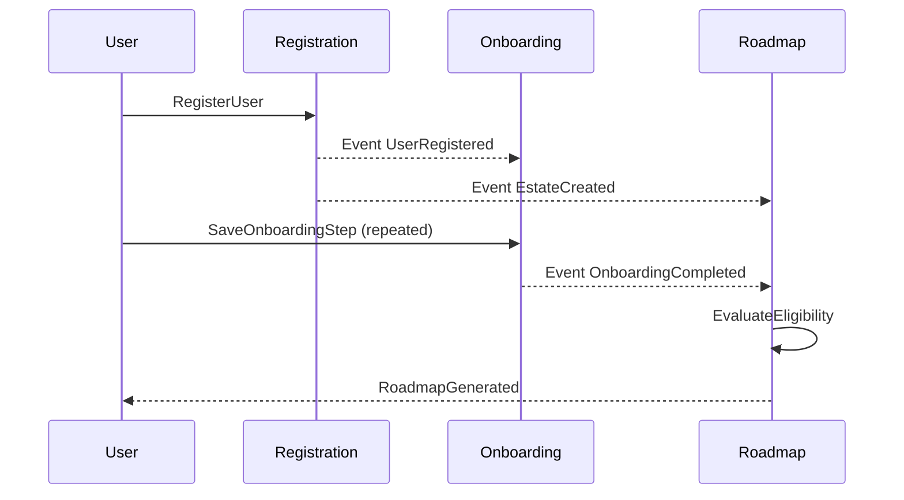
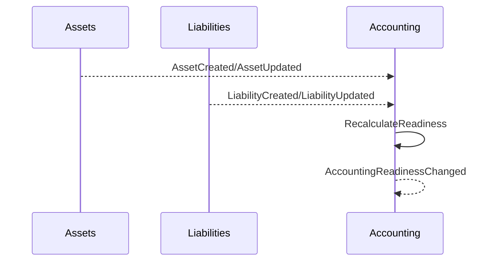

# Estate Management Modular Architecture Evaluation

## Document Control
- **Version:** 1.0
- **Date:** 2026-03-04
- **Scope:** Evaluation/design only (no runtime implementation)
- **Target Domains:** Registration & Onboarding, Roadmap, Assets, Liabilities, Accounting

---

## 1) Module Boundary Analysis

### 1.1 Current State Summary
The current codebase is a modular-monolith with a central API gateway (`server/index.ts`) mounting domain-specific route modules (`auth`, `assets`, `liabilities`, `estates`, `ssot`, etc.). This is already an appropriate foundation for internal API contracts and eventual service extraction.

### 1.2 Module Ownership Matrix (Data Models, Endpoints, Events)

| Domain Object / Capability | Owning Module | Current Endpoint/Service Signals | Shared Dependency | Ambiguity / Action |
|---|---|---|---|---|
| User auth (register/login/refresh/logout/verify/reset) | Registration | `/api/auth/*` | Email, token blacklist, JWT | Clear ownership |
| User profile | Registration | `/api/auth/me` | Estate reads for profile context | Clear |
| Estate bootstrap on register | Registration | `AuthService.register` creates estate for EXECUTOR | Estate table consumed by Roadmap/Accounting | Clarify bootstrap vs lifecycle ownership |
| Onboarding session progression | Onboarding | Frontend persistence + estate updates (`/api/estates/my`) | Estate completeness, authority fields | Needs explicit Onboarding API boundary |
| Estate profile and completeness | Onboarding (intake), shared read | `/api/estates/my` and related updates | Roadmap eligibility, Accounting readiness | Define ownership split with Registration |
| Personalized roadmap generation | Roadmap | `/api/estates/:id/roadmap` | Estate intake, authority, state rules | Clear |
| Roadmap versioning/pinning | Roadmap | roadmap service + pin/repin endpoints | SSOT roadmap versions | Clear |
| Asset CRUD and communications | Assets | `/api/assets/*` | Authority middleware, audit logging | Clear |
| Asset authority gating/audit | Assets | middleware + audit service invocation | Estate access + authority state | Clear, but shared middleware ownership should be documented |
| Liability CRUD | Liabilities | `/api/liabilities/*` | Estate lookup + subscription gating | Clear |
| Liability priority classification | Liabilities | `priority-options` and service | Jurisdiction rules | Clear |
| Solvency assessment | Liabilities | `/api/liabilities/solvency` | Asset dataset + estate authority type | Cross-module data dependency |
| Accounting readiness | Accounting | `/api/estates/my/accounting-readiness` | Assets, liabilities, docs, appointment date | Clear but compute dependencies are broad |
| Distribution readiness signaling | Accounting (or Settlement orchestration) | `/api/estates/my/distribution-readiness` | Accounting + liabilities + risk | Needs orchestration owner decision |

### 1.3 Shared Data Dependencies
- Estate metadata (`deceasedState`, authority/completeness, status) is a shared dependency for Onboarding, Roadmap, Liabilities, and Accounting.
- Asset and liability aggregates feed solvency and accounting readiness.
- Document status (`INVENTORY_APPRAISAL`) influences accounting readiness.

### 1.4 Circular Dependency Risks
Potential cycle candidates to remove via contracts:
1. Onboarding updates estate → Roadmap gating reads estate → Roadmap output may drive onboarding completion UX.
2. Liabilities solvency reads assets; Accounting reads both liabilities/assets; downstream distribution reads accounting + liabilities.

**Resolution strategy:** enforce command/query/event contracts and move cross-module flow control into a dedicated orchestration layer.

---

## 2) Internal API Contract Design

### 2.1 Contract Style
- **Commands:** synchronous writes, authoritative module owns validation + persistence.
- **Queries:** synchronous reads, side-effect free.
- **Events:** asynchronous notifications, immutable payload, at-least-once delivery semantics.

### 2.2 Typed Schema Standard (applies to all modules)
Every command/query/event defines:
- `schemaVersion` (string)
- `correlationId` (uuid)
- `actor` (`userId`, `role`, optional `ip`)
- `timestamp` (ISO)
- `payload` (module-specific typed object)

### 2.3 Communication Pattern Rules
- **Synchronous:** commands/queries required for immediate UX response.
- **Asynchronous:** events for downstream recalculations, analytics, notifications, and eventual consistency workflows.

---

## 3) Registration & Onboarding Module Contracts

### 3.1 Registration Module
**Owns:** authentication endpoints, profile bootstrap, executor estate bootstrap.

#### Commands
1. `RegisterUser`
   - Input: email, password, fullName, state?, userType, deceasedName?, estimatedValue?
   - Validation: email format, password min length, fullName min length, enum checks.
   - Success: user created, token issued, optional estate bootstrap for executor.
2. `LoginUser`
3. `RefreshSessionToken`
4. `LogoutSession`
5. `UpdateUserProfile`

#### Queries
1. `GetCurrentUserProfile`
2. `GetUserEstateMetadata` (minimum metadata needed by onboarding/roadmap)

#### Events Published
1. `UserRegistered`
2. `EstateCreated` (for executor bootstrap)
3. `UserProfileUpdated`

### 3.2 Onboarding Module
**Owns:** guided onboarding progression and completion state.

#### Commands
1. `StartOnboardingSession`
2. `SaveOnboardingStep`
3. `CompleteOnboarding`

#### Queries
1. `GetOnboardingSession`
2. `GetOnboardingProgress`

#### Events Published
1. `OnboardingStepCompleted`
2. `OnboardingCompleted`

---

## 4) Roadmap Module Contracts

**Owns:** eligibility gates, roadmap generation, roadmap versioning/pinning.

### Commands
1. `RegenerateRoadmap`
   - Input: estateId, reason, force?
   - Validation: estate access, completeness/authority gating.
   - Success: new/generated roadmap snapshot.
2. `PinRoadmapVersion`
3. `RepinRoadmapVersion`

### Queries
1. `GetCurrentRoadmapForEstate`
2. `GetRoadmapEligibilityStatus`
3. `GetRoadmapVersionMetadata`

### Events Published
1. `RoadmapGenerated`
2. `RoadmapPinned`
3. `RoadmapEligibilityFailed`

### Events Consumed
1. `EstateCreated` → optional initial roadmap generation trigger.
2. `OnboardingCompleted` → re-evaluate eligibility and generate if ready.

---

## 5) Assets Module Contracts

**Owns:** asset CRUD, communication artifacts, authority gating, audit logging.

### Commands
1. `CreateAsset`
2. `UpdateAsset`
3. `DeleteAsset`
4. `GenerateAssetCommunicationDraft`
5. `GenerateAssetLetter`

For CRUD commands:
- Validation: required fields, type/category, estate access, subscription state.
- Success: persisted mutation with audit log entry (`timestamp`, `actor`, `operation`).

### Queries
1. `GetAssetById`
2. `ListAssetsForEstate`
3. `GetAssetDocuments`

### Events Published
1. `AssetCreated`
2. `AssetUpdated`
3. `AssetDeleted`
4. `AssetCommunicationGenerated`

---

## 6) Liabilities Module Contracts

**Owns:** liability CRUD, priority classification, solvency calculations.

### Commands
1. `CreateLiability`
2. `UpdateLiability`
3. `DeleteLiability`
4. `ReclassifyLiabilityPriority`

### Queries
1. `GetLiabilityById`
2. `ListLiabilitiesForEstate`
3. `GetLiabilityTotals`
4. `GetPriorityOptionsByState`
5. `GetSolvencyAssessment`

### Events Published
1. `LiabilityCreated`
2. `LiabilityUpdated`
3. `LiabilityDeleted`
4. `SolvencyStatusChanged` (only when solvent/insolvent transitions)

---

## 7) Accounting Module Contracts

**Owns:** accounting readiness, compliance prerequisites, downstream distribution signal generation.

### Commands
1. `RecalculateAccountingReadiness`
2. `GenerateDistributionSignal`

### Queries
1. `GetAccountingReadinessStatus`
2. `GetCompliancePrerequisites`
3. `GetDistributionSignal`

### Events Published
1. `AccountingReadinessChanged`
2. `DistributionSignalGenerated`

### Events Consumed
1. `AssetCreated`
2. `AssetUpdated`
3. `LiabilityCreated`
4. `LiabilityUpdated`
5. `LiabilityDeleted`
6. `DocumentStatusChanged` (inventory/appraisal updates)

---

## 8) Cross-Module Orchestration Analysis

## 8.1 Key Flow A: Registration to First Roadmap

### 8.2 Key Flow B: Financial Updates to Accounting

### 8.3 Sync vs Async
- **Sync:** user-triggered CRUD and “get current status” operations.
- **Async:** recalculation and propagation (`RoadmapGenerated`, `SolvencyStatusChanged`, `AccountingReadinessChanged`).

### 8.4 Saga Patterns (for future extraction)
- Use orchestration saga for multi-step operations (e.g., registration + estate bootstrap + onboarding start).
- Compensations:
  - If estate bootstrap fails after user creation, mark onboarding blocked + emit incident event.
  - If roadmap generation fails after onboarding completion, retain completion state and queue retry.

### 8.5 Error Handling Strategy
- Standard envelope: `code`, `message`, `details`, `correlationId`, `retryable`.
- Event handlers must be idempotent by event ID and `schemaVersion`.

### 8.6 Race Conditions to Mitigate
- Concurrent asset/liability updates causing stale accounting readiness.
- Multiple onboarding submissions publishing duplicate completion events.
- Roadmap regeneration racing with pin/repin operations.

---

## 9) API Gateway Integration Analysis

### 9.1 Current Gateway Role
- Central route mounting and middleware orchestration via `server/index.ts`.
- Applies global controls: CORS, rate limit, authentication wrappers.

### 9.2 Future Gateway Role (if extracted services)
- Continue as ingress/API facade with module-based routing.
- Route based on ownership map:
  - `/api/auth*` → Registration
  - `/api/onboarding*` → Onboarding
  - `/api/roadmap*` or `/api/estates/:id/roadmap` → Roadmap
  - `/api/assets*` → Assets
  - `/api/liabilities*` → Liabilities
  - `/api/accounting*` / readiness endpoints → Accounting
- Add response composition endpoint only where explicitly needed (avoid broad aggregations).

---

## 10) Feasibility Assessment

## 10.1 Technical Risks
1. Shared DB schema currently enables implicit coupling.
2. Business rules spread across routes/services/middleware may resist clean extraction.
3. Event-driven consistency introduces ordering/idempotency complexity.

### 10.2 Data Consistency Challenges
- Readiness and solvency depend on multi-module aggregates.
- Requires either transactional outbox + eventual consistency model, or temporary synchronous calls in modular-monolith.

### 10.3 Performance Implications
- Internal function calls today are fast; service extraction adds network latency/retries/timeouts.
- Mitigation: cache read models for roadmap/readiness; keep write paths authoritative.

### 10.4 Deployment Complexity Changes
- From single deploy to multi-service deploy pipeline with contract/version coordination.

### 10.5 Testing Strategy Changes
- Add contract tests (consumer/provider), event schema compatibility tests, and end-to-end saga tests.

### 10.6 Operational Monitoring Requirements
- Correlation IDs across module boundaries.
- Event lag/dead-letter monitoring.
- Per-module SLOs (p95 latency/error budget).

### 10.7 Structure Suitability Verdict
Current codebase structure **does support** clean separation because major domains already map to route/service modules.

### 10.8 Recommendation
- **Near term:** remain modular-monolith, formalize internal contracts.
- **Mid term:** extract only high-change/high-scale modules after contract stability.
- **Microservices now:** not recommended unless team scale or load profile requires it.

---

## 11) Implementation Sequence Recommendations

| Priority | Module | Rationale | Coupling Risk | Effort (S/M/L) |
|---|---|---|---|---|
| 1 | Registration & Onboarding | Entry workflow quality and event provenance affect all downstream modules | Medium | M |
| 2 | Roadmap | Already has clear gates and bounded behavior; high product impact | Medium | M |
| 3 | Assets | Clear bounded CRUD + audit patterns | Low-Medium | M |
| 4 | Liabilities | Clear bounded CRUD, but solvency reads assets | Medium | M |
| 5 | Accounting | Highest aggregate dependency, best stabilized last | High | L |

### Milestones
1. Publish module ownership matrix and contract schemas.
2. Introduce event catalog + idempotency policy.
3. Implement orchestration layer boundaries (still in monolith).
4. Extract first candidate module only after 2 release cycles of stable contracts.

---

## 12) Migration Path (Modular-Monolith → Microservices)

## Phase 0: Contract Hardening (No extraction)
- Keep all modules in monolith.
- Add command/query/event contracts and ownership enforcement.
- Introduce feature flags for call routing abstraction.

## Phase 1: Edge Extraction Candidate (Roadmap or Assets)
- Extract one module behind gateway route.
- Keep shared DB read access minimized; prefer API calls.
- Rollback: route flag flips back to monolith implementation.

## Phase 2: Financial Domain Split (Liabilities, then Accounting)
- Extract Liabilities with explicit solvency API.
- Extract Accounting after event contracts stabilize.
- Rollback per module via routing flags and shadow traffic.

## Phase 3: Registration/Onboarding split (optional)
- Extract only if auth/compliance/identity scale warrants it.

### Cross-Phase Migration Controls
- **Data migration:** dual-write avoidance; use outbox and backfill read models.
- **Testing:** contract tests + canary + replay against event logs.
- **Deployment:** hybrid topology (gateway + monolith + selected services).
- **Feature toggles:** per-module routing toggle, async handler toggle, shadow-read toggle.

---

## 13) Documentation Deliverables

This document provides:
1. Module ownership matrix.
2. Internal API specifications for all five modules.
3. Sequence diagrams for key orchestration flows.
4. Feasibility and risk analysis.
5. Implementation sequence with effort estimates.
6. Migration path with phased rollout and rollback.
7. Architectural decision summary.

### Architectural Decision Records (ADR Summary)
- **ADR-001:** Prefer modular-monolith hardening before microservice extraction.
- **ADR-002:** Contract-first C/Q/E model for all inter-module interactions.
- **ADR-003:** Accounting remains last extraction due to highest aggregate coupling.
- **ADR-004:** Gateway remains canonical ingress in all migration phases.

